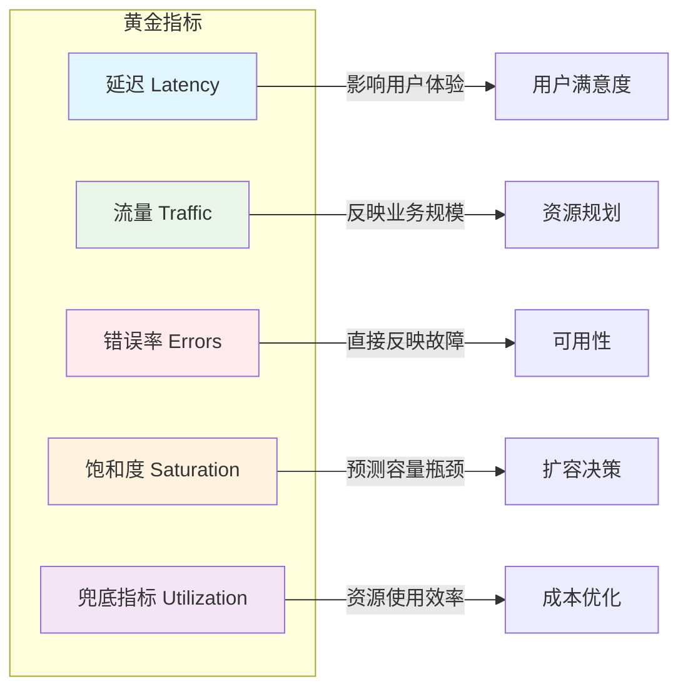
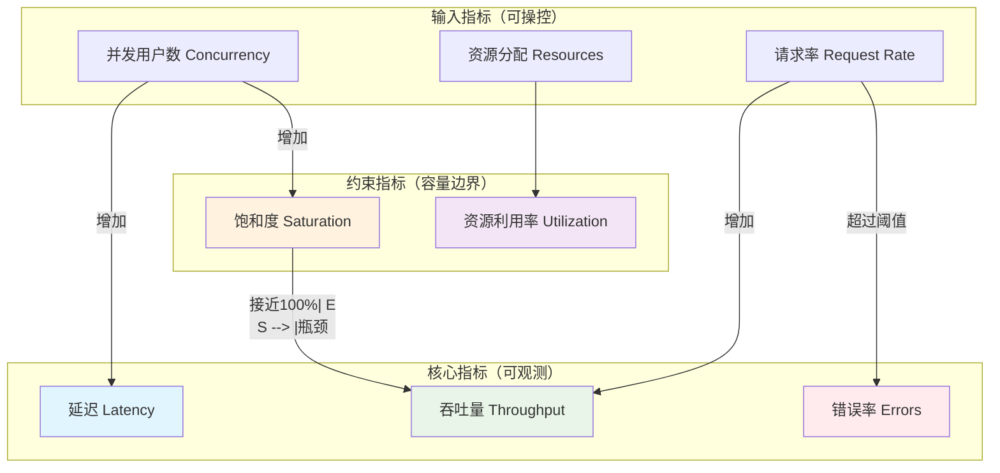

# 性能指标体系全景

凌晨两点，线上报警响了：「数据库 CPU 使用率 98%」。值班工程师紧急扩容、加索引、调整缓存策略，忙活了半小时，系统终于稳定。复盘会上大家松了一口气，准备庆祝这次故障的快速恢复。

但真正的问题，直到一周后才暴露出来。产品经理翻看监控数据时发现：**从半年前开始，用户平均页面加载时间就已经从 1.2 秒缓慢爬升到 2.8 秒**，只是在平均值上看不太出来。而这半年间，用户投诉量增加了 40%，转化率下降了 15%，但没有人把这些和「性能退化」关联起来。

这个故事揭示了一个经典陷阱：**团队只看平均值**，却忽略了那 1% 的用户正在经历 10 秒以上的等待——他们不会抱怨，只是默默离开了。

## 为什么需要性能指标体系

性能指标不是给监控大屏用的装饰品，而是**沟通业务与技术之间的桥梁**。

当业务方说「系统要快」，工程师需要追问「多快算快？」——这个追问的答案，就是性能指标。当老板问「这次优化效果如何」，工程师需要拿出数据证明——这个数据的载体，就是性能指标。当系统出问题时，工程师需要快速定位瓶颈——这个定位的依据，还是性能指标。

没有指标体系，技术决策就变成了「我觉得」「我以为」「以前就是这么做的」。有了指标体系，决策才能建立在数据之上，才能讨论「达标了吗」「优化了多少」「还能提升多少空间」。

更重要的是，性能指标帮助我们**建立共同语言**。产品、运营、老板都关心系统「快不快」「稳不稳」，但他们的感知是主观的。通过把主观感受量化成客观指标，团队才能在同一套标准下讨论问题、制定目标、评估结果。

### 黄金指标：Google SRE 的最佳实践

2010 年，Google 发布了 Site Reliability Engineering（SRE）系列文章，其中最广为流传的贡献之一，就是提出了**黄金指标（The Four Golden Signals）**的概念。这四个指标是：延迟（Latency）、流量（Traffic）、错误率（Errors）、饱和度（Saturation）。

后来社区在此基础上扩展，加入了兜底指标，形成了完整的五因子体系：



这五个指标不是孤立的，而是相互关联的。当流量增加时，延迟通常会上升；当延迟过高时，错误率可能上升；当饱和度接近 100% 时，整个系统的性能会急剧恶化。理解这种关联，是诊断性能问题的关键。

### 指标的因果关系

性能指标之间存在复杂的因果和约束关系，理解这些关系才能真正用好指标：



**延迟**和**吞吐量**是性能的一体两面。在资源未饱和时，增加并发通常能同时提升吞吐量和延迟（因为排队时间增加）。但在资源饱和后，继续增加并发只会让延迟飙升，吞吐量反而下降。这就是为什么「加了资源系统反而更慢」——不是因为资源不够，而是因为资源分配策略有问题。

**错误率**是系统健康状况的直接反映。但要注意区分「真错误」和「假错误」：HTTP 404 是错误，HTTP 503 是错误，但 HTTP 200 带上「服务降级」标记也是错误。需要结合业务语义来判断。

**饱和度**是最重要的前瞻性指标。CPU 使用率 80% 看起来还好，但如果过去一周的增速是每天 +5%，那么四天后就会达到 100%。看到饱和度指标时，要问的不是「现在够不够」，而是「还能撑多久」。

## 黄金指标详解

### 延迟（Latency）

延迟是用户感知最直接的指标。一条 HTTP 请求的端到端延迟可能只有 50ms，但在这 50ms 里，DNS 解析花了 5ms，TCP 连接花了 10ms，SSL 握手花了 15ms，服务端处理花了 15ms，响应传输花了 5ms。只有把延迟拆解到这一步，才能真正找到优化点。

延迟的关键不在于平均值，而在于百分位数。P99 延迟才是真正影响用户体验的指标——它代表「99% 的用户经历的事情」。

### 流量（Traffic）

流量描述系统承受的负载规模。对于 Web 服务，流量通常用 QPS（每秒请求数）或 RPS（每秒请求数）来衡量。对于数据库，流量用 QPS 或 TPS（每秒事务数）来衡量。

流量指标的价值在于**容量规划**。当流量呈现上升趋势时，需要提前扩容；当流量达到上限时，需要考虑分库分表或服务拆分。

### 错误率（Errors）

错误率是系统健康状况的直接反映。但「错误」的定义需要根据业务场景来定：

- HTTP 层面的错误：4xx（客户端错误）、5xx（服务端错误）
- 业务层面的错误：业务逻辑判断出的失败，如「余额不足」「库存为零」
- 超时错误：请求超过预设的 timeout 阈值

不同类型的错误需要不同的处理策略。HTTP 5xx 需要排查服务端问题，业务错误需要优化业务流程，超时错误可能需要扩容或优化性能。

### 饱和度（Saturation）

饱和度描述资源的利用程度。当资源接近饱和时，系统性能会急剧下降：

- CPU 饱和：处理能力达到上限，新的请求必须排队
- 内存饱和：触发频繁 GC，响应时间抖动
- 磁盘 I/O 饱和：读写请求排队等待
- 连接池饱和：无法创建新连接，请求被拒绝

饱和度是**前瞻性指标**。看到 CPU 使用率 80% 时，要问的不是「现在够不够」，而是「按当前增速，几天后会达到 100%」。

## 指标采集方案

知道要关注哪些指标只是第一步，关键是如何准确地采集这些指标。

### 端到端采集

端到端指标是最直观的，通常由 API 网关或负载均衡器提供：

- 总请求数、平均延迟、P99/P999 延迟
- 请求成功率、错误率分布
- 按接口、按用户群体细分的指标

Nginx 的 `ngx_http_stub_status_module`、AWS ALB 的 CloudWatch 指标、Kong 的 analytics 插件，都是常见的端到端采集方案。

### 应用层采集

应用层指标提供更细粒度的洞察，通常通过 Micrometer、Prometheus 客户端库来实现：

```java
// 使用 Micrometer 采集自定义指标
MeterRegistry registry = new PrometheusMeterRegistry(PrometheusConfig.DEFAULT);

Counter requests = registry.counter("http_server_requests_seconds",
    "uri", "/api/users",
    "status", "200");

Timer latency = registry.timer("http_server_latency_seconds",
    "uri", "/api/users");
```

应用层指标的优势在于可以**打上业务标签**（如用户类型、商品类目、地区），从而实现多维度的下钻分析。

### 基础设施层采集

基础设施层指标描述底层的资源使用情况：

- CPU 使用率、Load Average
- 内存使用量、GC 频率与时长
- 磁盘 I/O、网络带宽
- 数据库连接池使用率

常见的采集工具包括：Node Exporter（基础设施指标）、JMX Exporter（Java 应用指标）、cAdvisor（容器指标）。

### 指标存储与查询

采集到的指标需要存储和查询。常见的时序数据库包括：

| 存储方案 | 适用场景 | 特点 |
| --- | --- | --- |
| Prometheus | 云原生环境 | 拉模式，强大的 PromQL |
| InfluxDB | 高写入场景 | 压缩率高，支持 Continuous Queries |
| VictoriaMetrics | 大规模场景 | Prometheus 兼容，资源高效 |
| M3DB | 超大规模 | 分布式，支持强一致查询 |

## 本章总结

性能指标体系是技术决策的基础。选择正确的指标，才能正确衡量系统状态、评估优化效果、制定容量计划。

**记住以下要点**：

1. **黄金指标**：延迟、流量、错误率、饱和度、兜底指标
2. **关注百分位数**：P99 比平均值更能反映用户体验
3. **理解因果关系**：流量上升 → 延迟上升 → 错误率上升 → 饱和度接近 100%
4. **饱和度是前瞻指标**：不要只看当前值，要看趋势
5. **多层次采集**：端到端 + 应用层 + 基础设施层

下一节我们将深入讲解延迟指标，揭开百分位数的秘密。