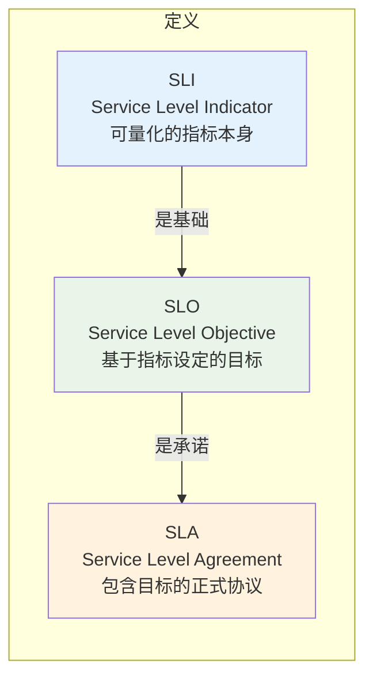
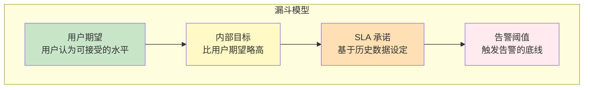
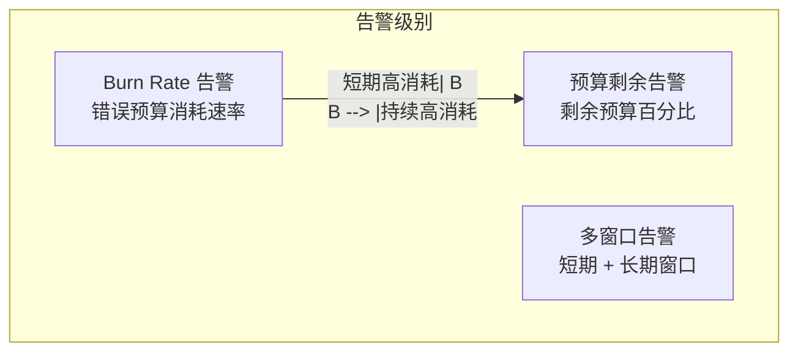
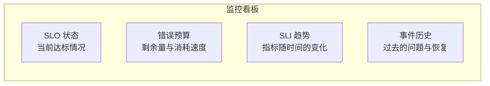
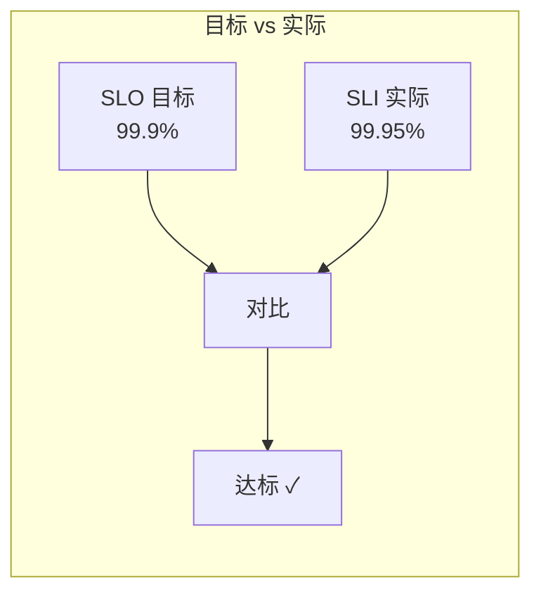
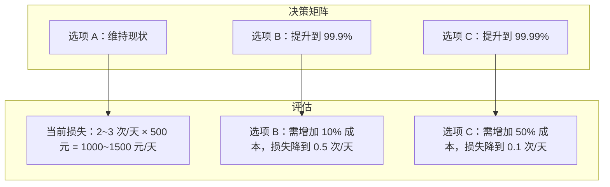

# SLA/SLO/SLI 与性能目标设定

「系统可用性 99.9%」——这句话到底意味着什么？一年有 525600 分钟，99.9% 意味着全年可以容忍约 525 分钟（约 8.7 小时）的不可用时间。但这 8.7 小时是连续的还是分散的？是计划内还是计划外的？这些问题，SLA/SLO/SLI 体系能够给你答案。

## 三者的定义与关系

SLA、SLO、SLI 是三个层层递进的概念：



**SLI（Service Level Indicator）** 是可量化的指标本身。比如「HTTP 请求的成功率」「接口的 TP99 延迟」「服务的启动时间」。SLI 是原始数据，是监控仪表盘上的数字。

**SLO（Service Level Objective）** 是基于 SLI 设定的目标。比如「HTTP 请求成功率 >= 99.9%」「TP99 延迟 < 200ms」。SLO 是承诺，是团队内部或对外的「达标线」。

**SLA（Service Level Agreement）** 是包含 SLO 的正式协议，通常有法律效力。SLA 会规定：如果 SLO 未达标，会有什么后果（比如赔偿、罚款）。SLA 是合同，是商业承诺。

三者的关系是：**SLI 是事实，SLO 是目标，SLA 是承诺**。没有 SLI，SLO 就是空话；没有 SLO，SLA 就是无本之木。

## 常用 SLI 指标

### 延迟类 SLI

- **HTTP 请求延迟**：TP50/TP90/TP99 延迟
- **首字节时间（TTFB）**：Time To First Byte
- **DNS 解析时间**：DNS lookup time
- **SSL/TLS 握手时间**：Connection setup time

### 可用性类 SLI

- **请求成功率**：成功请求数 ÷ 总请求数
- **错误率**：4xx/5xx 错误占比
- **服务可用时间**：uptime ÷ (uptime + downtime)

### 吞吐量类 SLI

- **QPS/RPS**：每秒请求数
- **TPS**：每秒事务数
- **并发连接数**：同时活跃的连接数

### 数据新鲜度类 SLI

- **数据同步延迟**：主从数据同步的时间差
- **缓存命中率**：缓存命中的请求占比
- **数据更新延迟**：数据写入到可查询的时间

## 如何设定有效的 SLO

### SLO 设定原则

SLO 不是越高越好，而是**合理就好**。设定 SLO 需要考虑以下因素：

1. **用户期望**：用户真正关心的指标是什么？
2. **实现成本**：达到更高 SLO 需要付出多少代价？
3. **业务风险**：SLO 不达标会造成多大的业务损失？

### SLO 设定的漏斗模型



### SLO 计算示例

假设历史数据显示：
- 当前请求成功率：99.5%
- 最近 30 天有 2 次低于 99% 的时段

合理的 SLO 设定：

```json
{
  "slo_name": "api_success_rate",
  "target": 0.999,
  "window": "30d",
  "measurement": "request_success_rate",
  "filter": "uri starts with '/api/'"
}
```

### 避免 SLO 过度工程化

很多团队犯的错误是把 SLO 设得太高，导致：

- 永远达不到，团队失去信心
- 过度优化，投入产出比不合理
- 忽视其他重要指标

**经验法则**：SLO 应该比历史最佳表现低一些，留出改进空间。

## 错误预算概念

### 什么是错误预算

错误预算（Error Budget）是 SLO 的「另一半」。如果说 SLO 是「我们要达到的目标」，错误预算就是「我们还能承受多少失败」。

计算方式很简单：**错误预算 = 100% - SLO**。

如果 SLO 是 99.9%，错误预算就是 0.1%。换算成时间：

```
每月错误预算：30d × 24h × 60m × 0.1% = 43.8 分钟
每年错误预算：365d × 24h × 60m × 0.1% = 525.6 分钟 ≈ 8.76 小时
```

### 错误预算的用法

错误预算的用法是：**用它来驱动发布决策**。

```mermaid
gantt
    title 错误预算消耗跟踪
    dateFormat  YYYY-MM-DD
    section 错误预算
    1月: 0, 31d
    2月: 31, 28d
    3月: 59, 31d

    section SLO红线
    75%消耗警戒: 0, 23d
    100%完全消耗: 31, 31d
```

**错误预算消耗策略**：

- **错误预算充足时**：可以正常发布新功能，冒烟测试即可
- **错误预算消耗到 75%**：减少发布频率，加强测试
- **错误预算即将耗尽**：暂停发布，专注稳定性
- **错误预算耗尽**：冻结发布，快速修复问题

### 错误预算的误解

很多团队的误区是：**把 SLO 当成最高目标，而不是最低标准**。

SLO 是「我们承诺的最低水平」，不是「我们追求的最高水平」。如果团队总是踩着 SLO 线运行，说明 SLO 设置得太高了，或者团队根本没有提升空间。

另一个误区是：**只关注 SLO，不关注错误预算**。SLO 是目标，错误预算才是真正用来做决策的工具。

## 基于 SLO 的告警

### 告警策略

基于 SLO 的告警通常有多个级别：



### Burn Rate 概念

Burn Rate（燃烧速率）描述错误预算的消耗速度：

```
Burn Rate = 当前错误率 ÷ SLO 允许的错误率

例如：
- 当前错误率：0.5%
- SLO 目标：99.9%（允许 0.1% 错误）
- Burn Rate = 0.5% ÷ 0.1% = 5

解读：以当前速度，错误预算会在 1/5 的周期内耗尽
```

### 多窗口告警

单一时段的高错误率可能是噪声，长期累积的高错误率才是真正的问题：

```java
// Prometheus SLO 告警规则
groups:
- name: slo-alerts
  rules:
  # 短期窗口（1小时），高速消耗
  - alert: SLIHighErrorRateShort
    expr: |
      (sum(rate(http_requests_total{job="api",code=~"5.."}[5m]))
      / sum(rate(http_requests_total{job="api"}[5m]))) > 0.01
    for: 2m
    labels:
      severity: warning
    annotations:
      summary: "SLI 短期错误率过高"

  # 长期窗口（1天），持续消耗
  - alert: SLOErrorBudgetBurn
    expr: |
      sum(rate(http_requests_total{job="api",code=~"5.."}[1h]))
      / sum(rate(http_requests_total{job="api"}[1h])) > 0.01
    for: 5m
    labels:
      severity: critical
    annotations:
      summary: "错误预算持续消耗"
```

## SLO 驱动的监控

### 看板设计

SLO 驱动的监控看板应该展示：



### SLI 达标率计算

```python
# 计算 SLI 达标率的伪代码
def calculate_sli_compliance(sli_data, slo_target, window):
    """
    sli_data: SLI 指标数据点列表
    slo_target: SLO 目标值（如 0.999）
    window: 统计窗口（如 '30d'）
    """
    compliant_points = sum(1 for point in sli_data
                          if point.value >= slo_target)
    total_points = len(sli_data)
    compliance_rate = compliant_points / total_points
    return compliance_rate
```

### 目标 vs 实际



## 真实案例：SLO 设定决策

### 案例背景

某电商平台的订单服务：

- 当前状态：请求成功率 99.5%，延迟 TP99 300ms
- 用户投诉：偶发订单失败，平均每天 2~3 次
- 业务影响：每次失败订单损失约 500 元

### 分析过程

1. **用户期望调研**：用户能接受的订单失败率是多少？
2. **成本分析**：提高 SLO 需要增加多少成本？
3. **风险评估**：SLO 不达标会造成多大损失？

### 决策



最终决策：**选项 B**，在成本和收益之间取得平衡。

## 本章总结

**核心要点**：

1. **SLI 是事实**：可量化的指标本身
2. **SLO 是目标**：基于指标设定的达标线
3. **SLA 是承诺**：包含目标的正式协议
4. **错误预算 = 100% - SLO**：用于驱动发布决策
5. **Burn Rate**：描述错误预算的消耗速度
6. **SLO 不是越高越好**：合理就好，考虑成本收益比

理解 SLA/SLO/SLI 是制定性能目标和建立监控体系的基础。下一节我们将讲解可用性与性能的关系。