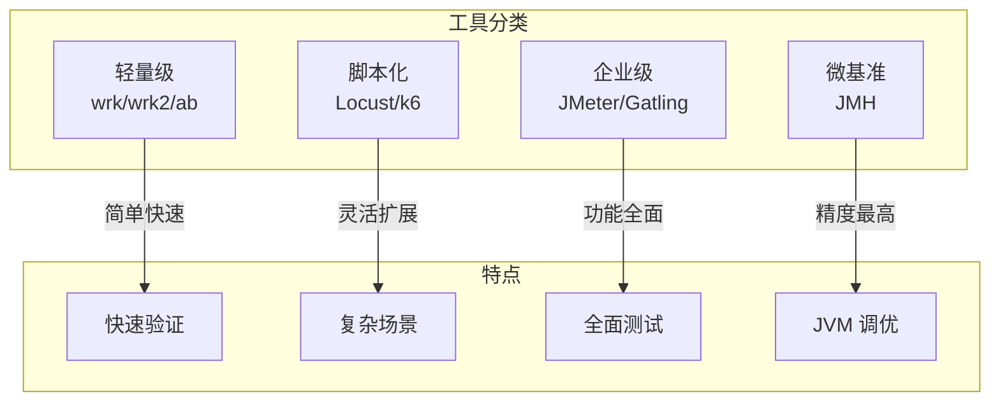

# 性能测试工具对比

工欲善其事，必先利其器。性能测试工具种类繁多，从轻量级的 `wrk` 到功能全面的企业级 `JMeter`，每种工具都有其擅长的场景。选择合适的工具，能让性能测试事半功倍。

## 工具全景图



## JMeter：功能全面的企业级工具

Apache JMeter 是最老牌的性能测试工具，功能最全面，但学习曲线也最陡峭。

### 适用场景

- 复杂业务流程的负载测试
- 需要图形界面的团队协作
- 需要生成详细报告的正式测试
- JDBC、MQ、FTP 等协议测试

### 优点

- 功能最全面，支持几乎所有协议
- 图形界面，学习曲线相对平滑
- 丰富的插件生态
- 完善的报告功能
- 大型社区，文档丰富

### 缺点

- 资源消耗大
- 脚本配置复杂
- 不适合快速验证

### 基本使用

```xml
<?xml version="1.0" encoding="UTF-8"?>
<jmeterTestPlan version="1.2">
    <hashTree>
        <TestPlan>
            <stringProp name="TestPlan.comments">API 性能测试</stringProp>
            <boolProp name="TestPlan.functional_mode">false</boolProp>
            <boolProp name="TestPlan.serialize_threadgroups">false</boolProp>
        </TestPlan>
        <hashTree>
            <ThreadGroup>
                <stringProp name="ThreadGroup.num_threads">100</stringProp>
                <stringProp name="ThreadGroup.ramp_time">10</stringProp>
                <stringProp name="ThreadGroup.duration">300</stringProp>
            </ThreadGroup>
            <hashTree>
                <HTTPSamplerProxy>
                    <stringProp name="HTTPSampler.domain">api.example.com</stringProp>
                    <stringProp name="HTTPSampler.path">/api/users</stringProp>
                    <stringProp name="HTTPSampler.method">GET</stringProp>
                </HTTPSamplerProxy>
            </hashTree>
        </hashTree>
    </hashTree>
</jmeterTestPlan>
```

## Locust：Python 编写的易扩展工具

Locust 使用 Python 编写，测试脚本就是普通的 Python 代码，灵活度极高。

### 适用场景

- 需要复杂业务逻辑的测试
- Python 团队，代码即测试
- 需要与现有 Python 项目集成
- 快速原型验证

### 优点

- Python 脚本，学习成本低
- 高度可扩展
- 分布式测试支持
- 实时 Web UI
- 易于集成 CI/CD

### 缺点

- 单机性能不如 Go/C 实现
- 需要 Python 环境

### 基本示例

```python title="locustfile.py"
from locust import HttpUser, task, between

class WebsiteUser(HttpUser):
    wait_time = between(1, 3)

    @task(3)
    def get_users(self):
        self.client.get("/api/users")

    @task(1)
    def create_user(self):
        self.client.post("/api/users", json={
            "name": "test",
            "email": "test@example.com"
        })

    def on_start(self):
        # 登录获取 token
        response = self.client.post("/api/login", json={
            "username": "admin",
            "password": "admin"
        })
        self.token = response.json().get("token")
```

运行 Locust：

```bash
# 本地运行
locust -f locustfile.py --host=http://localhost:8080

# 分布式运行
locust -f locustfile.py --master
locust -f locustfile.py --worker --master-host=192.168.1.100
```

## Gatling：Scala 编写，报表美观

Gatling 使用 Scala DSL，测试代码简洁，报告非常美观。

### 适用场景

- 需要高质量报告的正式测试
- Scala 团队
- 复杂场景模拟
- CI/CD 集成

### 优点

- 报告美观专业
- DSL 语法简洁
- 支持 CI/CD 集成
- 场景录制功能
- WebSocket/Server-Sent Events 支持

### 缺点

- 学习 Scala DSL
- 资源消耗较大

### 基本示例

```scala title="Simulation.scala"
package com.example

import io.gatling.core.Predef._
import io.gatling.http.Predef._

class ApiSimulation extends Simulation {

  val httpConf = http
    .baseUrl("http://localhost:8080")
    .acceptHeader("application/json")
    .contentTypeHeader("application/json")

  val scn = scenario("API Performance Test")
    .exec(
      http("Get Users")
        .get("/api/users")
        .check(status.is(200))
    )
    .pause(1)
    .exec(
      http("Create User")
        .post("/api/users")
        .body(StringBody("""{"name":"test"}""")).asJson
        .check(status.is(201))
    )

  setUp(
    scn.inject(
      rampUsers(1000).during(60)
    )
  ).protocols(httpConf)
   .assertions(
     global.responseTime.max.lt(1000),
     global.successfulRequests.percent.gt(99)
   )
}
```

## wrk/wrk2：轻量级 HTTP 压测

wrk 是用 C 编写的轻量级 HTTP 压测工具，性能极高，适合快速验证。

### 适用场景

- 快速验证 API 性能
- CI/CD 中的快速回归测试
- 不需要复杂场景的基准测试

### 优点

- 性能极高
- 使用简单
- 零依赖
- 包含 Lua 脚本支持

### 缺点

- 仅支持 HTTP
- 不支持复杂场景

### 基本使用

```bash
# 基础压测
wrk -t4 -c100 -d30s http://localhost:8080/api/users

# 参数说明
# -t4: 4 个线程
# -c100: 100 个并发连接
# -d30s: 持续 30 秒
```

```bash
# 使用 Lua 脚本
wrk -t4 -c100 -d30s -s post.lua http://localhost:8080/api/users
```

```lua title="post.lua"
wrk.method = "POST"
wrk.headers["Content-Type"] = "application/json"

counter = 0
request = function()
    counter = counter + 1
    local body = string.format('{"name":"user%d","email":"user%d@test.com"}', counter, counter)
    return wrk.format(nil, nil, nil, body)
end
```

### wrk2：恒定 QPS 模式

wrk2 是 wrk 的增强版，支持恒定 QPS 模式，更适合 SLA 测试：

```bash
# 恒定 1000 QPS
wrk -t4 -c100 -d60s -R1000 http://localhost:8080/api/users
```

## k6：现代 JavaScript 压测

k6 是用 Go 编写的现代压测工具，使用 JavaScript 编写测试脚本，性能优秀且易于扩展。

### 适用场景

- 现代 DevOps 团队
- 需要 CI/CD 集成
- 云原生环境
- 从 JMeter/Locust 迁移

### 优点

- 性能优秀
- JavaScript 脚本
- 云服务支持（k6 Cloud）
- 丰富的输出选项（Prometheus、Datadog 等）
- 支持浏览器录制

### 缺点

- 需要安装

### 基本示例

```javascript title="load-test.js"
import http from 'k6/http';
import { check, sleep } from 'k6';

export const options = {
    stages: [
        { duration: '2m', target: 100 },   // 2 分钟内升到 100 用户
        { duration: '5m', target: 100 },   // 保持 100 用户 5 分钟
        { duration: '2m', target: 0 },     // 2 分钟内降到 0
    ],
    thresholds: {
        http_req_duration: ['p(99)<500'],  // 99% 请求 < 500ms
        http_req_failed: ['rate<0.01'],     // 错误率 < 1%
    },
};

export default function () {
    const res = http.get('http://localhost:8080/api/users');
    check(res, {
        'status is 200': (r) => r.status === 200,
        'response time < 500ms': (r) => r.timings.duration < 500,
    });

    sleep(1);
}
```

## 工具对比

| 工具 | 性能 | 易用性 | 扩展性 | 报告 | 适用场景 |
| --- | --- | --- | --- | --- | --- |
| JMeter | 中等 | 中等 | 高 | 详细 | 企业级复杂测试 |
| Locust | 中等 | 高 | 高 | 一般 | Python 团队 |
| Gatling | 高 | 中等 | 高 | 美观 | Scala 团队 |
| wrk | 极高 | 高 | 低 | 简单 | 快速验证 |
| k6 | 高 | 高 | 高 | 美观 | DevOps 团队 |

## 选型建议

### 按团队技能选

- **Java 团队**：JMeter、Gatling
- **Python 团队**：Locust
- **Go 团队**：k6
- **DevOps 团队**：k6、wrk
- **快速验证**：wrk/wrk2

### 按测试场景选

- **简单 API 压测**：wrk/wrk2
- **复杂业务流程**：JMeter、Gatling
- **CI/CD 集成**：k6、wrk
- **微基准测试**：JMH
- **端到端测试**：JMeter、Gatling

### 推荐组合

**小团队快速验证**：`wrk` 或 `k6`

```bash
# wrk 快速验证
wrk -t4 -c100 -d30s http://localhost:8080/api/users
```

**中型团队正式测试**：`k6` + `JMH`

```javascript title="k6 集成 JMH 结果"
import http from 'k6/http';
import { Rate } from 'k6/metrics';

const errorRate = new Rate('errors');

export const options = {
    stages: [
        { duration: '5m', target: 200 },
    ],
    thresholds: {
        'http_req_duration': ['p(99)<500'],
        'errors': ['rate<0.01'],
    },
};

export default function () {
    const res = http.get('http://localhost:8080/api/users');
    errorRate.add(res.status !== 200);
}
```

**大型团队企业级**：`JMeter` + `Gatling` + `JMH`

## 本章总结

**核心要点**：

1. **JMeter**：功能最全面，适合复杂场景
2. **Locust**：Python 脚本，灵活易扩展
3. **Gatling**：Scala DSL，报告美观
4. **wrk/wrk2**：轻量级，快速验证
5. **k6**：现代 JavaScript，适合 DevOps

选择合适的工具，让性能测试更高效。