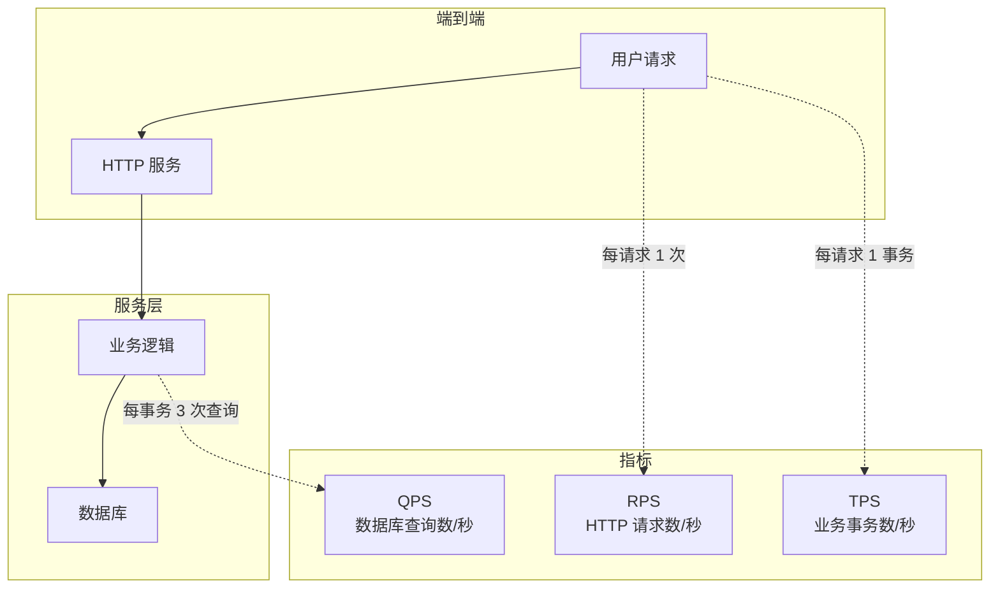
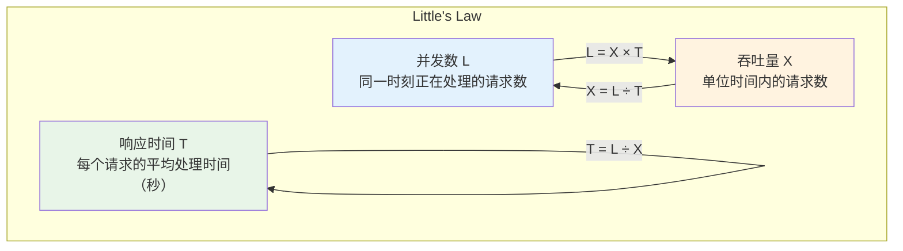
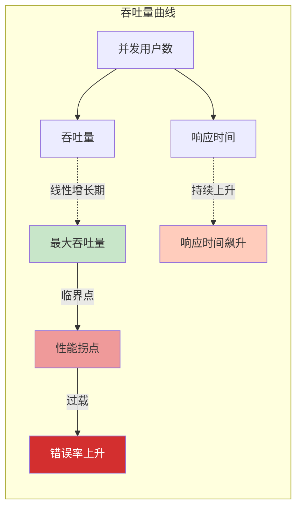
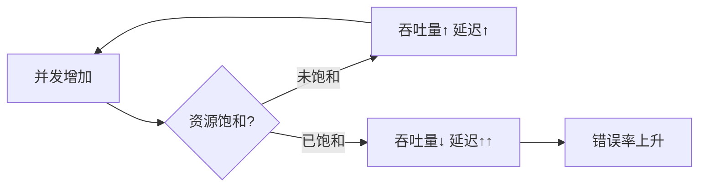

# 吞吐量详解：QPS/TPS/RPS

很多人以为「系统能抗多少 QPS」是一个简单的数字，但实际上，吞吐量是一个复杂的系统性问题，它与延迟、并发、资源利用密切关联。理解了吞吐量的本质，才能做出正确的容量规划。

## QPS/TPS/RPS 的区别

这三个概念经常被混用，但它们的含义其实并不完全相同。

### QPS（Queries Per Second）

QPS 是**每秒查询数**，通常用于描述数据库或缓存系统的处理能力。

例如，「MySQL 能支撑 5000 QPS」，意思是 MySQL 每秒能执行 5000 次查询。这个数字通常是通过 `SHOW GLOBAL STATUS LIKE 'Questions'` 计算出来的。

QPS 的特点：
- 统计的是**查询次数**，不是事务数
- 对于数据库，同一个事务中可能有多个查询
- QPS 反映的是数据库层面的负载

### TPS（Transactions Per Second）

TPS 是**每秒事务数**，用于描述业务的完整交易过程。

事务和查询的区别在于：**事务是由多个操作组成的完整业务单元**。比如一次用户登录可能包含：

- 查询用户信息（1 次查询）
- 查询权限信息（1 次查询）
- 查询会话信息（1 次查询）
- 更新最后登录时间（1 次更新）

这 4 次查询算 1 次 TPS。

TPS 的计算公式：

```
TPS = QPS ÷ 平均每个事务的查询数
```

### RPS（Requests Per Second）

RPS 是**每秒请求数**，是一个更通用的概念。

在 HTTP 服务的场景下，RPS 和 QPS 经常混用，因为一个 HTTP 请求通常对应一次业务查询。但在微服务架构中，一个请求可能触发多个下游服务调用，此时 RPS 和 QPS 就有区别了。

三者的关系可以用一张图来概括：



## 并发用户数与吞吐量的关系

吞吐量不是凭空产生的，它来自真实用户的请求。理解并发用户数和吞吐量的关系，是容量规划的基础。

### Little's Law（利特法则）



**Little's Law** 是理解这个关系的钥匙：**并发数 = 吞吐量 × 平均响应时间**。

反过来：**吞吐量 = 并发数 ÷ 平均响应时间**。

假设一个系统的平均响应时间是 100ms（0.1 秒），最大并发数是 1000，那么它的最大吞吐量是：

```
吞吐量 = 1000 ÷ 0.1 = 10000 QPS
```

这个公式告诉我们：**吞吐量不是想提升就能提升的，它受制于并发数和响应时间**。

- 如果想提升吞吐量，要么增加并发数（扩容）
- 要么降低响应时间（优化性能）

### 并发用户数 vs 同时在线用户

需要区分两个概念：

| 概念 | 定义 | 估算方式 |
| --- | --- | --- |
| 同时在线用户 | 任意时刻正在使用系统的用户数 | DAU × 平均使用时长 ÷ 时间跨度 |
| 活跃用户 | 任意时刻正在发起请求的用户数 | 同时在线用户 × 请求发起比例 |

假设一个系统：
- 日活（DAU）是 10 万用户
- 每个用户平均使用 30 分钟
- 工作时间是 8 小时（28800 秒）
- 每 10 秒发起一次请求

计算同时在线用户数：

```
同时在线 = 100000 × (30 × 60) ÷ (8 × 60 × 60) = 6250 用户
```

计算活跃用户数（假设 30% 用户同时在线）：

```
活跃用户 = 6250 × 30% = 1875 用户
```

计算吞吐量：

```
吞吐量 = 1875 × (1 ÷ 10) = 187.5 RPS
```

## 吞吐量的天花板

每个系统都有吞吐量的上限，超过这个上限后，要么拒绝请求，要么系统崩溃。找到这个天花板，是性能测试的核心目标。



### 吞吐量天花板的成因

吞吐量天花板往往不是单一因素造成的，而是**多个瓶颈叠加**的结果：

- **CPU 算力不够**：CPU 使用率接近 100%，计算成为瓶颈
- **内存带宽不足**：大量数据在 CPU 和内存之间传输
- **网络带宽打满**：数据传输成为瓶颈
- **数据库连接池耗尽**：等待数据库连接
- **线程池耗尽**：等待可用线程

有一个简单的方法判断瓶颈位置：**如果吞吐量达到上限时 CPU 使用率接近 100%，瓶颈在 CPU；如果 CPU 使用率不高但吞吐量上不去，瓶颈可能在 I/O 或等待锁。**

### 阿姆达尔定律

阿姆达尔定律（Amdahl's Law）描述了并行计算的理论加速比：

```
加速比 = 1 ÷ (S + (1 - S) ÷ N)
```

其中 S 是串行比例，N 是并行度。

假设一个任务的 80% 可以并行执行，20% 必须串行执行：

- 2 个 CPU：加速比 = 1 ÷ (0.2 + 0.8 ÷ 2) = 1.67
- 4 个 CPU：加速比 = 1 ÷ (0.2 + 0.8 ÷ 4) = 2.5
- 8 个 CPU：加速比 = 1 ÷ (0.2 + 0.8 ÷ 8) = 3.57

可以看到，**串行部分会成为性能提升的天花板**。即使无限增加 CPU，理论加速比也不会超过 5 倍（1 ÷ 0.2）。

## 吞吐量与延迟的关系

吞吐量和延迟是性能的一体两面，但它们的关系并非线性。

### 在资源未饱和时

增加并发数通常能同时提升吞吐量和延迟：

- 吞吐量：随着并发增加而增加（更多请求被处理）
- 延迟：随着并发增加而略微增加（排队时间增加）

### 在资源饱和后

继续增加并发只会让延迟飙升，吞吐量反而下降：



这就是为什么「加了资源系统反而更慢」——不是因为资源不够，而是因为资源分配策略有问题。

### 最佳运行点

每个系统都有一个**最佳运行点**，在这个点附近：

- 吞吐量接近最大值
- 延迟保持在可接受范围内
- 资源利用率合理

找到这个最佳运行点，是容量规划的核心目标。

## 实际计算示例

### 场景：估算系统最大 QPS

已知条件：
- 平均响应时间：50ms
- 最大并发数：200（线程池大小）
- 业务逻辑中，80% 时间是 CPU 计算，20% 时间是 I/O 等待

计算最大 QPS：

```
最大 QPS = 200 ÷ 0.05 = 4000 QPS
```

但考虑到 CPU 利用率限制：

```
实际 QPS = 4000 × 80% = 3200 QPS
```

### 场景：估算所需服务器数量

已知条件：
- 目标 QPS：10000
- 单机最大 QPS：2000
- 预留 30% 余量

计算服务器数量：

```
所需服务器 = 10000 ÷ (2000 × 70%) = 7.14 ≈ 8 台
```

### 场景：估算响应时间

已知条件：
- 目标 QPS：5000
- 最大并发数：500

计算平均响应时间：

```
响应时间 = 500 ÷ 5000 = 0.1 秒 = 100ms
```

## 本章总结

**核心要点**：

1. **QPS/TPS/RPS 有区别**：QPS 是查询数，TPS 是事务数，RPS 是请求数
2. **Little's Law 是基础**：并发数 = 吞吐量 × 响应时间
3. **吞吐量有天花板**：由 CPU、内存、网络、数据库等瓶颈共同决定
4. **阿姆达尔定律**：串行部分决定了性能提升的上限
5. **吞吐量和延迟是矛盾的**：饱和后，继续增加并发只会让延迟飙升

理解吞吐量是容量规划的基础。下一节我们将讲解并发用户数，探讨并发与并行的区别。