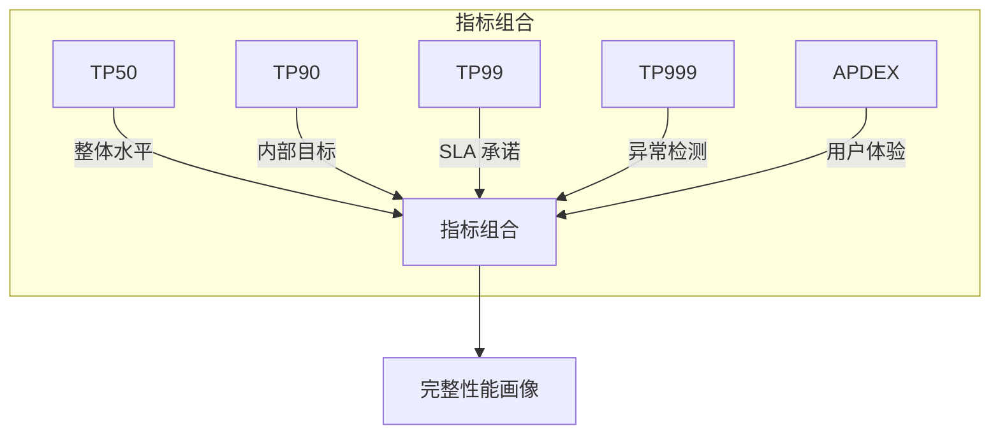

# TP 指标详解：超越 P99

提到性能指标，很多人只知道 P99。但 TP 指标远不止 P99 这么简单。在实际工程中，不同的百分位数有不同的应用场景，理解它们的差异，才能更好地制定性能目标和排查问题。

## TP 指标的全景图

TP（Top Percentile）是百分位数的另一种叫法，在监控领域和金融行业更常用。

```mermaid
graph TD
    subgraph TP 指标全景
        P50["TP50\n中位数"]
        P90["TP90\n头部用户"]
        P95["TP95\nSLA 目标"]
        P99["TP99\n绝大多数"]
        P999["TP999\n极端长尾"]
        P9999["TP9999\n异常检测"]
    end

    P50 --> |"用户体验| P90
    P90 --> |"更严格| P95
    P95 --> |"对外承诺| P99
    P99 --> |"诊断依据| P999
    P999 --> |"异常发现| P9999

    style P50 fill:#c8e6c9
    style P90 fill:#fff9c4
    style P95 fill:#ffe0b2
    style P99 fill:#ffccbc
    style P999 fill:#ef9a9a
    style P9999 fill:#d32f2f,color:#fff
```

## TP50：快速判断整体水平

TP50 是中位数，表示 50% 的请求比这个值快，50% 比它慢。

### 特点

- 对极端值不敏感，比平均值更稳定
- 计算简单，适合快速判断
- 无法反映长尾用户体验

### 适用场景

- 日常监控的「健康状态」指标
- 快速判断系统是否正常
- 作为 TP90/TP99 的补充参考

### 例子

```
TP50 = 50ms：系统响应非常稳定，一半请求在 50ms 内完成
TP99 = 500ms：虽然中位数优秀，但有 1% 的请求超过 500ms
```

## TP90：内部性能目标

TP90 表示 90% 的请求比这个值快，10% 比它慢。

### 特点

- 对长尾有一定敏感度
- 通常作为内部性能目标
- 能够反映「大多数用户」的体验

### 适用场景

- 设置内部性能目标
- 作为 TP99 的补充，用于评估优化效果
- 识别性能退化的早期信号

### 例子

```
TP90 = 100ms
解读：每 10 个用户中有 1 个等待超过 100ms
如果日活 100 万，每天有 10 万「差体验用户」
```

## TP95：行业参考标准

TP95 表示 95% 的请求比这个值快，5% 比它慢。

### 特点

- 对长尾更敏感
- 通常作为 SLA 目标的参考
- 兼顾大多数用户和长尾用户

### 适用场景

- 设置 SLA 目标前的参考标准
- 评估用户投诉率与延迟的关系
- 作为 TP99 和 TP90 之间的「中间地带」

### TP95 vs TP90 的差异

假设 TP90 = 100ms，TP95 = 150ms：

```
差距 = 50ms
差距比例 = 50%

这说明 5% 的「差体验用户」比 10% 的「差体验用户」更差
```

## TP99：SLA 承诺的基石

TP99 表示 99% 的请求比这个值快，1% 比它慢。

### 特点

- 对长尾非常敏感
- 通常作为对外 SLA 承诺的核心指标
- 能够发现严重的性能问题

### 适用场景

- 对外 SLA 承诺
- 容量规划的上限参考
- 发现系统异常行为

### 例子

```
TP99 = 200ms
解读：每 100 个请求中有 1 个超过 200ms
如果每天 1000 万请求，就有 10 万「差体验请求」
```

### TP99 的陷阱

TP99 虽然重要，但也有其局限性：

1. **瞬时抖动**：TP99 是某一时刻的值，下一时刻可能完全不同
2. **样本量要求**：TP99 需要至少 100 个样本才有意义
3. **分布盲点**：TP99 相同不代表延迟分布相同

## TP999：极端长尾的诊断

TP999 表示 99.9% 的请求比这个值快，0.1% 比它慢。

### 特点

- 极端长尾指标
- 通常用于发现系统异常
- 不是 SLA 目标，而是诊断依据

### 适用场景

- 发现偶发的严重延迟问题
- 排查 GC、死锁、慢查询
- 评估系统在极端情况下的表现

### 例子

```
TP99 = 200ms
TP999 = 2000ms

差距 = 1800ms
这说明有 0.9% 的请求经历了「地狱级」体验
```

### TP999 的价值

TP999 突然飙升通常意味着：

- Full GC 发生
- 死锁导致线程等待
- 慢查询超时
- 网络抖动
- 连接池耗尽

## TP 与 SLA 的关系

### SLA 承诺的层次

不同百分位数对应不同的 SLA 层次：

| 指标 | 含义 | 典型 SLA |
| --- | --- | --- |
| TP50 | 一半用户的体验 | 非 SLA 指标 |
| TP90 | 大多数用户的体验 | 内部目标 |
| TP95 | 头部用户的体验 | 参考标准 |
| TP99 | 绝大多数用户的体验 | 常见 SLA |
| TP999 | 极端长尾 | 严格要求 |

### SLA 计算示例

假设 SLA 承诺「TP99 < 200ms」：

```
计算方式：
- 采集 1 分钟内的所有请求
- 计算 TP99 值
- 如果 TP99 > 200ms，则 SLA 不达标

时间维度：
- 每小时 60 次检查
- 每天 1440 次检查
- 每月 43200 次检查

如果 SLA = 99.9%：
- 每月允许 43 次不达标
- 每小时允许 1.8 次不达标
```

## APDEX 评分体系

APDEX（Application Performance Index）是另一种性能评估体系，它将用户满意度分为三个级别：

```mermaid
flowchart LR
    subgraph APDEX 评分
        A["请求延迟"]
        A --> |"< 目标阈值| S["满意\nSatisfied"]
        A --> |"< 4× 目标阈值| T["可容忍\nTolerating"]
        A --> |"> 4× 目标阈值| F["失望\nFrustrated"]
    end

    S --> |"100%| G["APDEX = 1.0"]
    T --> |"50%| G
    F --> |"0%| G
```

### APDEX 计算公式

```
APDEX = (满意请求数 + 0.5 × 可容忍请求数) ÷ 总请求数
```

### 例子

假设目标阈值 = 100ms，1000 个请求：

- 700 个请求 < 100ms（满意）
- 200 个请求 100~400ms（可容忍）
- 100 个请求 > 400ms（失望）

```
APDEX = (700 + 0.5 × 200) ÷ 1000 = 0.8
```

### APDEX vs TP 指标

| 维度 | APDEX | TP 指标 |
| --- | --- | --- |
| 表达方式 | 0~1 的评分 | 具体的时间值 |
| 用户感知 | 直观反映满意度 | 需要计算比例 |
| 灵活性 | 需要设定阈值 | 直接可用 |
| 适用场景 | 用户体验评估 | SLA 承诺 |

## 指标组合使用

单一指标都不够，需要组合使用：



### 推荐组合

1. **日常监控**：TP50 + TP90 + TP99
2. **SLA 承诺**：TP95 + TP99
3. **异常检测**：TP999 + TP9999
4. **用户体验**：APDEX + TP99

## 本章总结

**核心要点**：

1. **TP50**：快速判断整体水平，中位数指标
2. **TP90**：内部性能目标，大多数用户的体验
3. **TP95**：行业参考标准，SLA 目标前的参考
4. **TP99**：SLA 承诺的基石，绝大多数用户的体验
5. **TP999**：极端长尾的诊断，发现系统异常
6. **APDEX**：用户满意度评分，0~1 的直观指标

理解 TP 指标是制定性能目标和 SLA 承诺的基础。下一节我们将讲解 SLA/SLO/SLI 的三角关系。