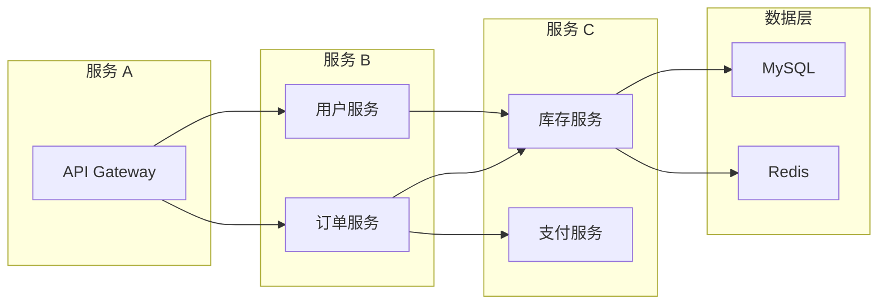
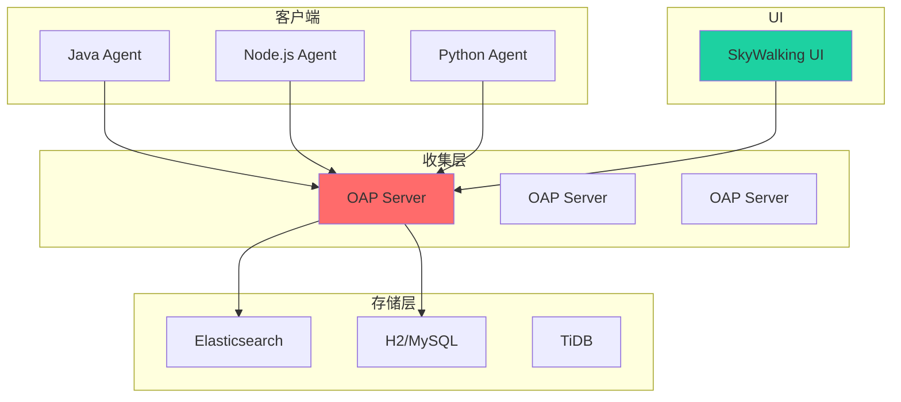
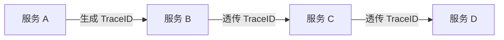

# SkyWalking / APM 集成

分布式系统的性能问题往往不是单点问题，而是涉及多个服务、多个组件的全链路问题。APM（Application Performance Monitoring）就是解决这个问题的工具。

## 分布式追踪的核心挑战

在分布式系统中，一个请求可能经过多个服务：



问题：
- 请求链路不透明
- 定位慢请求困难
- 无法了解跨服务依赖

## SkyWalking 架构



### 核心组件

- **Agent**：埋点采集器，无侵入或轻侵入
- **OAP（Observability Analysis Platform）**：后端分析平台
- **UI**：可视化界面

## 链路追踪原理

### TraceID 生成与传播



每个请求有一个唯一的 TraceID，通过 HTTP Header 或 RPC 上下文传播。

### Span 概念

```java
// Span 示例
Span span = tracer.startSpan("HTTP GET /api/user");

try {
    // 业务逻辑
    userService.getUser(id);
} finally {
    span.end();
}
```

Span 包含：
- **Operation Name**：操作名称
- **Start Time / End Time**：时间戳
- **Tags**：标签（如 HTTP URL、状态码）
- **Logs**：日志
- **References**：父子关系

### 数据模型

```java
// Trace -> Transaction
// Transaction -> Span (多个)
// Span -> Tag/Log (多个)

TraceID: "abc123"                          // 追踪 ID
SpanID: 1                                  // 跨度 ID
ParentSpanID: 0                            // 父跨度 ID
ServiceName: "order-service"               // 服务名
ServiceInstanceName: "order-service-1"      // 实例名
OperationName: "/api/order/create"         // 操作名
StartTime: 1704067200000                   // 开始时间
EndTime: 1704067200500                     // 结束时间
Duration: 500ms                            // 耗时
Tags: {http.status_code: 200}              // 标签
```

## SkyWalking 接入

### Java Agent 接入

```bash
# 下载 agent
wget https://archive.apache.org/dist/skywalking/9.5.0/apache-skywalking-apm-9.5.0.tar.gz

# 解压
tar -xzf apache-skywalking-apm-9.5.0.tar.gz

# 配置
export SW_AGENT_NAME=my-app
export SW_COLLECTOR_BACKEND_SERVICES=oap-server:11800

# 启动应用
java -javaagent:/path/to/skywalking-agent.jar \
     -jar my-app.jar
```

### Spring Boot 接入

```xml title="pom.xml"
<dependency>
    <groupId>org.apache.skywalking</groupId>
    <artifactId>apm-toolkit-trace</artifactId>
    <version>9.5.0</version>
</dependency>
```

```java title="手动埋点"
import org.apache.skywalking.apm.toolkit.trace.TraceContext;

public class OrderService {

    public Order createOrder(String userId) {
        // 获取 TraceID
        String traceId = TraceContext.traceId();

        // 自定义 tag
        TraceContext.tag("user.id", userId);

        // 自定义日志
        TraceContext.log("Creating order for user: " + userId);

        // 业务逻辑
        return orderDao.create(userId);
    }
}
```

## APM 选型对比

| 特性 | SkyWalking | Jaeger | Zipkin |
| --- | --- | --- | --- |
| 语言支持 | 多语言 | 多语言 | 多语言 |
| 存储 | ES/MySQL/TiDB | ES/Cassandra | ES/MySQL |
| UI | 完善 | 一般 | 一般 |
| 报警 | 支持 | 不支持 | 不支持 |
| 性能 | 高 | 中 | 中 |
| 社区 | 活跃 | 活跃 | 活跃 |
| 商业支持 | 有 | 无 | 无 |

## 链路追踪最佳实践

### 命名规范

```java
// 好的命名
span.setOperationName("HTTP GET /api/users/{id}");
span.setOperationName("MySQL: SELECT * FROM orders");

// 不好的命名
span.setOperationName("getUser");
span.setOperationName("query");
```

### 异步处理

```java
// 异步方法需要创建新的 Span
CompletableFuture.supplyAsync(() -> {
    Span span = tracer.createSpan("async-process");
    try {
        return process();
    } finally {
        span.end();
    }
});
```

### 采样策略

```java title="agent.config"
agent.sample_n_per_3_secs=100  # 每 3 秒采样 100 个
# 或
agent.sample_on_error=true     # 只在出错时采样
```

## 本章小结

APM 的核心价值：
- **全链路追踪**：从入口到出口的完整链路
- **性能分析**：定位慢请求的瓶颈
- **依赖分析**：服务之间的调用关系
- **报警**：性能指标异常时通知

SkyWalking 是功能完善的 APM 解决方案，适合中大型分布式系统。

## 延伸思考

APM 与链路追踪有什么区别？

APM（Application Performance Monitoring）是更大的概念，包括：
- 链路追踪（Distributed Tracing）
- 指标监控（Metrics）
- 日志聚合（Logging）
- 报警（Alerting）

链路追踪是 APM 的核心组件之一，但不是全部。完整的 APM 方案应该整合以上所有能力。
