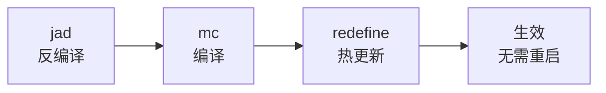

# Arthas 诊断工具实战

Arthas 是阿里巴巴开源的 Java 诊断工具，在线上问题排查中非常受欢迎——因为它不需要重启应用，不需要配置额外 agent，即连即用。

## 安装与启动

### 方式一：一键安装

```bash
# 下载并启动
curl -L https://arthas.aliyun.com/install.sh | sh

# 或手动下载
wget https://arthas.aliyun.com/arthas-boot.jar
java -jar arthas-boot.jar
```

### 方式二：IDEA 插件

在 IDEA 中安装 Arthas 插件，右键点击类方法即可生成 Arthas 命令。

## 核心命令

### dashboard：系统全局状态

```bash
# 查看系统整体状态
dashboard

# 输出
┌─────────────────────────────┬──────────────────┬──────────────────┐
│         Threads            │      Memory      │       GC         │
├─────────────────────────────┼──────────────────┼──────────────────┤
│  Name          State  CPU  │ Heap     512MB   │ GC次数  120      │
│  http-nio-8080 RUNNABLE 45%│ Used     200MB   │ GC时间  3.5s     │
│  pool-1-thread-1 WAITING   │ Free     312MB   │ FGC      2       │
└─────────────────────────────┴──────────────────┴──────────────────┘
```

### thread：线程分析

```bash
# 查看所有线程
thread

# 查看 CPU 占用最高的线程
thread -n 5

# 查看指定线程
thread 123

# 查看阻塞的线程
thread -b
```

### trace：方法调用链路追踪

```bash
# 追踪方法调用
trace com.example.Service processOrder

# 追踪并过滤
trace com.example.Service processOrder '#cost > 100'

# 追踪多次调用
trace com.example.Service processOrder -n 5
```

```java
// 示例输出
`---[0.123ms] com.example.Service:processOrder()
    +---[0.045ms] com.example.DAO:queryUser()
    +---[0.032ms] com.example.DAO:queryOrder()
    +---[0.015ms] com.example.Cache:get()
    `---[0.008ms] com.example.Service:formatResponse()
```

### watch：方法入参/返回值观察

```bash
# 观察方法入参和返回值
watch com.example.Service processOrder '{params, returnObj}'

# 只观察入参
watch com.example.Service processOrder '{params}'

# 观察异常
watch com.example.Service processOrder '{params, throwExp}'

# 带条件观察
watch com.example.Service processOrder '{params}' 'params[0] == "order123"'
```

### stack：方法调用路径

```bash
# 查看方法被调用的路径
stack com.example.Service processOrder

# 带条件
stack com.example.Service processOrder '#cost > 10'
```

## 热修复能力

### jad：在线反编译

```bash
# 反编译类
jad com.example.Service

# 反编译指定方法
jad com.example.Service processOrder
```

### mc：内存编译器

```bash
# 编译 Java 文件
mc /tmp/Service.java -d /tmp
```

### redefine：热更新

```bash
# 热更新类（不重启）
redefine /tmp/Service.class
```



### 热更新限制

热更新有以下限制：
- 不支持修改类结构（字段、方法）
- 不支持新增方法
- 不支持删除方法
- 只能修改方法体

## 实战案例

### 案例一：定位慢查询

```bash
# 追踪数据库操作
trace com.example.dao.* '{params, returnObj}' '#cost > 10'

# 查看具体调用
trace com.example.dao.OrderDAO queryById -n 5
```

### 案例二：排查内存问题

```bash
# 查看对象大小
sc -d com.example.Order

# 查看对象实例
sm -d com.example.Order

# 导出 Heap Dump
heapdump /tmp/heap.hprof
```

### 案例三：排查死锁

```bash
# 查看死锁
thread -b

# 输出
Found 1 deadlock:
"pool-1-thread-1" Id=45 BLOCKED on java.lang.Object@7a123456
    owned by "pool-1-thread-2" Id=46
```

## 常用命令速查

| 命令 | 功能 |
| --- | --- |
| `dashboard` | 系统全局状态 |
| `thread` | 线程分析 |
| `trace` | 方法调用链路追踪 |
| `watch` | 观察方法入参/返回值 |
| `stack` | 查看方法调用路径 |
| `monitor` | 统计方法调用 |
| `jad` | 反编译 |
| `mc` | 内存编译 |
| `redefine` | 热更新 |
| `profiler` | 生成火焰图 |
| `heapdump` | 导出 Heap Dump |
| `sysprop` | 查看/修改系统属性 |

## 与其他工具对比

| 工具 | 优势 | 劣势 |
| --- | --- | --- |
| Arthas | 线上诊断、热修复 | 功能相对有限 |
| JProfiler | 功能全面 | 需要重启 |
| async-profiler | 火焰图 | 命令行 |
| JMC/JFR | 低开销 | 数据分析 |

## 本章小结

Arthas 的核心命令：
- **dashboard**：系统全局状态
- **thread**：线程分析
- **trace**：方法调用链路追踪
- **watch**：方法入参/返回值观察
- **jad/mc/redefine**：热修复能力

Arthas 是线上问题排查的利器，熟练掌握可以大大提升诊断效率。

## 延伸思考

Arthas 热修复能替代正常发布吗？

不能。热修复有以下限制：
1. 不能修改类结构
2. 可能导致内存中类不一致
3. 不支持新增/删除方法

热修复只能用于紧急修复，不应作为常规发布手段。修复后仍需正常发布流程。
