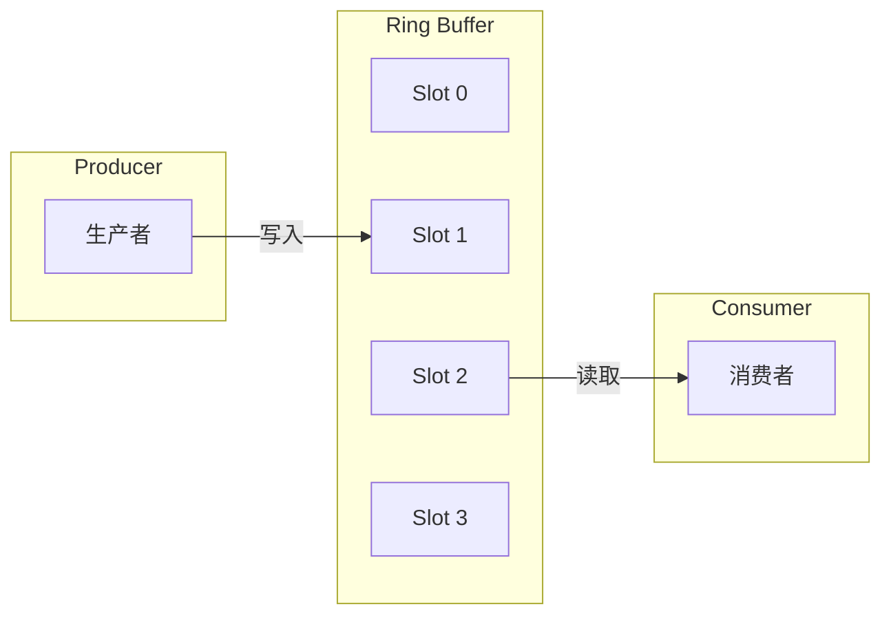
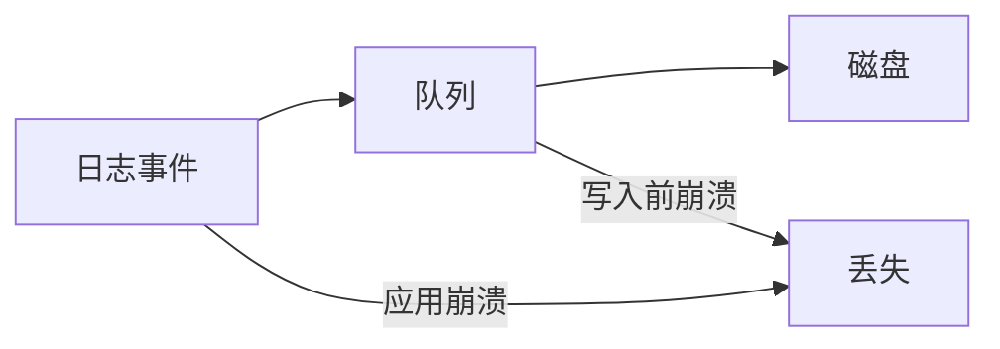

# 异步日志原理

日志是性能问题的高发区。同步日志写入会阻塞业务线程，在高并发场景下，一次磁盘 IO 可能导致数百毫秒的延迟。

## 同步日志的代价


同步日志的核心问题是**磁盘 IO 的不确定性**：
- 普通 HDD 的随机写入延迟在 1-10ms
- SSD 可能只需要 0.1-0.5ms
- 在高负载时，OS 的 Page Cache 可能被占满，导致写操作排队

## 异步日志架构

异步日志的核心思想是将日志写入与业务线程解耦：


业务线程只需要将日志事件放入队列，立即返回；日志线程在后台批量处理。

## 队列的设计

### 有界队列 vs 无界队列

**有界队列**：
- 队列满时，日志会被丢弃或降级为同步
- 避免内存无限增长

**无界队列**：
- 可以无限增长
- 可能导致 OOM

```java title="有界队列示例"
public class BoundedQueue<E> {
    private final Object[] buffer;
    private final int capacity;
    private int head = 0;
    private int tail = 0;
    private int size = 0;

    public boolean offer(E element) {
        if (size >= capacity) {
            return false;  // 队列满，拒绝
        }
        buffer[tail] = element;
        tail = (tail + 1) % capacity;
        size++;
        return true;
    }
}
```

### Disruptor：无锁队列

Disruptor 是高性能的无锁队列，被 Log4j2 异步日志采用：



Disruptor 的关键优化：
- **环形缓冲区**：预分配内存，无 GC
- **缓存行填充**：避免伪共享
- **无锁写入**：利用 CAS 操作

## Log4j2 异步日志

### 配置 AsyncAppender

```xml title="log4j2.xml"
<?xml version="1.0" encoding="UTF-8"?>
<Configuration status="WARN">
    <Appenders>
        <Console name="Console" target="SYSTEM_OUT">
            <PatternLayout pattern="%d{HH:mm:ss.SSS} [%t] %-5level %logger{36} - %msg%n"/>
        </Console>

        <Async name="AsyncAppender">
            <AppenderRef ref="Console"/>
            <bufferSize>8192</bufferSize>
            <includeLocation>true</includeLocation>
        </Async>
    </Appenders>

    <Loggers>
        <Root level="info">
            <AppenderRef ref="AsyncAppender"/>
        </Root>
    </Loggers>
</Configuration>
```

### 配置 AsyncLogger

```xml title="log4j2-async.xml"
<?xml version="1.0" encoding="UTF-8"?>
<Configuration status="WARN">
    <Loggers>
        <!-- 异步 Logger -->
        <Logger name="com.example" level="info" additivity="false">
            <AppenderRef ref="Console"/>
        </Logger>

        <Root level="info">
            <AppenderRef ref="Console"/>
        </Root>
    </Loggers>
</Configuration>
```

### Disruptor 配置

```properties title="log4j2.component.properties"
# Disruptor 配置
log4j2.asyncLogger.ringBufferSize=262144
log4j2.asyncLogger.waitStrategy=YieldingWaitStrategy
```

## 异步日志的关键问题

### 问题一：队列满了怎么办？

```java
// 策略一：丢弃日志
if (queue.offer(logEvent)) {
    return;  // 入队成功
}
// 队列满，丢弃日志

// 策略二：阻塞
queue.put(logEvent);  // 队列满则阻塞

// 策略三：降级为同步
synchronousAppender.append(logEvent);
```

Log4j2 默认使用 `BlockingWaitStrategy`，队列满时阻塞。

### 问题二：应用崩溃时日志丢失

异步日志在队列中，尚未写入磁盘。如果应用崩溃，这些日志会丢失：



**解决方案**：
- 使用 `log4j2.AsyncAppender` 的 `immediateFlush` 属性
- 或者接受一定程度的日志丢失（大多数场景可接受）

### 问题三：日志顺序

异步日志不保证顺序。如果需要严格顺序，应该使用同步日志。

## 性能对比

| 配置 | 吞吐量 | 延迟 | 日志丢失风险 |
| --- | --- | --- | --- |
| 同步日志 | ~10,000/秒 | 1-10ms | 无 |
| Log4j2 异步 | ~500,000/秒 | < 1us | 队列满时丢弃 |

```java title="基准测试"
@Benchmark
@BenchmarkMode(Mode.Throughput)
@OutputTimeUnit(TimeUnit.SECONDS)
public void syncLogging() {
    logger.info("Operation completed: userId={}, orderId={}", 12345, "ORDER-001");
}

@Benchmark
@BenchmarkMode(Mode.Throughput)
@OutputTimeUnit(TimeUnit.SECONDS)
public void asyncLogging() {
    asyncLogger.info("Operation completed: userId={}, orderId={}", 12345, "ORDER-001");
}
```

## 本章小结

异步日志的核心设计：
- **队列**：使用 Ring Buffer 或 Disruptor
- **批量写入**：减少磁盘 IO 次数
- **后台线程**：独立处理日志写入

关键配置：
- 队列大小（bufferSize）
- 等待策略（WaitStrategy）
- 队列满时的策略

## 延伸思考

异步日志的队列大小如何设置？

队列太大会导致：
- 内存占用高
- 应用崩溃时日志丢失多

队列太大会导致：
- 频繁阻塞
- 吞吐量下降

建议：
- 根据日志量和内存预算设置
- 监控队列使用率
- 设置合理的丢弃策略
