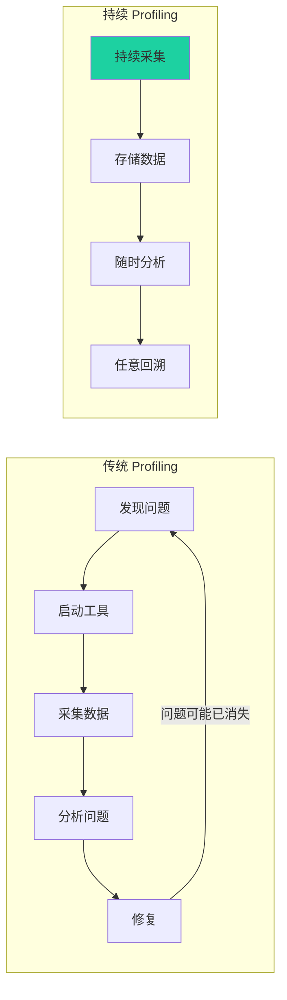
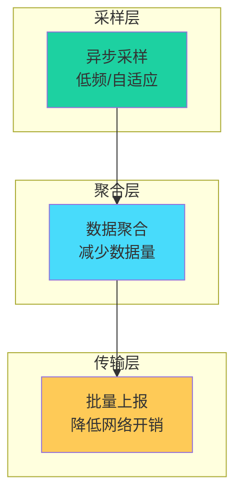
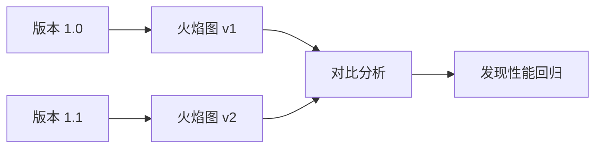
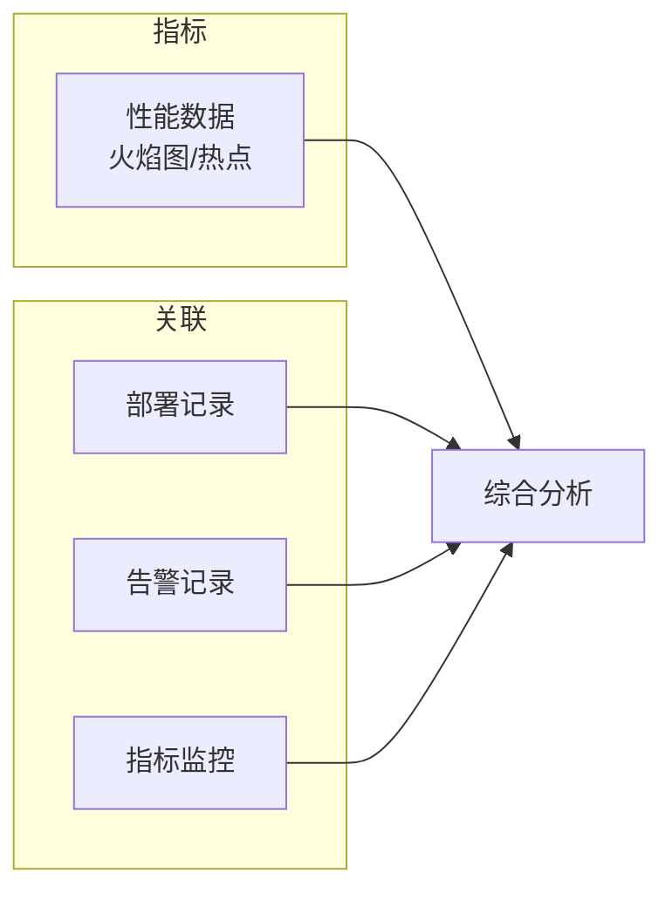

# 持续性能分析

传统性能剖析是「按需」进行的：发现问题 → 启动工具 → 采集数据 → 分析问题。但这种方式有几个问题：

- 问题往往在工具启动前就消失了
- 只能看到「此时此刻」，看不到历史趋势
- 需要人工介入，无法自动化告警

**持续性能分析（Continuous Profiling）**解决了这些问题：它像监控一样持续运行，自动采集性能数据，存储历史数据，支持任意时间范围的分析。

## 什么是持续性能分析



## 持续 Profiling vs 按需 Profiling

| 特性 | 传统 Profiling | 持续 Profiling |
| --- | --- | --- |
| 采集时机 | 按需启动 | 持续运行 |
| 历史数据 | 无 | 有（可回溯） |
| 问题复现 | 难 | 简单（随时回放） |
| 自动化告警 | 难 | 容易 |
| 开销 | 高（采样集中） | 低（采样分散） |
| 成本 | 低 | 高（存储成本） |

## 生产环境安全 Profiling

持续 Profiling 的关键是**低开销**，否则会影响生产环境。

### 低开销设计



关键设计：
- **异步采样**：不阻塞业务线程
- **低采样频率**：通常每秒 10-100 次
- **数据聚合**：减少存储和传输
- **尾部采样**：优先保留慢请求

### 开销控制

| 指标 | 目标值 |
| --- | --- |
| CPU 开销 | `< 2%` |
| 内存开销 | `< 5MB` |
| 网络开销 | `< 1Mbps` |

## 工具对比

| 工具 | 特点 | 部署方式 | 开销 |
| --- | --- | --- | --- |
| Pyroscope | 开源、存储成本低 | 自托管 | < 2% |
| Polar Signals | 托管服务、零运维 | SaaS | < 2% |
| Grafana Beyla | eBPF 驱动、零代码侵入 | K8s 部署 | < 1% |
| AWS CodeGuru | 云服务、ML 驱动 | AWS 原生 | < 5% |
| Datadog | APM 集成、商业 | SaaS | < 5% |

## 持续 Profiling 的价值

### 价值一：任意回溯

```java
// 场景：三天前的问题，今天才发现
// 传统方式：无法复现
// 持续 Profiling：可以查看当时的火焰图

// 选择任意时间段
startTime: 2024-01-01 02:00:00
endTime: 2024-01-01 02:05:00

// 自动生成该时段的火焰图
```

### 价值二：性能回归检测



### 价值三：关联分析



## 本章小结

持续性能分析的核心特点：
- **持续运行**：像监控一样 7x24
- **低开销**：< 2% CPU 开销
- **历史回溯**：任意时间段分析
- **自动化**：无需人工介入

代表工具：Pyroscope、Polar Signals、Grafana Beyla。

## 延伸思考

持续 Profiling 的存储成本如何控制？

主要策略：
1. **数据聚合**：按时间窗口聚合
2. **尾部采样**：只保留慢请求的完整数据
3. **压缩**：使用高效的压缩算法
4. **分层存储**：热数据用 SSD，冷数据用 HDD
