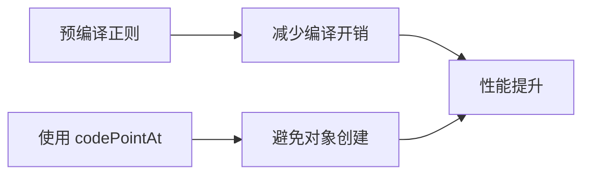
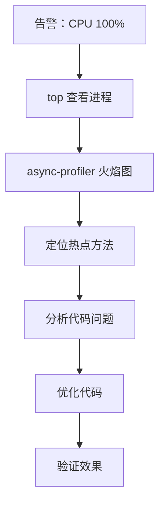

# 性能优化案例：CPU 飙升排查

监控系统告警：服务器 CPU 使用率突然飙升至 100%，持续 5 分钟。应用响应变慢，用户开始投诉。

## 问题背景

服务器状态：
- CPU：100%（正常 30-40%）
- 内存：正常
- GC：正常
- QPS：正常（略低）

## 排查步骤

### 第一步：确认 CPU 热点

```bash
# 使用 top 查看 CPU 占用
top -Hp <pid>

# 输出
PID USER      PR  NI  VIRT  RES  SHR S %CPU %MEM    TIME+  COMMAND
1234 java     20   0  8.0g  2.5g  0   R 95.6  15.6   5:23.45 java

# 确认是 Java 进程导致的
```

### 第二步：生成火焰图

```bash
# 使用 async-profiler 生成 CPU 火焰图
./async-profiler.sh start -d 30 -f /tmp/cpu.html -e cpu <pid>

# 等待 30 秒后，生成火焰图
```

### 第三步：分析火焰图

打开 `cpu.html`，火焰图显示：

```
java/lang/String.charAt()                    ████████████████  25%
  -> com/example/TextProcessor.process()     ██████████████    22%
    -> com/example/TextProcessor.format()    ████████████      18%

java/util/regex/Pattern.matcher()           ████████          12%
  -> com/example/Validator.validate()        ██████            10%

com/fasterxml/jackson/core/JsonGenerator     ██████            8%
```

问题定位到 `TextProcessor.process()` 方法。

### 第四步：查看代码

```java title="TextProcessor.java"
public class TextProcessor {

    public String process(String text) {
        String result = text;

        // 循环中每次都调用 charAt
        for (int i = 0; i < text.length(); i++) {
            char c = result.charAt(i);  // 每次都创建 Character 对象

            // 正则每次都编译
            if (result.matches(".*特殊字符.*")) {
                result = result.replace("特殊字符", "");
            }
        }

        return result;
    }
}
```

### 根因分析

1. **循环中调用 `charAt`**：每次调用可能创建 Character 对象
2. **正则每次编译**：`matches()` 每次都编译正则

## 修复方案

```java title="TextProcessor.java"
public class TextProcessor {

    // 预编译正则
    private static final Pattern SPECIAL_CHARS =
        Pattern.compile(".*特殊字符.*");

    public String process(String text) {
        String result = text;

        // 使用 codePointAt 代替 charAt，避免 Character 创建
        for (int i = 0; i < result.length(); ) {
            int codePoint = result.codePointAt(i);  // 返回 int，不创建对象
            // 处理 codePoint...
            i += Character.charCount(codePoint);
        }

        // 使用预编译的正则
        if (SPECIAL_CHARS.matcher(result).matches()) {
            result = result.replace("特殊字符", "");
        }

        return result;
    }
}
```

## 修复效果

| 指标 | 修复前 | 修复后 |
| --- | --- | --- |
| CPU 使用率 | 100% | 35% |
| 接口响应时间 | 500ms | 50ms |
| CPU 时间分布 | charAt 25% | 1% |

## 问题总结

### 问题根因

1. **`charAt()` 在循环中调用**：虽然 charAt 本身很快，但结合业务逻辑可能成为瓶颈
2. **`Pattern.matches()` 每次编译**：正则编译开销很大

### 优化策略



## 排查流程总结



## 经验总结

### 教训一：正则要预编译

```java
// 错误
if (str.matches("\\d{4}-\\d{2}-\\d{2}")) { }

// 正确
private static final Pattern DATE_PATTERN =
    Pattern.compile("\\d{4}-\\d{2}-\\d{2}");

if (DATE_PATTERN.matcher(str).matches()) { }
```

### 教训二：字符串操作要小心

字符串操作是 CPU 热点的高发区：
- `+` 拼接 vs StringBuilder
- `split()` vs StringTokenizer
- `replace()` vs replaceAll

### 教训三：火焰图是 CPU 优化的利器

火焰图可以直观展示 CPU 时间的分布：
- 宽度 = CPU 时间占比
- 尖顶 = 真正的热点

## 本章小结

CPU 飙升排查的标准流程：
1. **top 查看进程**：确认是 Java 进程
2. **火焰图分析**：定位热点方法
3. **代码分析**：找到性能问题
4. **优化代码**：针对性优化
5. **验证效果**：确认优化有效

## 延伸思考

为什么 charAt 会成为热点？

`charAt()` 本身很快，但结合以下情况会成为热点：
1. **循环中调用**：高频调用放大影响
2. **与其他慢操作混合**：木桶效应
3. **热点数据特性**：长字符串影响更大

优化时应该用 `profiling` 确认瓶颈，而不是凭感觉优化。
