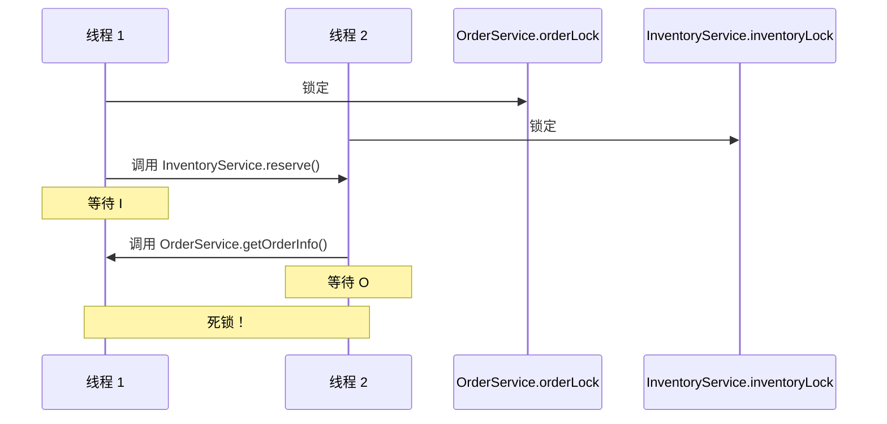
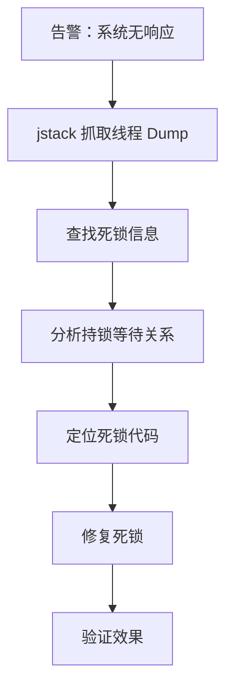

# 性能优化案例：线程死锁排查

监控系统告警：应用完全无响应，所有接口超时。服务彻底卡死。

## 问题背景

症状：
- 所有接口无响应
- 日志停止输出
- CPU 使用率正常
- 内存使用正常

这是典型的死锁症状：线程之间相互等待，导致系统完全卡住。

## 排查步骤

### 第一步：抓取线程 Dump

```bash
# 抓取线程 dump
jstack <pid> > thread_dump.txt

# 查看输出
cat thread_dump.txt
```

### 第二步：分析线程 Dump

```java title="thread_dump.txt 关键部分"
"pool-1-thread-1" #45 prio=5 os_prio=0 tid=0x00007f8d12345678 nid=0x1234 waiting for monitor entry [0x00007f8d56789000]
   java.lang.Thread.State: BLOCKED (on object monitor)
    at com.example.OrderService.process(OrderService.java:45)
    - waiting to lock <0x0000000789abcdef> (a java.lang.Object)
    - locked <0x0000000789abcdee> (a java.lang.Object)
    at com.example.OrderService$$EnhancerBySpringCGLIB$$12345678.process()

"pool-1-thread-2" #46 prio=5 os_prio=0 tid=0x00007f8d12345679 nid=0x1235 waiting for monitor entry [0x00007f8d56789001]
   java.lang.Thread.State: BLOCKED (on object monitor)
    at com.example.InventoryService.reserve(InventoryService.java:67)
    - waiting to lock <0x0000000789abcdee> (a java.lang.Object)
    - locked <0x0000000789abcdef> (a java.lang.Object)
    at com.example.InventoryService$$EnhancerBySpringCGLIB$$98765432.reserve()
```

### 第三步：识别死锁

JVM 会自动检测死锁：

```
Found one Java-level deadlock:
=========================

"pool-1-thread-1":
  waiting to lock monitor 0x00007f8d23456789 (Object@0x0000000789abcdef),
  which is held by "pool-1-thread-2"

"pool-1-thread-2":
  waiting to lock monitor 0x00007f8d23456790 (Object@0x0000000789abcdee),
  which is held by "pool-1-thread-1"

Java stack information for the threads listed above:
==================================================
```

### 第四步：分析代码

```java title="OrderService.java"
public class OrderService {

    private final Object orderLock = new Object();  // Lock A
    private final InventoryService inventoryService;

    public Order process(Order order) {
        synchronized (orderLock) {  // 先锁 A
            // 处理订单
            inventoryService.reserve(order.getItems());  // 调用 InventoryService
        }
    }
}
```

```java title="InventoryService.java"
public class InventoryService {

    private final Object inventoryLock = new Object();  // Lock B
    private final OrderService orderService;

    public void reserve(List<Item> items) {
        synchronized (inventoryLock) {  // 先锁 B
            // 扣减库存
            orderService.getOrderInfo(...);  // 调用 OrderService
        }
    }
}
```

## 根因分析



死锁条件：
1. **互斥**：Lock A 和 Lock B 只能被一个线程持有
2. **持有并等待**：线程持有 Lock A，等待 Lock B
3. **不可抢占**：Lock 不能被强制释放
4. **循环等待**：线程 1 等线程 2，线程 2 等线程 1

## 修复方案

### 方案一：统一加锁顺序

```java title="OrderService.java"
public class OrderService {

    private final Object orderLock = new Object();

    public Order process(Order order) {
        // 先锁自己的锁
        synchronized (orderLock) {
            // 再调用其他服务（此时已经持有锁，不会死锁）
            // 因为其他服务获取锁时会检查是否已持有
        }
    }
}
```

```java title="InventoryService.java"
public class InventoryService {

    private final Object inventoryLock = new Object();

    public void reserve(List<Item> items) {
        // 如果需要调用 OrderService，也要先持有自己的锁
        // 但此时 OrderService 已经持有 orderLock，不会死锁
        synchronized (inventoryLock) {
            // 扣减库存
        }
    }
}
```

### 方案二：使用 ReentrantLock

```java title="使用 ReentrantLock"
public class OrderService {

    private final ReentrantLock lock = new ReentrantLock();

    public Order process(Order order) {
        lock.lock();
        try {
            // 业务逻辑
            inventoryService.reserve(order.getItems());
        } finally {
            lock.unlock();
        }
    }
}
```

### 方案三：避免嵌套调用

```java title="服务拆分"
public class OrderService {

    public Order process(Order order) {
        // 业务逻辑（不持有锁）
        OrderContext context = createContext(order);

        // 调用其他服务时只传数据，不传控制权
        inventoryService.reserve(context.getItems());
    }
}

public class InventoryService {

    public void reserve(List<Item> items) {
        // 独立的业务逻辑
    }
}
```

## 修复效果

修复后的线程状态：
```
"pool-1-thread-1" #45 prio=5 os_prio=0 tid=0x00007f8d12345678 runnable
   java.lang.Thread.State: RUNNABLE
    at com.example.OrderService.process(OrderService.java:45)
    - locked <0x0000000789abcdef> (a java.lang.Object)

"pool-1-thread-2" #46 prio=5 os_prio=0 tid=0x00007f8d12345679 runnable
   java.lang.Thread.State: RUNNABLE
    - locked <0x0000000789abcdee> (a java.lang.Object)
```

系统恢复正常响应。

## 排查流程总结



## 死锁预防策略

### 策略一：固定加锁顺序

如果多个锁必须同时持有，按固定顺序加锁。

```java title="固定顺序"
public void doSomething() {
    // 固定顺序：先 A 后 B
    synchronized (lockA) {
        synchronized (lockB) {
            // 业务逻辑
        }
    }
}
```

### 策略二：使用 tryLock

```java title="tryLock 避免死锁"
ReentrantLock lockA = new ReentrantLock();
ReentrantLock lockB = new ReentrantLock();

public void doSomething() {
    while (true) {
        if (lockA.tryLock()) {
            try {
                if (lockB.tryLock()) {
                    try {
                        // 业务逻辑
                        break;
                    } finally {
                        lockB.unlock();
                    }
                }
            } finally {
                lockA.unlock();
            }
        }
        // 等待一段时间后重试
        Thread.sleep(10);
    }
}
```

### 策略三：减少锁粒度

```java title="分拆锁"]
// 错误：一个锁保护多个资源
class BadService {
    private final Object lock = new Object();
    private List<A> listA;
    private List<B> listB;

    public void addA(A a) {
        synchronized (lock) { listA.add(a); }
    }

    public void addB(B b) {
        synchronized (lock) { listB.add(b); }
    }
}

// 正确：每个资源一个锁
class GoodService {
    private final Object lockA = new Object();
    private final Object lockB = new Object();
    private List<A> listA;
    private List<B> listB;

    public void addA(A a) {
        synchronized (lockA) { listA.add(a); }
    }

    public void addB(B b) {
        synchronized (lockB) { listB.add(b); }
    }
}
```

## 经验总结

### 教训一：避免嵌套锁

服务调用链中尽量避免持有锁时调用其他服务。如果必须调用，确保加锁顺序一致。

### 教训二：使用工具检测死锁

JVM 自动检测死锁：
```java
// JMX 检测
ThreadMXBean threadMX = ManagementFactory.getThreadMXBean();
long[] deadlocks = threadMX.findDeadlockedThreads();
```

### 教训三：超时设置

```java
// tryLock 设置超时
if (lock.tryLock(1, TimeUnit.SECONDS)) {
    try {
        // 业务逻辑
    } finally {
        lock.unlock();
    }
} else {
    // 处理获取锁失败
}
```

## 本章小结

死锁排查的标准流程：
1. **症状识别**：系统无响应，日志停止
2. **jstack 抓取**：查看线程 Dump
3. **查找死锁信息**：JVM 自动检测死锁
4. **分析持锁等待**：理解死锁形成原因
5. **修复代码**：统一加锁顺序或避免嵌套锁
6. **验证效果**：确认系统恢复正常

## 延伸思考

为什么死锁会导致系统完全卡住？

因为线程池的线程数量是有限的。如果所有线程都死锁了，线程池就没有可用线程，新的请求无法处理，系统就完全无响应了。

这就是为什么死锁比一般的性能问题更严重：它不是"变慢"，而是"完全不可用"。
