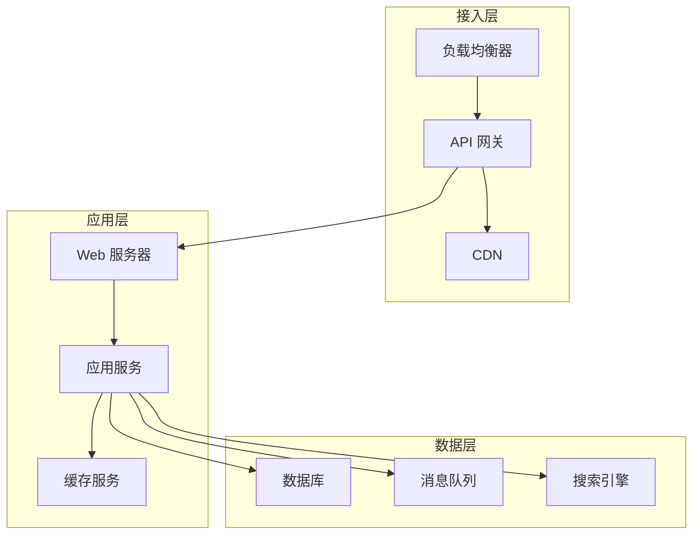

# 全链路性能优化方法论

性能优化不是头痛医头、脚痛医脚。它需要系统性的思维，从全局视角分析问题，找到真正的瓶颈，然后有针对性地优化。

## 性能优化的三层架构



### 接入层优化

- **负载均衡**：选择合适的负载均衡算法
- **连接复用**：HTTP Keep-Alive、连接池
- **压缩传输**：Gzip、Brotli
- **HTTPS 优化**：TLS 握手优化

### 应用层优化

- **缓存策略**：多级缓存、缓存穿透/击穿/雪崩
- **异步处理**：消息队列、异步框架
- **并发处理**：线程池、协程
- **代码优化**：算法、数据结构、资源复用

### 数据层优化

- **数据库优化**：索引、SQL 优化、分库分表
- **缓存优化**：Redis 集群、缓存策略
- **查询优化**：读写分离、ES 搜索

## 性能优化的顺序

性能优化必须遵循一定顺序，避免做无用功。

### 第一步：找瓶颈

先用监控和 profiling 工具找到真正的瓶颈。


常见的瓶颈类型：
- **CPU 瓶颈**：热点代码占用大量 CPU
- **内存瓶颈**：内存泄漏、GC 频繁
- **I/O 瓶颈**：磁盘/网络 I/O 等待
- **锁瓶颈**：锁竞争、线程阻塞

### 第二步：评估收益

优化前评估预期收益，避免优化收益低的地方。

| 优化点 | 预期收益 | 投入成本 | 优先级 |
| --- | --- | --- | --- |
| 热点代码优化 | 50% 提升 | 中 | 高 |
| 缓存优化 | 80% 提升 | 高 | 高 |
| GC 优化 | 30% 提升 | 中 | 中 |
| 日志优化 | 10% 提升 | 低 | 低 |

### 第三步：实施优化

有针对性地实施优化，避免全面重构。

```java
// 优化前：全面重构
// 耗时：2 周
// 风险：高
// 不推荐

// 优化后：针对性优化
// 耗时：2 天
// 风险：低
// 推荐
```

### 第四步：验证效果

优化后必须验证效果，确认问题已解决。

```bash
# 性能测试
ab -n 10000 -c 100 http://api.example.com/

# 对比优化前后的指标
```

## 性能优化 Checklist

### 接入层

- [ ] CDN 静态资源加速
- [ ] HTTP/2 或 HTTP/3 支持
- [ ] TLS 握手优化
- [ ] 负载均衡算法选择
- [ ] 连接复用配置

### 应用层

- [ ] 多级缓存（本地 + Redis）
- [ ] 缓存穿透防护（布隆过滤器）
- [ ] 热点数据预加载
- [ ] 异步处理（消息队列）
- [ ] 线程池合理配置
- [ ] HTTP 连接池配置
- [ ] 日志异步化

### 数据层

- [ ] 数据库索引优化
- [ ] SQL 语句优化
- [ ] 读写分离
- [ ] 分库分表
- [ ] Redis 集群
- [ ] 消息队列削峰

### 监控

- [ ] 基础指标监控（CPU/内存/磁盘）
- [ ] 应用指标监控（QPS/延迟/错误率）
- [ ] 链路追踪
- [ ] 日志聚合
- [ ] 告警配置

## 性能优化成果量化

优化成果必须量化，才能证明优化价值。

### 量化指标

| 指标 | 优化前 | 优化后 | 提升 |
| --- | --- | --- | --- |
| QPS | 1000 | 5000 | 5x |
| P99 延迟 | 500ms | 50ms | 10x |
| CPU 使用率 | 90% | 40% | 减少 56% |
| 内存使用 | 8GB | 4GB | 减少 50% |
| 成本 | 10 万/月 | 6 万/月 | 减少 40% |

### 汇报模板

```
性能优化报告
====================

问题描述
--------
某接口 P99 延迟 500ms，用户体验差。

优化前数据
----------
- QPS: 1000
- P50: 100ms
- P99: 500ms
- CPU: 90%

根因分析
--------
通过火焰图分析，发现热点在 JSON 序列化。

优化方案
--------
1. 使用 Kryo 替代 Jackson（序列化性能提升 3x）
2. 使用 ProtoBuffer 替代 JSON（序列化体积减少 50%）

优化后数据
----------
- QPS: 3000
- P50: 30ms
- P99: 50ms
- CPU: 45%

优化收益
--------
- P99 延迟降低 90%
- QPS 提升 3x
- CPU 降低 50%
```

## 常见优化模式

### 模式一：缓存为王

```
减少计算 -> 减少 I/O -> 减少延迟
```

- 多级缓存：本地缓存 + Redis + 数据库
- 缓存更新策略：Cache Aside / Read Through / Write Through

### 模式二：异步优先

```
同步阻塞 -> 异步非阻塞 -> 提高吞吐
```

- 消息队列削峰
- 异步日志
- 异步 HTTP 调用

### 模式三：批量处理

```
逐条处理 -> 批量处理 -> 减少开销
```

- 批量写入数据库
- 批量发送消息
- 批量 API 调用

### 模式四：空间换时间

```
重复计算 -> 结果缓存 -> 减少计算
```

- 热点数据缓存
- 计算结果预聚合
- 索引表

## 本章小结

全链路性能优化的核心要点：
- **分层架构**：接入层、应用层、数据层
- **顺序优化**：先找瓶颈，再评估收益，最后实施
- **量化成果**：用数据证明优化价值
- **监控保障**：持续监控，防止回归

## 延伸思考

什么时候不应该做性能优化？

性能优化是有成本的，应该在必要的时候才做：

1. **性能满足需求时**：如果当前性能已经满足业务需求，不需要优化
2. **优化成本过高时**：如果优化成本大于收益，不需要优化
3. **业务快速迭代期**：业务还在探索期，重点是快速验证，不需要过早优化
4. **系统即将重构时**：如果计划对系统进行重构，可以延后优化

记住：**过早优化是万恶之源**。先让系统跑起来，再在必要的时候进行针对性的优化。
