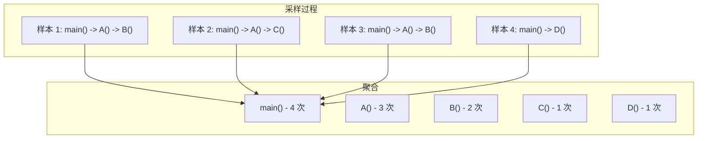
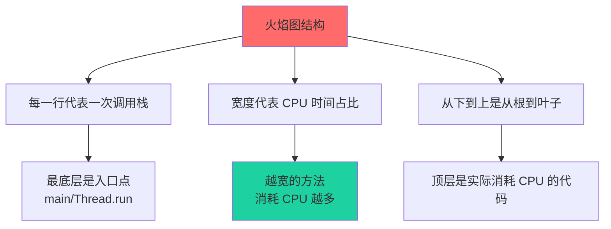

# CPU Profiling 火焰图

火焰图（Flame Graph）是 Brendan Gregg 发明的一种可视化方法，能直观展示 CPU 时间的分布。它已经成为性能分析领域的标准工具。

## 火焰图原理

火焰图基于采样剖析。每次采样时，记录当前线程的调用栈。重复数千次后，统计每个调用栈出现的次数。



## 如何读懂火焰图

火焰图的核心解读原则：



1. **从下往上看**：最底层是调用入口，往上是被调用的方法
2. **从宽往窄看**：越宽的方框表示该方法消耗的 CPU 时间越多
3. **从尖顶往下钻**：顶层往往是真正的热点

## 火焰图类型

### On-CPU 火焰图

展示 CPU 正在执行代码的时间。

```bash
# 使用 async-profiler 生成 On-CPU 火焰图
./async-profiler.sh start -d 30 -f profile.html -e cpu <pid>
```

### Off-CPU 火焰图

展示 CPU 在等待 I/O、锁、GC 等的时间。

```bash
# 生成 Off-CPU 火焰图
./async-profiler.sh start -d 30 -f profile.html -e wall -i 1000000 <pid>
```

### Memory 火焰图

展示内存分配热点的火焰图。

```bash
# 生成内存分配火焰图
./async-profiler.sh start -d 30 -f alloc.html -e alloc <pid>
```

### Lock 火焰图

展示锁竞争的火焰图。

```bash
# 生成锁竞争火焰图
./async-profiler.sh start -d 30 -f lock.html -e lock <pid>
```

## async-profiler 使用

async-profiler 是 Java 性能剖析的利器，支持生成多种火焰图。

### 安装

```bash
# 下载
wget https://github.com/jvm-profiling-tools/async-profiler/releases/download/v2.9/async-profiler-2.9-linux-x64.tar.gz

# 解压
tar -xzf async-profiler-2.9-linux-x64.tar.gz
```

### 基本使用

```bash title="CPU 火焰图"
# 30 秒 CPU 采样
./profiler.sh -d 30 -f /tmp/profile.html <pid>

# 使用浏览器打开
firefox /tmp/profile.html
```

### 常用选项

| 选项 | 说明 |
| --- | --- |
| `-d <seconds>` | 采样时长 |
| `-e <event>` | 采样事件（cpu/alloc/lock/wall） |
| `-f <file>` | 输出文件（html/svg） |
| `-b <buffer>` | 采样缓冲区大小 |
| `-i <interval>` | 采样间隔（纳秒） |

### 生成对比火焰图

```bash
# 优化前
./profiler.sh -d 60 -f before.html <pid>

# 优化后
./profiler.sh -d 60 -f after.html <pid>

# 使用 flamegraph.pl 合并对比
./FlameGraph/flamegraph.pl --diff before.svg after.svg > diff.svg
```

## 火焰图实战解读

### 典型问题：序列化占用大量 CPU

```
java/util/ArrayList.writeObject
  -> com/example/OrderService.serialize
    -> com/fasterxml/jackson/core/JsonGenerator.writeNumber
      -> com/fasterxml/jackson/core.json.UTF8JsonGenerator.writeRaw
```

找到序列化热点后，可以考虑：
- 减少序列化对象的大小
- 使用更快的序列化库（Kryo/Protobuf）
- 避免不必要的序列化

### 典型问题：正则表达式慢

```
java/lang/String.matches
  -> java/util/regex/Pattern$PatternMatcher.match
    -> java/util/regex/Pattern$BmpMatcher.match0
```

正则表达式每次调用都需要编译。解决方案是预编译正则：

```java
// 错误：每次调用都编译
if (str.matches("\\d{4}-\\d{2}-\\d{2}")) { ... }

// 正确：预编译
private static final Pattern DATE_PATTERN = Pattern.compile("\\d{4}-\\d{2}-\\d{2}");

if (DATE_PATTERN.matcher(str).matches()) { ... }
```

### 典型问题：GC 时间占比高

```
java/lang/ref/Finalizer.<init>
  -> java/lang/ref/Finalizer.register
    -> com/example/HeavyObject.finalize
```

finalize() 方法会增加 GC 压力。应该使用 `AutoCloseable` 替代。

## 本章小结

火焰图是性能分析的核心工具：
- **原理**：基于采样的调用栈可视化
- **解读**：下到上是调用链，宽度是时间占比
- **工具**：async-profiler 生成 Java 火焰图
- **类型**：On-CPU/Off-CPU/Memory/Lock

学会读懂火焰图，是性能工程师的必备技能。

## 延伸思考

为什么火焰图顶端的函数往往不是问题的根源？

因为火焰图的宽度代表"在这个函数中消耗了多少时间"，但真正消耗时间的地方可能在：
1. **被调用的子函数**（往上看）
2. **锁等待**（看 Off-CPU 火焰图）
3. **GC 暂停**（看 GC 专用火焰图）

真正的问题往往隐藏在火焰图的某个分支中，需要深入挖掘。
