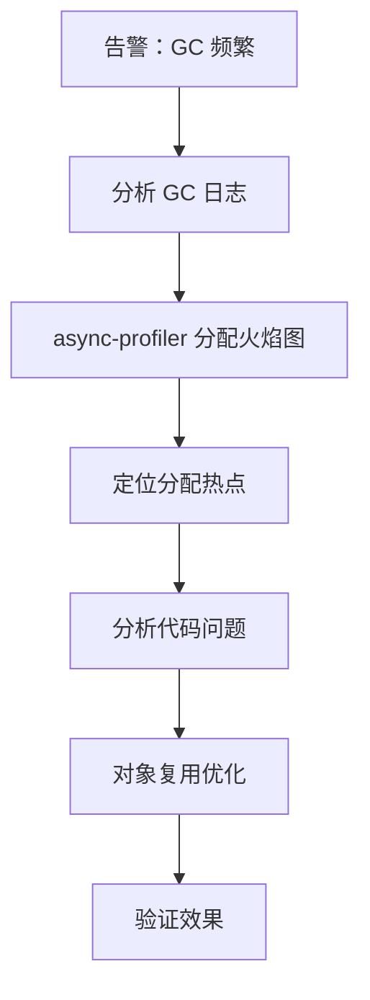

# 性能优化案例：GC 频繁排查

监控系统显示：Young GC 每秒 10-15 次，每次耗时 50-80ms。GC 总时间占总运行时间的 15%。接口延迟明显增加。

## 问题背景

GC 日志：
```
[GC (Allocation Failure)  512M->256M(1024M)  52ms]
[GC (Allocation Failure)  768M->384M(1024M)  65ms]
[GC (Allocation Failure)  896M->512M(1024M)  78ms]
...
```

每秒 10 次 Young GC，每次 50-80ms，意味着 CPU 的 8% 在做 GC。

## 排查步骤

### 第一步：分析 GC 日志

```bash
# 启用详细 GC 日志
java -Xlog:gc*:file=gc.log:time,uptime,level -jar app.jar
```

```bash
# 使用 GCViewer 分析
java -jar gcviewer.jar gc.log
```

GC 统计：
- Young GC 频率：12 次/秒
- Young GC 平均耗时：60ms
- 对象分配率：800MB/秒
- Survivor 区使用率：95%（频繁晋升）

### 第二步：分析分配热点

```bash
# 使用 async-profiler 分析内存分配
./async-profiler.sh start -d 60 -f alloc.html -e alloc <pid>

# 生成内存分配火焰图
```

### 第三步：分析火焰图

```
com/example/OrderService.createOrder()       ████████████████████████  35%
  -> java.util.ArrayList.<init>()           ██████████████████████    32%
    -> java.util.HashMap.<init>()           █████████████████        28%

com/example/InventoryService.reserve()      ████████████              12%
  -> java.util.ArrayList.<init>()           ██████████               10%
```

问题定位到 `OrderService.createOrder()`。

### 第四步：查看代码

```java title="OrderService.java"
public class Order createOrder(String userId) {
    // 问题一：每次创建新的 ArrayList
    List<OrderItem> items = new ArrayList<>();

    for (String itemId : itemIds) {
        OrderItem item = new OrderItem();
        item.setId(itemId);
        item.setQuantity(1);
        items.add(item);
    }

    // 问题二：每次创建新的 HashMap
    Map<String, String> metadata = new HashMap<>();
    metadata.put("userId", userId);
    metadata.put("timestamp", String.valueOf(System.currentTimeMillis()));

    // 问题三：字符串拼接创建大量 String 对象
    String key = "order:" + userId + ":" + System.currentTimeMillis();

    Order order = new Order();
    order.setItems(items);           // 传入整个 List
    order.setMetadata(metadata);
    order.setKey(key);

    return order;
}
```

## 根因分析

1. **频繁创建 ArrayList/HashMap**：循环中每次都 new
2. **字符串拼接**：`+` 拼接创建大量 String 对象
3. **对象晋升**：大对象直接进入老年代，频繁触发 Full GC

## 修复方案

```java title="OrderService.java"
public class Order createOrder(String userId) {
    // 复用对象（线程安全需要 ThreadLocal 或对象池）
    List<OrderItem> items = orderItemList.get();
    items.clear();

    for (String itemId : itemIds) {
        OrderItem item = new OrderItem();
        item.setId(itemId);
        item.setQuantity(1);
        items.add(item);
    }

    // 复用 Map
    Map<String, String> metadata = orderMetadata.get();
    metadata.clear();
    metadata.put("userId", userId);
    metadata.put("timestamp", String.valueOf(System.currentTimeMillis()));

    // 使用 StringBuilder
    StringBuilder keyBuilder = orderKeyBuilder.get();
    keyBuilder.setLength(0);
    keyBuilder.append("order:")
             .append(userId)
             .append(":")
             .append(System.currentTimeMillis());

    Order order = orderPool.acquire();
    try {
        order.setItems(items);
        order.setMetadata(metadata);
        order.setKey(keyBuilder.toString());
        return order;
    } finally {
        orderPool.release(order);
    }
}
```

### 使用 ThreadLocal 复用

```java
private static final ThreadLocal<List<OrderItem>> orderItemList =
    ThreadLocal.withInitial(ArrayList::new);

private static final ThreadLocal<Map<String, String>> orderMetadata =
    ThreadLocal.withInitial(HashMap::new);

private static final ThreadLocal<StringBuilder> orderKeyBuilder =
    ThreadLocal.withInitial(() -> new StringBuilder(64));
```

## 修复效果

| 指标 | 修复前 | 修复后 |
| --- | --- | --- |
| Young GC 频率 | 12 次/秒 | 2 次/秒 |
| Young GC 耗时 | 60ms | 8ms |
| 对象分配率 | 800MB/秒 | 120MB/秒 |
| GC 时间占比 | 15% | 2% |

## 排查流程总结



## GC 优化策略

### 策略一：减少对象分配

- 复用对象（ThreadLocal、对象池）
- 使用基本类型
- 避免不必要的包装

### 策略二：减少大对象

```java
// 配置大对象阈值
-XX:PretenureSizeThreshold=1m
```

### 策略三：调整年轻代大小

```bash
# 增大年轻代
java -Xmn512m -jar app.jar

# 或使用 G1，调整年轻代比例
java -XX:G1NewSizePercent=40 -jar app.jar
```

## 经验总结

### 教训一：GC 频繁要看分配率

GC 频繁的根本原因是**对象分配率太高**：
- GC 日志显示分配率
- async-profiler 火焰图显示分配热点
- 两者结合定位问题

### 教训二：对象复用要谨慎

对象复用需要考虑：
- 线程安全（ThreadLocal 是好选择）
- 对象状态清理（使用前清空）
- 内存泄漏（ThreadLocal 要及时清理）

### 教训三：性能测试要关注 GC

上线前压测时应该关注：
```bash
# 开启 GC 日志
-Xlog:gc*:file=gc.log

# 分析 GC 指标
GC频率、GC耗时、对象分配率
```

## 本章小结

GC 频繁排查的标准流程：
1. **GC 日志分析**：确认分配率和 GC 频率
2. **分配火焰图**：定位分配热点
3. **代码分析**：找到高分配代码
4. **对象复用**：减少不必要的对象创建
5. **调整参数**：适当调整堆大小和 GC 参数
6. **验证效果**：确认 GC 改善

## 延伸思考

什么时候应该增加年轻代大小？

年轻代太小：
- 对象容易晋升到老年代
- Survivor 区不足以容纳存活对象

年轻代太大：
- 老年代变小，Full GC 频繁
- 单次 GC 停顿时间变长

建议：
- 观察对象晋升年龄（GC 日志中的 `age`）
- 如果对象在年轻代经过多次 GC 才晋升，说明 Survivor 区太小
- 可以增加 Survivor 区比例：`-XX:SurvivorRatio=8`
