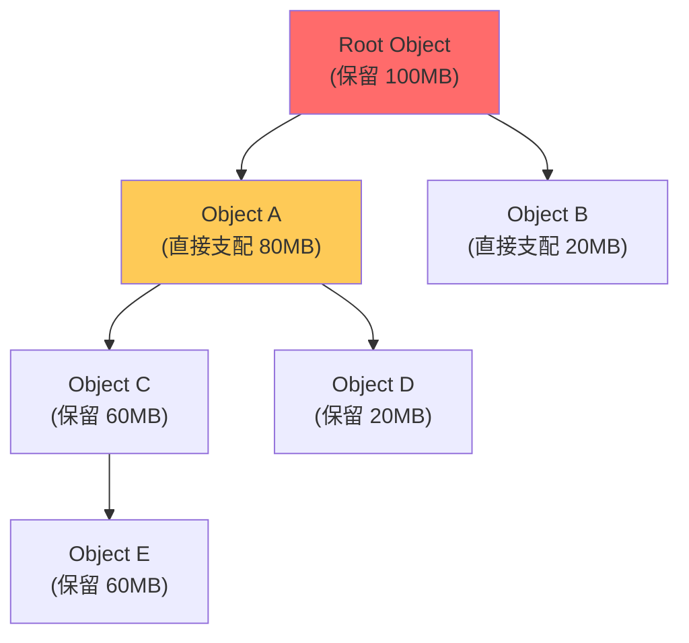
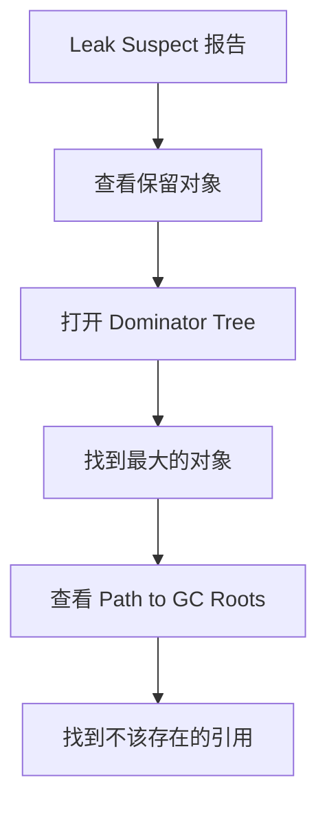

# 堆内存分析工具

堆转储（Heap Dump）是分析内存问题的关键。一个 Heap Dump 包含了 JVM 堆中所有对象的信息，是排查内存泄漏的终极手段。

## MAT：Memory Analyzer Tool

Eclipse MAT 是分析 Heap Dump 的免费利器。

### 核心功能

| 功能 | 说明 |
| --- | --- |
| Leak Suspects | 自动分析可能的内存泄漏 |
| Dominator Tree | 支配树，找出保持对象存活的关键节点 |
| Histogram | 对象数量和大小统计 |
| Path to GC Roots | 从对象到 GC Root 的最短路径 |

### Leak Suspects

自动分析并报告可能的内存泄漏：


### Dominator Tree

支配树展示对象之间的支配关系：



如果 A 支配 C，那么"如果没有 A，C 就会被 GC"。Dominator Tree 帮助找到保持对象存活的"关键节点"。

### Path to GC Roots

显示从对象到 GC Root 的完整路径：

```java
// 示例
HashMap<String, Object> map = new HashMap<>();
map.put("user", new User("张三"));  // 这个 User 不会被 GC

// GC Root: Static field (map)
```

### 导出 Heap Dump

```bash
# 使用 jmap 导出
jmap -dump:format=b,file=heap.bin <pid>

# 使用 MAT 导出
# MAT -> File -> Acquire Heap Dump
```

## JProfiler

JProfiler 是商业级 Java Profiler，功能全面。

### 主要视图

**内存视图**：
- 实时对象数量和大小
- 内存分配热点
- 堆内存使用趋势

**CPU 视图**：
- 方法调用树
- 调用链分析
- 热点方法排名

**线程视图**：
- 线程状态
- 线程死锁检测
- 线程历史

### 使用步骤


### Heap Dump 分析

```java title="代码触发 Heap Dump"
import com.jprofiler.api.*;

public class HeapDumpExample {
    public static void dump(String filename) throws Exception {
        // JProfiler API 触发 Heap Dump
        Session session = Session.getCurrentSession();
        HeapDumper.dumpHeap(session, filename);
    }
}
```

## VisualVM

VisualVM 是 JDK 自带的监控和故障排查工具。

### 主要功能

- 监控 CPU、内存、线程
- 生成和查看 Heap Dump
- 性能分析
-线程 Dump

### 启动

```bash
# JDK 8 及之前
jvisualvm

# JDK 9+ 需要单独安装
# https://visualvm.github.io/
```

### Heap Dump 分析


### OQL 查询

VisualVM 支持对象查询语言（OQL）：

```sql
-- 查找所有 HashMap
select map from java.util.HashMap map

-- 查找大于 1MB 的对象
select p from java.lang.Object p
where p.@objectSize > 1048576

-- 查找包含特定字符串的对象
select a from java.lang.String a
where a.toString().contains("张三")
```

## YourKit

YourKit 是另一个商业级 Java Profiler。

### 特色功能

- **智能快照比较**：对比两个时间点的快照
- **自动泄漏检测**：持续跟踪对象生命周期
- **低开销监控**：生产环境友好

### 与 MAT 集成

YourKit 可以导出 MAT 格式的快照：

```bash
# YourKit 导出
# File -> Export Snapshot -> Heap Dump (hprof)
```

## 工具对比

| 工具 | 费用 | 优势 | 劣势 |
| --- | --- | --- | --- |
| MAT | 免费 | 功能强大，专门分析 Heap Dump | 不支持实时监控 |
| JProfiler | 商业 | 功能全面，实时监控强 | 费用高 |
| VisualVM | 免费 | JDK 自带，无需安装 | 功能有限 |
| YourKit | 商业 | 智能分析，低开销 | 费用高 |

## 实战：定位内存泄漏

### 步骤一：导出 Heap Dump

```bash
# 确认进程 PID
jps -l

# 导出 Heap Dump
jmap -dump:format=b,file=heap_$(date +%Y%m%d_%H%M%S).hprof <pid>
```

### 步骤二：使用 MAT 分析

1. 打开 MAT，加载 Heap Dump
2. 运行 "Leak Suspects" 报告
3. 查看 "Problem Suspect" 部分

### 步骤三：定位泄漏点



### 步骤四：验证修复

```bash
# 修复后再次导出 Heap Dump
jmap -dump:format=b,file=heap_after.hprof <pid>

# 使用 MAT 对比
# Compare Heap Dumps...
```

## 本章小结

堆内存分析工具的核心功能：
- **MAT**：Heap Dump 离线分析，Leak Suspects、Dominator Tree
- **JProfiler**：实时监控 + Heap Dump，综合性强
- **VisualVM**：JDK 自带，轻量级分析
- **YourKit**：智能泄漏检测，生产环境友好

**实战建议**：先用 MAT 分析 Heap Dump 定位泄漏点，再用 JProfiler/VisualVM 实时监控观察趋势。

## 延伸思考

为什么 Heap Dump 文件这么大？

Heap Dump 包含堆中所有对象的信息：
- 每个对象的类型、大小、引用关系
- 对象内容（如果是 String 等）
- 字符串池内容

一个 4GB 堆的 Heap Dump 可能达到 3-4GB。生产环境导出 Heap Dump 前要确认磁盘空间足够。
