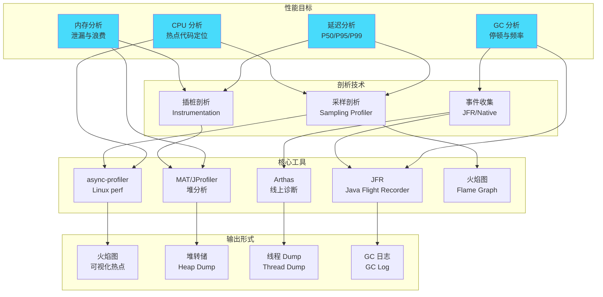
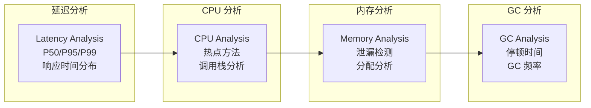
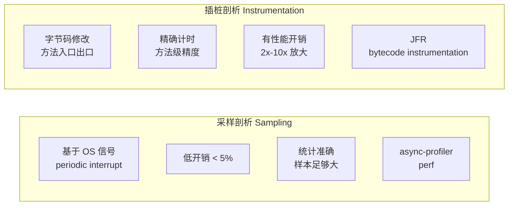
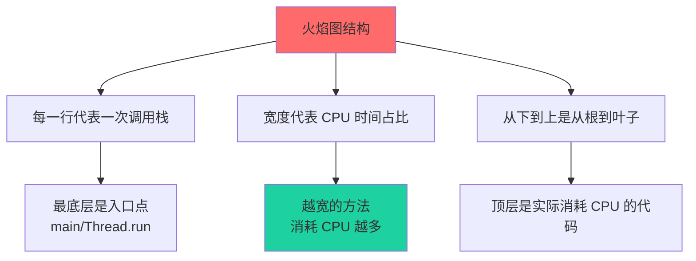
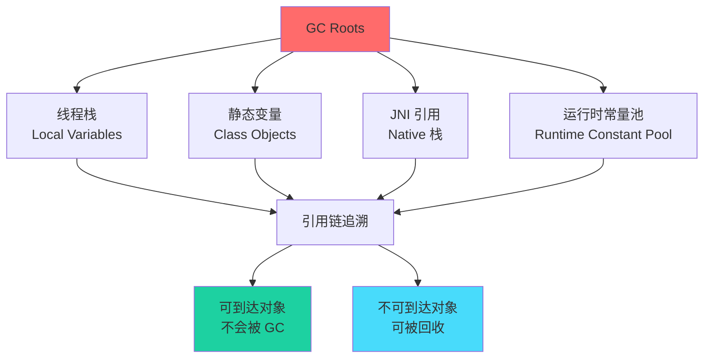
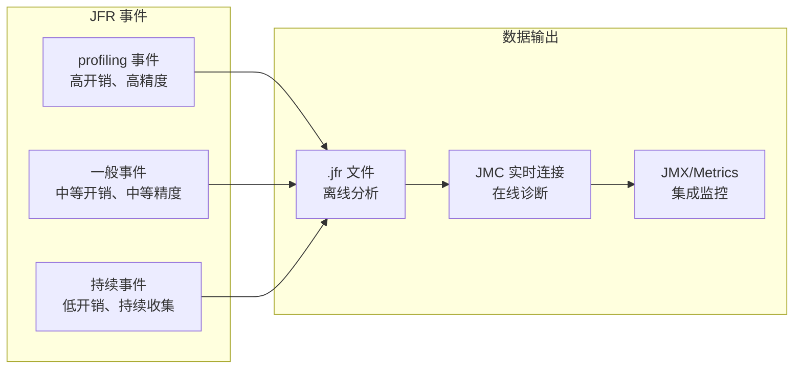
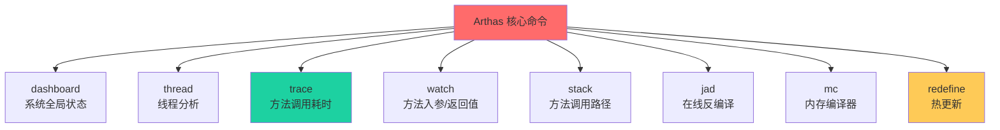
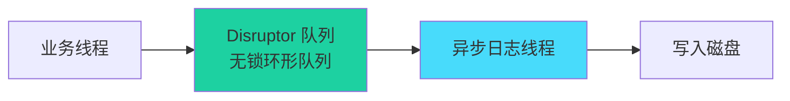
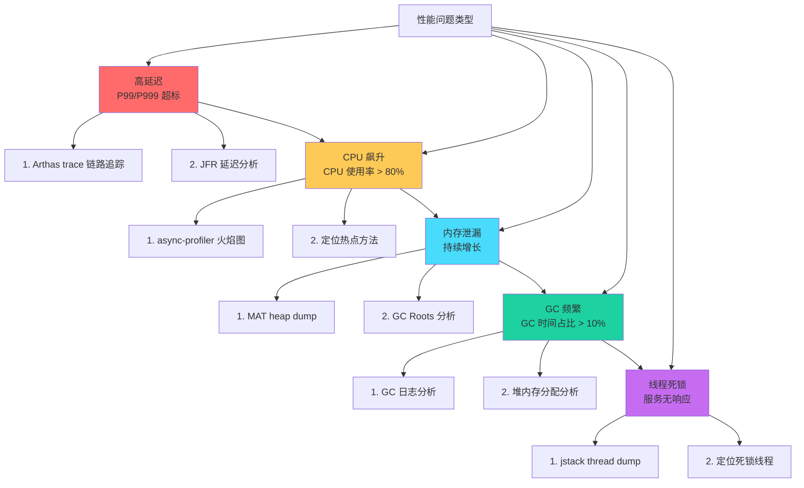

# 性能剖析

凌晨 2 点，线上告警响起：核心接口 P99 延迟突然飙升至 500ms，客服电话被打爆。你打开日志，发现只有一行 timeout 异常，但根本不知道卡在哪一行代码。更糟糕的是，CPU 使用率只有 30%，内存占用正常，GC 也正常——问题仿佛藏在了某个看不见的角落。

又或者，你遇到这样的情况：上线前压测一切正常，上线后第一天还好，第二天开始内存缓慢增长，第三天 OOM 重启。一周后发现，原来是一个静态集合忘记清理——但这个 Bug 是什么时候引入的？谁能为此负责？

**性能问题，从来不是简单的「代码写得不好」。它是一个系统性问题：涉及 JVM 行为、OS 资源调度、业务逻辑复杂度、外部依赖响应时间等多个维度。** 而性能剖析，就是帮你穿透这些迷雾、找到根因的那把钥匙。

本模块从性能剖析方法论出发，深入讲解 CPU Profiling、内存分析、JFR/JMC、Arthas、火焰图、异步日志优化、持续性能分析等核心知识点，帮助你建立完整的性能诊断能力体系。

## 模块结构

本模块按主题分为 11 个子模块：

| 子模块 | 核心问题 | 典型场景 |
| --- | --- | --- |
| 性能剖析方法论 | Profiling 的时机、目标、分层策略 | 测试环境 vs 生产环境 |
| 采样 vs 插桩 | 低开销统计 vs 精确计数的权衡 | 方法级精度 vs 性能开销 |
| CPU Profiling 火焰图 | 热点代码定位、系统级剖析 | P99 延迟高、CPU 打满 |
| 内存 Profiling | 对象分配、存活分析、泄漏检测 | 内存持续增长、OOM |
| 堆内存分析工具 | MAT/JProfiler/VisualVM 使用 | 堆转储分析、对象保留链 |
| JFR 详解 | JVM 内置 APM、低开销事件收集 | 生产环境持续监控 |
| JMC 使用 | JFR 数据可视化分析 | 性能趋势、异常检测 |
| Arthas 诊断工具 | 线上诊断、热修复 | 无法停机的生产环境 |
| 异步日志优化 | Log4j2 异步原理、低延迟设计 | 日志 IO 阻塞影响响应时间 |
| 持续性能分析 | Pyroscope、Polar Signals、Grafana Beyla | 7x24 生产环境剖析 |
| 性能优化案例 | 高延迟/CPU/内存/GC/死锁实战 | 真实问题排查过程 |

## 核心概念图谱

性能剖析涉及多种工具和技术，下图展示它们之间的关系：



## 性能剖析方法论

性能剖析不是漫无目的地「看看哪里慢」，而是有目标、有层次、有时机的系统性工作。

### 三大目标

性能剖析围绕三个核心目标展开：



**延迟分析**：关注请求的响应时间分布。P50 代表中位数体验，P95/P99 代表长尾用户的体验。很多时候平均值很漂亮，但 P99 让你看到真实的「最坏情况」。

**CPU 分析**：找出消耗 CPU 时间最多的代码路径。热点可能是业务逻辑、序列化/反序列化、正则表达式、加密解密——每种热点的优化策略完全不同。

**内存分析**：区分内存泄漏与内存浪费。泄漏是对象无法被 GC 回收（通常是因为错误的持有引用），浪费是对象虽然被回收但分配了过多内存（如频繁创建临时对象）。

### 剖析时机

| 环境 | 优势 | 劣势 | 适用场景 |
| --- | --- | --- | --- |
| 测试环境 | 无生产压力、可重复、可控制 | 与生产环境可能有差异 | 基准测试、回归验证 |
| 预发环境 | 真实流量、数据更接近生产 | 流量有限、可能影响测试 | 上线前验证 |
| 生产环境 | 完全真实、可发现测试未覆盖的问题 | 有风险、需控制开销 | 偶发性问题、真实压测 |

**黄金原则**：测试环境发现不了的问题，生产环境帮你发现；生产环境发现不了的问题，只有持续剖析才能发现。

### 分层策略

```mermaid
flowchart TD
    subgraph 第一层：快速定位
        A["外部依赖\n数据库/缓存/外部 API"] 
        B["网络 IO\n连接池/DNS/TCP"] 
        C["GC 停顿\nGC 日志分析"] 
    end

    subgraph 第二层：深入分析
        D["线程分析\njstack/线程 Dump"] 
        E["CPU 热点\n火焰图剖析"] 
        F["锁竞争\nsynchronized/Lock"] 
    end

    subgraph 第三层：根因挖掘
        G["内存泄漏\nMAT/Heap Dump"] 
        H["分配热点\nAllocation Profiling"] 
        I["代码逻辑\nArthas trace"] 
    end

    A --> B
    B --> C
    C --> D
    D --> E
    E --> F
    F --> G
    G --> H
    H --> I

    style A fill:#ff6b6b
    style B fill:#ff6b6b
    style C fill:#feca57
    style D fill:#feca57
    style E fill:#1dd1a1
    style F fill:#1dd1a1
    style G fill:#48dbfb
    style H fill:#48dbfb
    style I fill:#48dbfb
```

遇到性能问题时，应该从最外层开始排查：先确认是不是外部依赖超时、是不是 GC 停顿、是不是网络问题——这些排查成本最低，往往能快速定位大部分问题。只有排除这些之后，才需要深入到 CPU 热点、内存泄漏等更深层次。

## 采样 vs 插桩

这是性能剖析的两种核心技术，各有优劣：



**采样剖析**：基于 OS 的周期性中断（如 Linux 的 `perf_event_open`），在每个中断时刻采样线程的调用栈。优点是开销极低（通常 `< 5%`），可以在生产环境直接使用；缺点是结果具有统计性，需要足够长的采样时间才能保证准确性。

**插桩剖析**：通过修改字节码，在方法入口和出口插入计时代码。优点是能精确记录每个方法的执行时间，包括调用次数；缺点是开销较大（可能放大 2x-10x），而且插桩代码本身可能改变优化决策。

| 特性 | 采样 | 插桩 |
| --- | --- | --- |
| 开销 | 低 | 高 |
| 精度 | 统计级 | 方法级 |
| 适用场景 | 生产环境、长时间运行 | 测试环境、精确诊断 |
| 常见工具 | async-profiler、perf | JFR、Arthas trace |

**实战建议**：先用采样剖析找到热点区域，再用插桩剖析精确测量该区域的具体方法耗时。这是一种「先粗后细」的策略，避免一开始就付出高开销的代价。

## CPU Profiling 与火焰图

CPU 热点分析是性能剖析最常见的场景。火焰图（Flame Graph）是 Brendan Gregg 发明的一种可视化方法，能直观展示 CPU 时间的分布。

### 火焰图解读



火焰图的核心解读原则：

1. **从下往上看**：最底层是调用入口（HTTP 请求入口、定时任务入口等），往上每一层是被调用的方法
2. **从宽往窄看**：越宽的方框表示该方法消耗的 CPU 时间越多
3. **从尖顶往下钻**：顶层往往是真正的热点（正则、序列化、加密等），点击可以钻进去看具体是哪一行

### async-profiler

async-profiler 是 Java 性能剖析的利器，它利用 JVMTI 和 `perf_events` 实现低开销的 CPU 采样：

```bash
# 采样 CPU 热点，30 秒
./async-profiler.sh start -d 30 -f profile.svg -e cpu <pid>

# 采样分配内存热点
./async-profiler.sh start -d 30 -f alloc.svg -e alloc <pid>

# 采集锁竞争
./async-profiler.sh start -d 30 -f lock.svg -e lock <pid>
```

与原生 `perf` 相比，async-profiler 能获取 Java 方法名、行号，甚至能显示内联函数——这对于 Java 性能分析至关重要。

## 内存 Profiling

内存问题分为两大类：**内存泄漏**和**内存浪费**。前者是对象无法被回收，后者是对象分配了超出需要的内存。

### GC Roots 追踪

理解内存泄漏的关键是理解 GC Roots——那些永远不会被垃圾回收的对象集合：



GC Roots 包括：活跃线程的局部变量、类的静态字段、JNI 引用、JVM 内部数据结构等。所有从 GC Roots 出发可到达的对象都是「存活对象」，不可到达的对象才会被回收。

### 内存泄漏 vs 内存浪费

| 特征 | 内存泄漏 | 内存浪费 |
| --- | --- | --- |
| 定义 | 对象还被持有引用，但已经不再使用 | 对象被正确回收，但分配了过多内存 |
| 表现 | 内存持续增长，最终 OOM | 内存使用量偏高，但不会无限增长 |
| 根因 | 错误的持有引用（静态集合未清理、监听器未注销等） | 频繁创建临时对象、字符串拼接、正则预编译等 |
| 解决方案 | 找到引用链，断开不需要的引用 | 优化代码，减少不必要的对象创建 |

**实战经验**：内存泄漏的排查往往比想象中更复杂——不是因为代码本身有多难懂，而是因为「这个对象为什么不会被回收」需要理解整个对象图。MAT 的「支配树（Dominator Tree）」和「GC Roots 最短路径」功能是定位泄漏的利器。

## JFR 与 JMC

Java Flight Recorder（JFR）是 JVM 内置的性能数据收集引擎，与 JMC（Java Mission Control）配合使用，是生产环境性能分析的标准工具。

### JFR 核心特性



JFR 的优势在于**低开销**。默认配置下，JFR 的开销通常 `< 2%`，可以在生产环境持续运行而不影响业务。这与传统的采样剖析工具形成鲜明对比——那些工具虽然更轻量，但无法提供 JFR 那样丰富的诊断数据。

JFR 收集的事件类型包括：CPU 热点、内存分配、GC 停顿、锁竞争、异常抛出、网络/文件 IO 等，几乎涵盖了性能分析需要的所有维度。

### JMC 可视化

JMC 提供图形化的分析界面，包括：

- **自动分析报告**：JMC 内置的诊断引擎会自动识别常见的性能问题
- **火焰图**：CPU 热点可视化
- **内存池视图**：各内存区域的分配和回收趋势
- **GC 时间线**：GC 停顿的详细时间线
- **线程分析**：线程状态、等待时间、锁竞争

## Arthas 诊断工具

Arthas 是阿里巴巴开源的 Java 诊断工具，在线上问题排查中非常受欢迎——因为它不需要重启应用，不需要配置额外 agent，即连即用。

### 核心命令



**最常用的三个命令**：

`trace`：追踪方法调用耗时，自动计算每个子调用的时间占比，找出慢在哪里。

`watch`：观察方法的入参、返回值、异常，支持条件表达式，只在你关心的场景触发。

`stack`：查看方法被调用的完整路径，帮助理解代码从哪里来。

**热更新能力**：`mc`（Memory Compiler）+ `redefine` 可以在不重启 JVM 的情况下更新代码——这在紧急问题时可能是救命稻草。但要注意，热更新有诸多限制，不能替代正常的发布流程。

## 异步日志优化

日志是性能问题的高发区。同步日志写入会阻塞业务线程，在高并发场景下，一次磁盘 IO 可能导致数百毫秒的延迟。

### 同步日志的代价


同步日志的核心问题是**磁盘 IO 的不确定性**。普通 HDD 的随机写入延迟在 1-10ms，SSD 可能只需要 0.1-0.5ms，但在高负载时，OS 的 Page Cache 可能被占满，导致写操作排队。

### Log4j2 异步日志

Log4j2 的 Async Appender 将日志写入交给独立的异步线程，业务线程只需要将日志事件放入队列：



**关键配置**：

```properties
# 启用异步日志
Logger name=com.example async=true

# 或配置 Async Appender
Appender type=Async name=AsyncLog
    AppenderRef ref=FileAppender
    bufferSize=8192
    includeLocation=true
    queueSize=8192
    discardThreshold=ERROR
```

Async Logger 使用 Disruptor 实现无锁队列，开销极低。但要注意：**如果队列满，日志会降级为同步写入**——这通常发生在日志量过大或 IO 跟不上时。因此，监控队列使用率非常重要。

## 案例驱动

理论需要与实践结合。以下是几类典型性能问题的排查路径：



每类问题都有其特征和排查路径，本模块后续会详细讲解每个案例的完整排查过程，包括如何复现问题、如何定位根因、如何验证修复效果。

## 持续性能分析

传统性能剖析是「按需」进行的：发现问题 → 启动工具 → 采集数据 → 分析问题。但这种方式有几个问题：

- 问题往往在工具启动前就消失了
- 只能看到「此时此刻」，看不到历史趋势
- 需要人工介入，无法自动化告警

**持续性能分析（Continuous Profiling）**解决了这些问题：它像监控一样持续运行，自动采集性能数据，存储历史数据，支持任意时间范围的分析。

### 工具对比

| 工具 | 特点 | 部署方式 |
| --- | --- | --- |
| Pyroscope | 开源、存储成本低、Grafana 集成 | 自托管 |
| Polar Signals | 托管服务、零运维、基于 Parca | SaaS 或自托管 |
| Grafana Beyla | eBPF 驱动、零代码侵入 | K8s 部署 |
| AWS CodeGuru | 云服务、ML 驱动 | AWS 原生 |

持续性能分析是性能剖析领域的重大进步——它让「事后剖析」变成「实时监控」，让性能问题无处遁形。

## 本章文章导读

### 入门路径

如果你是性能剖析的初学者，建议按以下顺序学习：

1. **性能剖析方法论** → 理解 Profiling 的目标、时机、分层策略
2. **采样 vs 插桩** → 理解两种技术的权衡与适用场景
3. **CPU Profiling 火焰图** → 学会用火焰图定位 CPU 热点
4. **Arthas 诊断工具实战** → 掌握最常用的线上诊断命令
5. **异步日志（Async Logger）原理** → 理解日志对性能的影响

### 进阶路径

有一定基础后，深入以下内容：

6. **内存 Profiling** → 对象存活分析、GC Roots 追踪
7. **堆内存分析工具（MAT/JProfiler/VisualVM）** → 堆转储分析实操
8. **JFR（Java Flight Recorder）详解** → JVM 内置 APM
9. **JMC（Java Mission Control）使用** → JFR 数据可视化分析
10. **Log4j2 异步日志配置** → 生产环境日志优化

### 精通路径

想成为性能诊断专家，继续深入：

11. **持续性能分析（Continuous Profiling）** → Pyroscope、Polar Signals、Grafana Beyla
12. **Pyroscope 与 Polar Signals** → 开源持续剖析工具实操
13. **性能优化案例：高延迟排查** → 真实案例完整剖析过程
14. **性能优化案例：CPU 飙升排查** → 火焰图实战
15. **性能优化案例：内存泄漏排查** → MAT 对象保留链
16. **性能优化案例：GC 频繁排查** → GC 日志 + 堆内存分析
17. **性能优化案例：线程死锁排查** → jstack + 线程 Dump
18. **全链路性能优化方法论** → 从单点到全局的系统性优化思路

## 学习建议

1. **从真实问题出发**：不要为了学工具而学工具，先有问题，再找工具
2. **动手实践**：每学一个工具，就在本地环境跑一遍，熟悉它的输出格式
3. **关注性能数据**：学会解读 P50/P95/P99、吞吐量、延迟分布——这些才是衡量性能的客观标准
4. **理解 JVM 与 OS 的交互**：JFR、async-profiler 等工具的实现原理都离不开 OS 层面的支持
5. **建立知识体系**：性能问题往往是系统性的，学会从全局视角分析问题

准备好开始了吗？让我们从性能剖析方法论开始，建立系统性的诊断思维。
