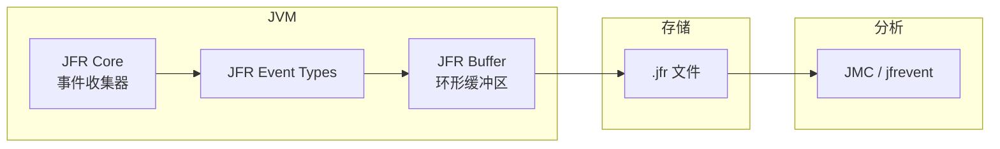

# JFR 详解

Java Flight Recorder（JFR）是 JVM 内置的性能数据收集引擎，被 Oracle 收购后成为商业特性，但在 OpenJDK 11+ 中已开源免费使用。JFR 与 JMC（Java Mission Control）配合使用，是生产环境性能分析的标准工具。

## JFR 架构



JFR 的工作原理：
1. JVM 内部埋点产生事件
2. 事件写入环形缓冲区
3. 缓冲区满或录制结束时写入 .jfr 文件
4. 使用 JMC 分析录制数据

## JFR 事件类型

JFR 收集的事件类型：

| 类别 | 事件 | 说明 |
| --- | --- | --- |
| JVM 信息 | `os` | 操作系统信息 |
| | `cpuInformation` | CPU 信息 |
| | `initialEnvironmentVariable` | 环境变量 |
| GC | `GCHeapSummary` | 堆摘要 |
| | `GarbageCollection` | GC 事件 |
| | `G1HeapRegionInformation` | G1 区域信息 |
| 编译 | `JVMInformation` | JVM 版本信息 |
| | `Compilation` | JIT 编译 |
| | `CodeSweeperStatistics` | 代码缓存 |
| 执行 | `ExecutionSample` | CPU 采样 |
| | `AllocationInNewTLAB` | TLAB 分配 |
| | `ActiveRecording` | 录制状态 |
| 内存 | `ObjectAllocationInNewTLAB` | 新 TLAB 分配 |
| | `ObjectAllocationOutsideTLAB` | 旧生代分配 |
| | `OldObjectSample` | 存活对象采样 |

## JFR 配置模式

JFR 提供两种配置模式：

| 模式 | 开销 | 数据量 | 适用场景 |
| --- | --- | --- | --- |
| `default` | 低 | 少 | 持续运行 |
| `profile` | 中 | 多 | 问题诊断 |

### default 配置

```bash
# 启用默认配置
java -XX:StartFlightRecording:settings=default \
     -XX:FlightRecorderOptions=repository=/var/log/jfr \
     -jar app.jar
```

### profile 配置

```bash
# 启用 profile 配置（更详细）
java -XX:StartFlightRecording:settings=profile \
     -XX:FlightRecorderOptions=repository=/var/log/jfr \
     -jar app.jar
```

### 自定义配置

```bash
# 创建自定义模板
jfr print --categories "GC,Compilation,Profiling" \
    --events "jdk.GarbageCollection,jdk.AllocationRequiringGC" \
    recording.jfr
```

## JFR 使用方法

### 方法一：启动时录制

```bash
# 启动时自动开始录制
java -XX:+UnlockCommercialFeatures \
     -XX:+FlightRecorder \
     -XX:StartFlightRecording:\
         name=startup,\
         delay=20s,\
         duration=60s,\
         filename=startup.jfr \
     -jar app.jar
```

### 方法二：运行时录制

```bash
# 使用 jcmd 启动录制
jcmd <pid> JFR.start
jcmd <pid> JFR.start name=myrecording settings=profile

# 转储录制数据
jcmd <pid> JFR.dump name=myrecording filename=dump.jfr

# 停止录制
jcmd <pid> JFR.stop name=myrecording

# 查看录制列表
jcmd <pid> JFR.check
```

### 方法三：持续录制

```bash
# 持续录制，保留最后 1 小时数据
java -XX:+FlightRecorder \
     -XX:FlightRecorderOptions=\
         maxage=1h,\
         maxsize=100MB,\
         repository=/var/log/jfr \
     -jar app.jar

# 使用 JMC 实时连接查看
```

## JFR 命令行工具

### jfr 命令（Java 14+）

```bash
# 查看录制信息
jfr print --dump recording.jfr

# 查看事件摘要
jfr summary recording.jfr

# 过滤事件
jfr print --events "jdk.GarbageCollection" recording.jfr

# 统计事件
jfr stats recording.jfr
```

### 示例输出

```bash
$ jfr summary recording.jfr

Version: 2.0
Recorded events: 1,234,567
Start time: 2024-01-01 10:00:00
End time: 2024-01-01 11:00:00
Duration: 1 hour

Event types:
  GC Heap Summary: 120
  Garbage Collection: 45
  CPU Load: 3,600
  Allocation In New TLAB: 890,123
```

## JFR 开销分析

JFR 的设计目标是对应用影响小于 1%：

| 配置 | CPU 开销 | 内存开销 |
| --- | --- | --- |
| default | < 0.5% | ~1MB |
| profile | < 1% | ~5MB |
| 持续录制 | < 1% | ~10MB |

优化措施：
- 环形缓冲区避免持续写入
- 自适应采样频率
- 事件聚合减少数据量

## JFR 与其他工具对比

| 工具 | 开销 | 精度 | 适用场景 |
| --- | --- | --- | --- |
| JFR | 低 | 高 | 生产环境 |
| async-profiler | 低 | 高 | CPU 热点 |
| JVMTI | 高 | 最高 | 精确调试 |

## 本章小结

JFR 的核心特点：
- **低开销**：设计目标 < 1%
- **丰富数据**：涵盖 GC、编译、内存、CPU 等
- **持续录制**：可以一直运行
- **生产安全**：对业务影响小

JFR 是生产环境性能分析的首选工具。

## 延伸思考

JFR 为什么能做到这么低的开销？

关键设计：
1. **事件聚合**：多个同类事件合并统计
2. **自适应采样**：根据负载动态调整采样频率
3. **环形缓冲区**：避免持续磁盘写入
4. **JVM 内置**：与 JVM 紧密集成，减少代理开销
