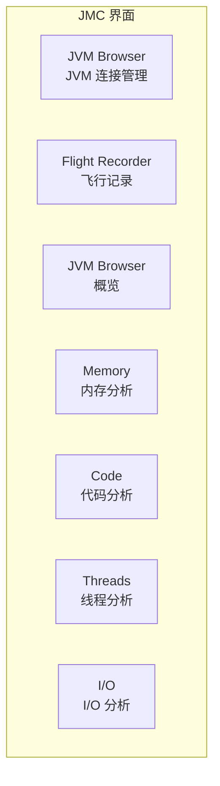
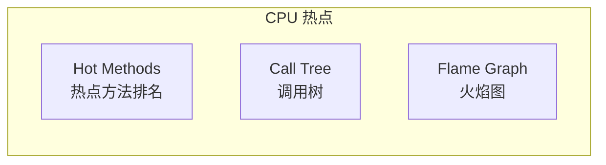
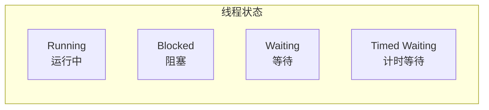
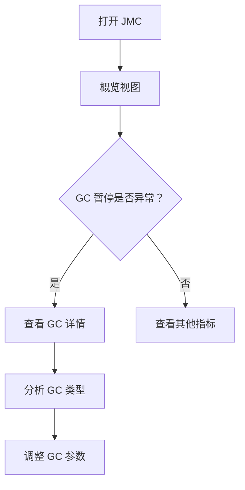
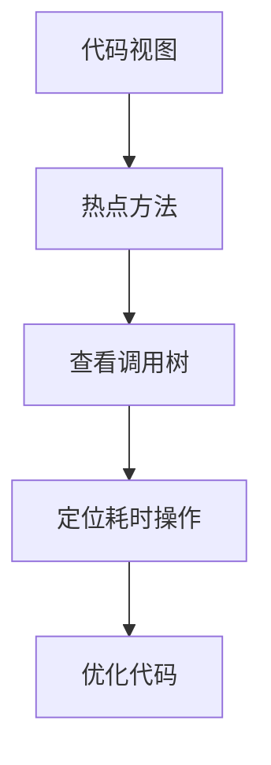
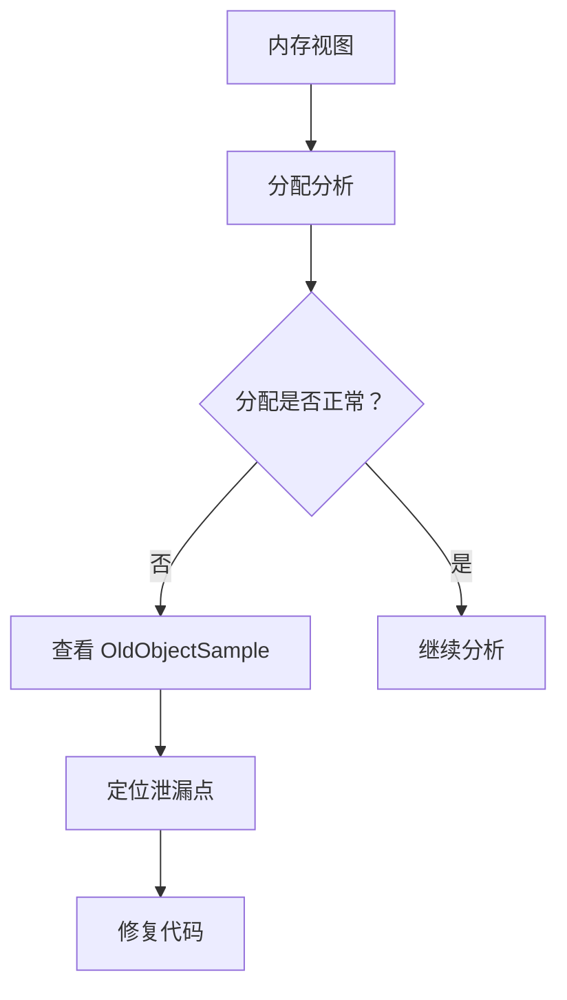

# JMC 使用

Java Mission Control（JMC）是 JFR 数据的图形化分析工具，提供直观的性能问题诊断能力。

## JMC 界面

JMC 的主要界面：



### 启动 JMC

```bash
# JDK 8 及之前
jmc

# JDK 11+ 需要单独安装
# https://github.com/JDKMissionControl/jmc
```

## 连接 JVM

### 方式一：实时连接

```bash
# 确保 JVM 启用 JMX
java -Dcom.sun.management.jmxremote.port=9010 \
     -Dcom.sun.management.jmxremote.authenticate=false \
     -Dcom.sun.management.jmxremote.ssl=false \
     -jar app.jar

# JMC -> File -> Connect -> Create New Connection
# 输入主机和端口
```

### 方式二：打开录制文件

```bash
# JMC -> File -> Open File
# 选择 .jfr 文件
```

## 概览视图

概览视图显示系统运行状态的总体摘要：


关键指标：
- **飞行时间**：录制时长
- **事件数量**：采集的事件总数
- **内存趋势**：堆内存使用曲线
- **GC 暂停**：GC 停顿时间线

## 内存视图

### 堆内存分析

```java
// 关键内存指标
GC Count: 45
GC Pause Time: 1.2s
Total Heap Allocated: 50GB
Average Allocation Rate: 200MB/s
```

### 分配分析

| 类型 | 数量 | 大小 | 占比 |
| --- | --- | --- | --- |
| `byte[]` | 1,234,567 | 50GB | 45% |
| `String` | 5,678,901 | 20GB | 18% |
| `Object[]` | 987,654 | 15GB | 14% |

### TLAB 分析

TLAB（Thread Local Allocation Buffer）分析显示各线程的分配情况。

## 代码视图

### CPU 负载分析



### 热点方法

| 方法 | 调用次数 | 自时间 | 总时间 | 占比 |
| --- | --- | --- | --- | --- |
| `Service.process()` | 1,000,000 | 5.2s | 10.5s | 50% |
| `DAO.query()` | 2,000,000 | 2.1s | 8.3s | 40% |
| `Util.format()` | 500,000 | 0.3s | 0.5s | 2% |

## 线程视图

### 线程状态



### 锁竞争分析

| 锁对象 | 持有时间 | 等待次数 | 平均等待时间 |
| --- | --- | --- | --- |
| `com.example.Lock` | 500ms | 100 | 5ms |
| `java.util.concurrent` | 200ms | 50 | 4ms |

## 自动分析报告

JMC 内置了自动分析引擎，会识别常见的性能问题：

### 常见问题类型

| 问题 | 严重性 | 说明 |
| --- | --- | --- |
| GC 暂停过长 | 高 | GC 暂停超过 1 秒 |
| 高分配率 | 中 | 分配速率异常 |
| 同步热点 | 中 | synchronized 竞争激烈 |
| 异常过多 | 低 | 异常抛出频繁 |

### 问题详情

点击问题项，可以查看详细说明和建议：

```
Problem: Long GC pause
Severity: High
Description: The garbage collector is pausing application threads for
             more than 1 second.

Recommendation:
1. Increase heap size if memory is available
2. Switch to G1 or ZGC
3. Reduce object allocation rate
```

## JFR 模板配置

### 创建自定义模板

```bash
# 导出默认模板
jfr configure --output template.jfc

# 编辑模板
# JMC -> Flight Recorder -> Templates -> Edit

# 使用自定义模板
java -XX:FlightRecorderOptions=settings=template.jfc -jar app.jar
```

### 模板配置项

```xml title="template.jfc"
<?xml version="1.0" encoding="UTF-8"?>
<configuration version="2.0">
    <event path="gc">
        <setting name="enabled">true</setting>
        <setting name="threshold">1 ms</setting>
    </event>

    <event path="cpu">
        <setting name="enabled">true</setting>
        <setting name="period">everyChunk</setting>
    </event>
</configuration>
```

## 常用分析流程

### 流程一：GC 问题排查



### 流程二：CPU 问题排查



### 流程三：内存泄漏排查



## 本章小结

JMC 的核心功能：
- **概览视图**：系统运行状态总览
- **内存视图**：GC 和分配分析
- **代码视图**：CPU 热点分析
- **线程视图**：线程状态和锁竞争
- **自动分析**：识别常见性能问题

## 延伸思考

JMC 与其他 Profiler 的区别？

- **JMC**：基于 JFR，低开销，生产环境友好，数据全面
- **async-profiler**：更轻量，适合火焰图
- **JProfiler**：商业工具，功能全面但有开销

建议先用 JMC 进行全面分析，再用其他工具深入特定问题。
