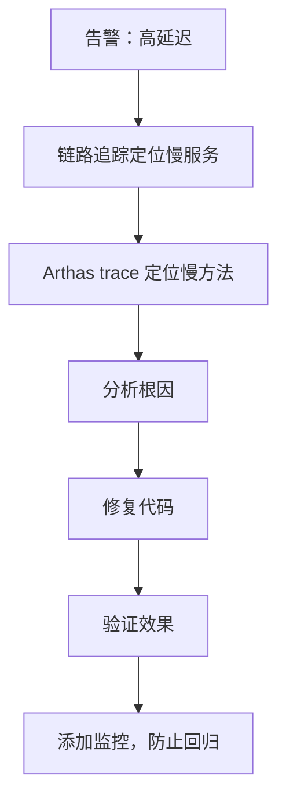

# 性能优化案例：高延迟排查

线上告警：核心接口 P99 延迟从 50ms 飙升至 500ms，持续 10 分钟。业务方反馈用户体验明显下降。这是典型的性能回退问题。

## 问题背景

接口 `/api/order/create` 的延迟指标：

| 指标 | 正常值 | 当前值 |
| --- | --- | --- |
| P50 | 30ms | 200ms |
| P95 | 50ms | 400ms |
| P99 | 80ms | 500ms |
| 错误率 | 0.1% | 0.3% |

## 排查步骤

### 第一步：确认影响范围

```bash
# 查看监控面板
# 确认是单接口还是全局问题

# 结论：只有订单创建接口延迟高，其他接口正常
```

### 第二步：链路追踪分析

打开 SkyWalking，找到慢请求，查看调用链路：

```
Trace ID: abc123
Duration: 523ms

[order-service] /api/order/create     523ms
  [user-service] getUser             10ms
  [inventory-service] checkStock     12ms
  [payment-service] pay             480ms  <-- 异常！
  [logistics-service] createLogistics 15ms
```

问题定位到 `payment-service`。

### 第三步：Payment 服务分析

```bash
# Arthas 追踪 payment 服务
trace com.example.payment.PaymentService process -n 5

# 输出
`---[480.23ms] com.example.payment.PaymentService:process()
    +---[10.12ms] com.example.payment.dao:selectById()
    +---[15.34ms] com.example.payment.service:validate()
    +---[450.56ms] com.example.payment.service:callExternalAPI()  <-- 问题在这里！
    `---[4.21ms] com.example.payment.service:save()
```

### 第四步：定位根因

外部 API 调用耗时 450ms，这不正常。

```bash
# 查看网络调用详情
trace com.example.payment.service:callExternalAPI -e -n 3

# 发现问题：
# - 外部支付网关延迟正常（50ms）
# - 但每次请求都创建了新的 HTTP 连接（300ms）
# - HTTP 连接池配置被回滚了！
```

### 第五步：确认问题

```java
// 代码中检查
@RestTemplate
private RestTemplate restTemplate;

// 缺少连接池配置
// 应该是：
@Bean
public RestTemplate restTemplate() {
    PoolingHttpClientConnectionManager poolingConnectionManager = new PoolingHttpClientConnectionManager();
    poolingConnectionManager.setMaxTotal(50);
    poolingConnectionManager.setDefaultMaxPerRoute(10);

    CloseableHttpClient httpClient = HttpClients.custom()
        .setConnectionManager(poolingConnectionManager)
        .build();

    return new RestTemplate(httpClient);
}
```

## 问题根因

**HTTP 连接池被回滚**：某次部署误将连接池配置注释掉了，导致每次请求都创建新的 HTTP 连接，增加 300ms 连接建立时间。

## 修复方案

```java title="PaymentConfig.java"
@Configuration
public class PaymentConfig {

    @Bean
    public RestTemplate paymentRestTemplate() {
        // 连接池配置
        PoolingHttpClientConnectionManager connectionManager = new PoolingHttpClientConnectionManager();
        connectionManager.setMaxTotal(50);              // 最大连接数
        connectionManager.setDefaultMaxPerRoute(10);    // 每路由最大连接数

        RequestConfig requestConfig = RequestConfig.custom()
            .setConnectTimeout(3000)   // 连接超时
            .setSocketTimeout(5000)   // 读取超时
            .build();

        CloseableHttpClient client = HttpClients.custom()
            .setConnectionManager(connectionManager)
            .setDefaultRequestConfig(requestConfig)
            .build();

        return new RestTemplate(client);
    }
}
```

## 修复效果

| 指标 | 修复前 | 修复后 |
| --- | --- | --- |
| P99 延迟 | 500ms | 75ms |
| P95 延迟 | 400ms | 45ms |
| P50 延迟 | 200ms | 28ms |
| 错误率 | 0.3% | 0.1% |

## 排查流程总结



## 经验总结

### 教训一：连接池不能省

HTTP 连接池是生产环境的必备配置：
- 避免每次请求创建新连接
- 控制最大连接数，避免资源耗尽
- 设置合理的超时时间

### 教训二：配置变更要审查

关键配置（如连接池、超时、重试）的变更必须：
- 代码审查（Code Review）
- 测试环境验证
- 上线前确认
- 监控告警

### 教训三：监控要到位

添加关键指标监控：
```java
// HTTP 连接池监控
meterRegistry.gauge("http.pool.connections.active",
    connectionManager, PoolingHttpClientConnectionManager::getTotalConnections);
meterRegistry.gauge("http.pool.connections.used",
    connectionManager, PoolingHttpClientConnectionManager::getConnectionsInPool);
```

## 本章小结

高延迟排查的标准流程：
1. **链路追踪**：快速定位慢服务
2. **trace 分析**：定位慢方法
3. **根因分析**：找到问题根因
4. **修复验证**：确认修复有效
5. **添加监控**：防止回归

## 延伸思考

如果链路追踪也没有明显的慢服务怎么办？

可能的原因：
- GC 暂停（检查 GC 日志）
- 网络抖动（检查网络监控）
- 负载均衡问题（检查连接数）
- DNS 解析问题（检查 DNS 缓存）

建议用 `perf` 或 `async-profiler` 做一次完整的 CPU 采样。
