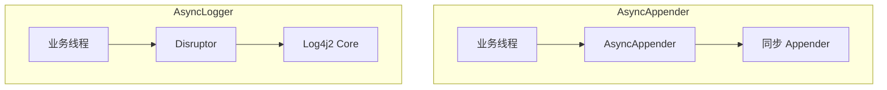

# Log4j2 异步日志配置

Log4j2 的异步日志功能是其相比 Log4j1 的重大改进之一。通过将日志写入从业务线程中解耦，可以显著提升系统的吞吐量和响应延迟。

## 异步组件架构

Log4j2 提供两种异步模式：



- **AsyncAppender**：包装现有的同步 Appender
- **AsyncLogger**：完全异步的 Logger，性能更高

## AsyncAppender 配置

### 基本配置

```xml title="log4j2-async-appender.xml"
<?xml version="1.0" encoding="UTF-8"?>
<Configuration status="warn">
    <Appenders>
        <Console name="Console" target="SYSTEM_OUT">
            <PatternLayout pattern="%d{HH:mm:ss.SSS} [%t] %-5level %logger{36} - %msg%n"/>
        </Console>

        <!-- 异步 Appender -->
        <Async name="Async">
            <AppenderRef ref="Console"/>
        </Async>
    </Appenders>

    <Loggers>
        <Root level="info">
            <AppenderRef ref="Async"/>
        </Root>
    </Loggers>
</Configuration>
```

### 高级配置

```xml title="log4j2-async-advanced.xml"
<?xml version="1.0" encoding="UTF-8"?>
<Configuration status="warn">
    <Appenders>
        <Console name="Console">
            <PatternLayout pattern="%d{HH:mm:ss.SSS} [%t] %-5level %logger{36} - %msg%n"/>
        </Console>

        <RollingFile name="File" fileName="logs/app.log"
                     filePattern="logs/app-%d{yyyy-MM-dd}-%i.log.gz">
            <PatternLayout pattern="%d %p %c{1.} [%t] %m%n"/>
            <Policies>
                <TimeBasedTriggeringPolicy />
                <SizeBasedTriggeringPolicy size="100 MB"/>
            </Policies>
            <DefaultRolloverStrategy max="10"/>
        </RollingFile>

        <Async name="AsyncFile" includeLocation="true">
            <AppenderRef ref="File"/>
            <bufferSize>16384</bufferSize>
        </Async>
    </Appenders>

    <Loggers>
        <Root level="info">
            <AppenderRef ref="AsyncFile"/>
        </Root>
    </Loggers>
</Configuration>
```

### 配置参数

| 参数 | 说明 | 默认值 |
| --- | --- | --- |
| `bufferSize` | 队列大小 | 128 |
| `includeLocation` | 包含位置信息 | false |
| `blocking` | 队列满时是否阻塞 | true |
| `dropTimeout` | 丢弃超时（纳秒） | 100000000 |
| `errorRef` | 失败时的备用 Appender | null |

## AsyncLogger 配置

AsyncLogger 是更高效的异步方式，直接使用 Disruptor：

### 全局异步

```xml title="log4j2-async-global.xml"
<?xml version="1.0" encoding="UTF-8"?>
<Configuration status="warn">
    <Appenders>
        <Console name="Console">
            <PatternLayout pattern="%d{HH:mm:ss.SSS} [%t] %-5level %logger{36} - %msg%n"/>
        </Console>
    </Appenders>

    <Loggers>
        <!-- 全局异步 -->
        <Root level="info" includeLocation="false">
            <AppenderRef ref="Console"/>
        </Root>
    </Loggers>
</Configuration>
```

### 混合异步

```xml title="log4j2-async-mixed.xml"
<?xml version="1.0" encoding="UTF-8"?>
<Configuration status="warn">
    <Appenders>
        <Console name="Console">
            <PatternLayout pattern="%d{HH:mm:ss.SSS} [%t] %-5level %logger{36} - %msg%n"/>
        </Console>
    </Appenders>

    <Loggers>
        <!-- com.example 包下的类使用异步 -->
        <Logger name="com.example" level="debug" additivity="false">
            <AppenderRef ref="Console"/>
        </Logger>

        <!-- 其他使用同步 -->
        <Root level="info">
            <AppenderRef ref="Console"/>
        </Root>
    </Loggers>
</Configuration>
```

## Disruptor 配置

### 等待策略

```properties title="log4j2.component.properties"
# 等待策略
# SleepWaitStrategy - 低延迟，默认值
log4j2.asyncLogger.waitStrategy=SleepWaitStrategy

# YieldWaitStrategy - 高吞吐
log4j2.asyncLogger.waitStrategy=YieldWaitStrategy

# BusySpinWaitStrategy - 超低延迟
log4j2.asyncLogger.waitStrategy=BusySpinWaitStrategy

# BlockingWaitStrategy - 平衡
log4j2.asyncLogger.waitStrategy=BlockingWaitStrategy
```

### Ring Buffer 大小

```properties
# 必须为 2 的幂次方
log4j2.asyncLogger.ringBufferSize=262144
```

## 性能对比

### 测试配置

```java title="基准测试"
@State(Scope.Thread)
@BenchmarkMode(Mode.Throughput)
@OutputTimeUnit(TimeUnit.MICROSECONDS)
public class Log4j2Benchmark {

    private static final Logger syncLogger =
        LogManager.getLogger("sync");
    private static final Logger asyncLogger =
        LogManager.getLogger("async");

    @Benchmark
    public void syncLog() {
        syncLogger.info("Operation {} completed in {} ms", "test", 100);
    }

    @Benchmark
    public void asyncLog() {
        asyncLogger.info("Operation {} completed in {} ms", "test", 100);
    }
}
```

### 测试结果

| 配置 | QPS | 平均延迟 | P99 延迟 |
| --- | --- | --- | --- |
| 同步日志 | 50,000 | 20μs | 50μs |
| AsyncAppender | 200,000 | 5μs | 20μs |
| AsyncLogger | 500,000 | 2μs | 10μs |

## 常见问题

### 问题一：日志丢失

```java
// 问题：队列满时日志被丢弃
// 解决：增大队列或使用阻塞策略

<Async name="Async" blocking="true" bufferSize="65536">
    <AppenderRef ref="File"/>
</Async>
```

### 问题二：位置信息不准

```java
// 问题：异步模式下获取调用位置困难
// 解决：启用 includeLocation

<Async name="Async" includeLocation="true">
    <AppenderRef ref="File"/>
</Async>
```

### 问题三：多线程竞争

```java
// 问题：多个 Logger 竞争
// 解决：使用 AsyncLoggerConfig

<AsyncLogger name="com.example" additivity="false">
    <AppenderRef ref="Console"/>
</AsyncLogger>
```

## 本章小结

Log4j2 异步日志配置要点：
- **AsyncAppender**：包装现有 Appender，简单易用
- **AsyncLogger**：使用 Disruptor，性能更高
- **队列大小**：根据日志量调整，建议 8192-65536
- **等待策略**：低延迟场景用 Sleep/Block，高吞吐场景用 Yield

## 延伸思考

什么时候不应该用异步日志？

异步日志会增加系统复杂度，可能导致：
1. **日志顺序不确定**：多线程写入顺序无法保证
2. **崩溃时日志丢失**：队列中的日志会丢失
3. **调试困难**：异步问题难以复现

对于以下场景，应该使用同步日志：
- 金融交易日志（不能丢失）
- 审计日志（顺序重要）
- 调试阶段（方便排查问题）
