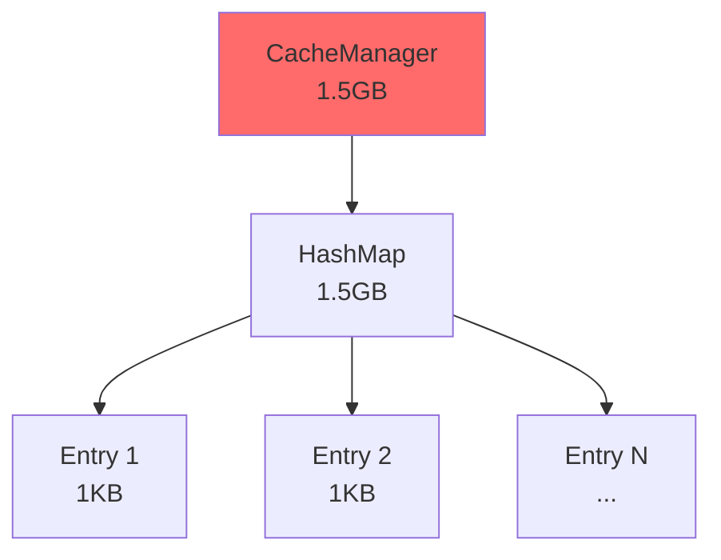
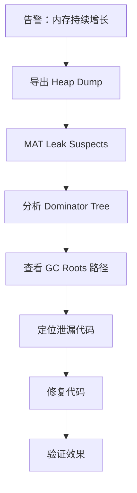

# 性能优化案例：内存泄漏排查

监控系统显示：应用内存每天增长 200MB，第三天凌晨触发 OOM 重启。服务开始变得不稳定，用户开始投诉。

## 问题背景

内存趋势：
- 第 1 天：1.2GB → 1.4GB
- 第 2 天：1.4GB → 1.6GB
- 第 3 天：1.6GB → 触发 OOM

GC 日志显示：
```
[GC (Allocation Failure)  2048M->1536M(4096M)]
[Full GC (Allocation Failure)  3584M->3072M(4096M)]
[Full GC (Allocation Failure)  3584M->3584M(4096M)]
[OOM]
```

这是典型的内存泄漏：内存持续增长，GC 无法回收。

## 排查步骤

### 第一步：导出 Heap Dump

```bash
# 触发 Heap Dump（OOM 前）
jmap -dump:format=b,file=heap_before_oom.hprof <pid>

# 如果应用已经 OOM，JVM 会自动生成
# 或者使用 Arthas
heapdump /tmp/heap.hprof
```

### 第二步：使用 MAT 分析

打开 MAT，加载 Heap Dump。

### 第三步：Leak Suspects 报告

MAT 自动生成 Leak Suspects 报告：

```
Problem Suspect 1:
One instance of "java.util.HashMap" 
loaded by "sun.reflect.DelegatingClassLoader" 
occupies 1,536,000,000 bytes (38.4%).

Thread java.lang.Thread @ 0x7f12345678
  -> this$0  com.example.CacheManager
  -> cache  java.util.HashMap
    -> table  java.util.HashMap$Node[]
```

### 第四步：定位泄漏点

查看 Dominator Tree：



### 第五步：查看引用链

查看 Path to GC Roots：

```
CacheManager.cache (HashMap)
  |
  +-> [Referrer: com.example.CacheManager.cache]
      |
      +-> [Referrer: com.example.CacheManager.this]
          |
          +-> [Referrer: java.lang.Thread.localVariables]
              |
              +-> [Referrer: Thread-1]
                  |
                  +-> [GC Root: Thread Stack]
```

## 根因分析

```java title="CacheManager.java"
public class CacheManager {

    private static Map<String, Object> cache = new HashMap<>();

    public void put(String key, Object value) {
        cache.put(key, value);  // 只增不减！
    }

    // 缺少清理逻辑
    // 缺少过期机制
}
```

问题是：缓存只有写入，没有清理。缓存无限增长。

## 修复方案

### 方案一：使用 WeakHashMap

```java
public class CacheManager {

    // 使用 WeakHashMap，GC 可以回收没有强引用的 Entry
    private static Map<String, WeakReference<Object>> cache =
        new WeakHashMap<>();

    public void put(String key, Object value) {
        cache.put(key, new WeakReference<>(value));
    }

    public Object get(String key) {
        WeakReference<Object> ref = cache.get(key);
        return ref != null ? ref.get() : null;
    }
}
```

### 方案二：添加过期机制

```java
public class CacheManager {

    private static Map<String, CacheEntry> cache = new ConcurrentHashMap<>();

    private static final long EXPIRE_MILLIS = 5 * 60 * 1000;  // 5 分钟

    public void put(String key, Object value) {
        cache.put(key, new CacheEntry(value, System.currentTimeMillis()));
    }

    public Object get(String key) {
        CacheEntry entry = cache.get(key);
        if (entry == null) return null;

        if (System.currentTimeMillis() - entry.timestamp > EXPIRE_MILLIS) {
            cache.remove(key);
            return null;
        }

        return entry.value;
    }

    private static class CacheEntry {
        Object value;
        long timestamp;
        CacheEntry(Object value, long timestamp) {
            this.value = value;
            this.timestamp = timestamp;
        }
    }
}
```

## 修复效果

| 指标 | 修复前 | 修复后 |
| --- | --- | --- |
| 内存增长 | 200MB/天 | 10MB/天（正常波动） |
| OOM 次数 | 每天 1-2 次 | 0 |
| 堆内存使用 | 持续上升 | 稳定在 1.5GB |

## 排查流程总结



## 常见内存泄漏模式

| 模式 | 特征 | 解决方案 |
| --- | --- | --- |
| 静态集合 | Map/Set 只增不减 | 添加清理机制 |
| 监听器未注销 | 添加监听器但不移除 | 实现注销方法 |
| ThreadLocal 未清理 | ThreadLocal.set 后不 remove | 使用 try-finally |
| 静态缓存 | 静态 Map 缓存无限增长 | 使用 WeakHashMap |
| 连接池泄漏 | 连接获取后不释放 | finally 块释放 |

## 经验总结

### 教训一：监控要到位

添加内存监控，及时发现内存增长趋势：
```java
// Micrometer 监控
meterRegistry.gauge("cache.size",
    cache, c -> c.size());
```

### 教训二：Heap Dump 是排查利器

内存问题必须看 Heap Dump：
- MAT 的 Leak Suspects 自动分析
- Dominator Tree 找保持对象
- Path to GC Roots 找引用链

### 教训三：修复后要验证

Heap Dump 修复前后对比：
```bash
# 修复前 Heap Dump
jmap -dump:format=b,file=before.hprof <pid>

# 修复后 Heap Dump
jmap -dump:format=b,file=after.hprof <pid>

# MAT -> Compare Heap Dumps
```

## 本章小结

内存泄漏排查的标准流程：
1. **监控发现**：内存持续增长
2. **Heap Dump**：导出堆转储
3. **MAT 分析**：Leak Suspects + Dominator Tree
4. **定位泄漏**：GC Roots 路径
5. **修复代码**：添加清理机制
6. **验证效果**：确认修复有效

## 延伸思考

为什么 Heap Dump 这么大还能分析？

MAT 使用了多种优化：
1. **流式处理**：不需要将整个文件加载到内存
2. **索引结构**：快速查询对象关系
3. **只保留必要数据**：不保存对象内容（对于分析来说）

即使是 10GB 的 Heap Dump，MAT 也能在几分钟内完成分析。
