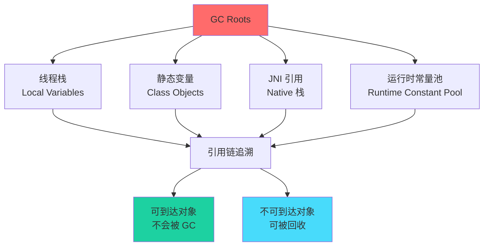
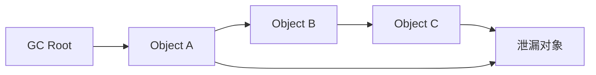

# 内存 Profiling

内存问题分为两大类：**内存泄漏**和**内存浪费**。前者是对象无法被回收，后者是对象分配了超出需要的内存。内存 Profiling 是定位这两类问题的关键手段。

## GC Roots 追踪

理解内存泄漏的关键是理解 GC Roots——那些永远不会被垃圾回收的对象集合：



GC Roots 包括：
- 活跃线程的局部变量
- 类的静态字段
- JNI 引用
- JVM 内部数据结构

所有从 GC Roots 出发可到达的对象都是「存活对象」，不可到达的对象才会被回收。

## 内存 Profiling 类型

### 分配剖析（Allocation Profiling）

分析"谁分配了最多的对象"。

```java
// 示例：统计对象分配
public class AllocationTracker {
    private static Map<Class<?>, AtomicLong> allocations = new ConcurrentHashMap<>();

    public static <T> T track(T obj) {
        allocations.computeIfAbsent(
            obj.getClass(),
            k -> new AtomicLong()
        ).incrementAndGet();
        return obj;
    }
}
```

分配剖析回答的问题：
- 哪个类分配了最多对象？
- 哪个方法触发了这些分配？
- 分配速率是多少？

### 存活剖析（Retention Profiling）

分析"谁持有最长引用"。



存活剖析回答的问题：
- 为什么这个对象没有被回收？
- 引用链是从 GC Root 到泄漏对象的？
- 哪个 GC Root 最需要关注？

## 内存泄漏 vs 内存浪费

| 特征 | 内存泄漏 | 内存浪费 |
| --- | --- | --- |
| 定义 | 对象还被持有引用，但已经不再使用 | 对象被正确回收，但分配了过多内存 |
| 表现 | 内存持续增长，最终 OOM | 内存使用量偏高，但不会无限增长 |
| 根因 | 错误的持有引用 | 频繁创建临时对象、字符串拼接等 |
| 解决方案 | 找到引用链，断开不需要的引用 | 优化代码，减少不必要的对象创建 |

## async-profiler 内存剖析

### 分配剖析

```bash
# 采样内存分配
./async-profiler.sh start -d 30 -f alloc.html -e alloc <pid>

# 采样包含栈追踪
./async-profiler.sh start -d 30 -f alloc.html -e alloc -a <pid>
```

### 存活剖析

使用 `-r` 选项采样存活对象：

```bash
# 存活对象剖析
./async-profiler.sh start -d 30 -f retention.html -e alloc -r <pid>
```

## JFR 内存剖析

### 配置

```bash
# 启用内存分配事件
java -XX:+FlightRecorder \
     -XX:FlightRecorderOptions=loglevel=info \
     -XX:StartFlightRecording=name=memory,settings=profile \
     -jar app.jar
```

### 关键事件

JFR 收集的内存相关事件：

| 事件 | 说明 |
| --- | --- |
| `ObjectAllocationInNewTLAB` | 在 TLAB 中分配的对象 |
| `ObjectAllocationOutsideTLAB` | 在 TLAB 外分配的对象 |
| `GarbageCollection` | GC 事件 |
| `OldObjectSample` | 存活时间较长的对象 |

## 常见内存泄漏模式

### 模式一：静态集合未清理

```java title="典型泄漏"
public class CacheManager {
    // 静态 Map 永远不会被 GC
    private static Map<String, Object> cache = new HashMap<>();

    public void put(String key, Object value) {
        cache.put(key, value);  // 只增不减
    }
}
```

**解决方案**：使用 `WeakHashMap` 或添加过期机制。

```java
// 方案一：WeakHashMap
private static Map<String, WeakReference<Object>> cache = new WeakHashMap<>();

// 方案二：添加过期
private static Map<String, CacheEntry> cache = new ConcurrentHashMap<>();
```

### 模式二：监听器未注销

```java title="典型泄漏"
public class EventManager {
    public void registerListener(EventListener listener) {
        listeners.add(listener);  // 只增不减
    }
}
```

**解决方案**：实现注销方法。

```java
public class EventManager {
    private List<EventListener> listeners = new CopyOnWriteArrayList<>();

    public void registerListener(EventListener listener) {
        listeners.add(listener);
    }

    public void unregisterListener(EventListener listener) {
        listeners.remove(listener);
    }
}
```

### 模式三：ThreadLocal 未清理

```java title="典型泄漏"
public class RequestHandler {
    private static ThreadLocal<User> currentUser = new ThreadLocal<>();

    public void handle() {
        currentUser.set(getUser());
        // 使用...
        // 忘记调用 currentUser.remove()
    }
}
```

**解决方案**：使用 `try-finally` 确保清理。

```java
public void handle() {
    try {
        currentUser.set(getUser());
        // 使用
    } finally {
        currentUser.remove();
    }
}
```

## 内存优化建议

### 减少对象分配

```java
// 错误：每次创建新 StringBuilder
String result = new StringBuilder()
    .append("a")
    .append(b)
    .append("c")
    .toString();

// 正确：复用 StringBuilder
StringBuilder sb = new StringBuilder(256);
sb.append("a").append(b).append("c");
String result = sb.toString();
```

### 使用基本类型

```java
// 错误：Integer 包装类型
Map<String, Integer> counts = new HashMap<>();

// 正确：基本类型
Map<String, LongAdder> counts = new ConcurrentHashMap<>();
```

## 本章小结

内存 Profiling 的两个方向：
- **分配剖析**：找出"谁分配了最多对象"
- **存活剖析**：找出"谁持有最长引用"

常见泄漏模式：静态集合、监听器、ThreadLocal。

**实战经验**：MAT 的「支配树（Dominator Tree）」和「GC Roots 最短路径」功能是定位泄漏的利器。

## 延伸思考

为什么 String 在 Java 中是内存浪费的大户？

因为：
1. 字符串字面量容易被重复创建
2. 字符串拼接会创建大量中间对象
3. 集合类经常以 String 作为 key

优化建议：
- 使用 `String.intern()` 复用字符串
- 使用 `StringBuilder` 代替 `+` 拼接
- 考虑使用自定义对象替代 String key
