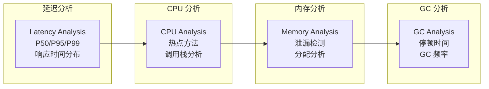

# 性能剖析方法论

凌晨 2 点，线上告警响起：核心接口 P99 延迟突然飙升至 500ms，客服电话被打爆。你打开日志，发现只有一行 timeout 异常，但根本不知道卡在哪一行代码。更糟糕的是，CPU 使用率只有 30%，内存占用正常，GC 也正常——问题仿佛藏在了某个看不见的角落。

**性能问题，从来不是简单的「代码写得不好」。它是一个系统性问题：涉及 JVM 行为、OS 资源调度、业务逻辑复杂度、外部依赖响应时间等多个维度。** 而性能剖析，就是帮你穿透这些迷雾、找到根因的那把钥匙。

## 性能剖析的三大目标

性能剖析围绕三个核心目标展开：



### 延迟分析

关注请求的响应时间分布。P50 代表中位数体验，P95/P99 代表长尾用户的体验。很多时候平均值很漂亮，但 P99 让你看到真实的「最坏情况」。

```java
// 计算延迟百分位数
List<Long> latencies = new ArrayList<>();
// ... 收集延迟数据 ...

Collections.sort(latencies);
int p50 = latencies.get(latencies.size() * 50 / 100);
int p95 = latencies.get(latencies.size() * 95 / 100);
int p99 = latencies.get(latencies.size() * 99 / 100);
```

### CPU 分析

找出消耗 CPU 时间最多的代码路径。热点可能是业务逻辑、序列化/反序列化、正则表达式、加密解密——每种热点的优化策略完全不同。

### 内存分析

区分内存泄漏与内存浪费：
- **泄漏**：对象还被持有引用，但已经不再使用
- **浪费**：对象被正确回收，但分配了过多内存

## 剖析时机

| 环境 | 优势 | 劣势 | 适用场景 |
| --- | --- | --- | --- |
| 测试环境 | 无生产压力、可重复、可控制 | 与生产环境可能有差异 | 基准测试、回归验证 |
| 预发环境 | 真实流量、数据更接近生产 | 流量有限、可能影响测试 | 上线前验证 |
| 生产环境 | 完全真实、可发现测试未覆盖的问题 | 有风险、需控制开销 | 偶发性问题、真实压测 |

**黄金原则**：测试环境发现不了的问题，生产环境帮你发现；生产环境发现不了的问题，只有持续剖析才能发现。

## 分层策略

```mermaid
flowchart TD
    subgraph 第一层：快速定位
        A["外部依赖\n数据库/缓存/外部 API"]
        B["网络 IO\n连接池/DNS/TCP"]
        C["GC 停顿\nGC 日志分析"]
    end

    subgraph 第二层：深入分析
        D["线程分析\njstack/线程 Dump"]
        E["CPU 热点\n火焰图剖析"]
        F["锁竞争\nsynchronized/Lock"]
    end

    subgraph 第三层：根因挖掘
        G["内存泄漏\nMAT/Heap Dump"]
        H["分配热点\nAllocation Profiling"]
        I["代码逻辑\nArthas trace"]
    end

    A --> B
    B --> C
    C --> D
    D --> E
    E --> F
    F --> G
    G --> H
    H --> I

    style A fill:#ff6b6b
    style B fill:#ff6b6b
    style C fill:#feca57
    style D fill:#feca57
    style E fill:#1dd1a1
    style F fill:#1dd1a1
    style G fill:#48dbfb
    style H fill:#48dbfb
    style I fill:#48dbfb
```

遇到性能问题时，应该从最外层开始排查：先确认是不是外部依赖超时、是不是 GC 停顿、是不是网络问题——这些排查成本最低，往往能快速定位大部分问题。

## 快速定位清单

### 第一步：检查外部依赖

```bash
# 检查数据库连接
mysql -e "SHOW STATUS LIKE 'Threads_connected';"

# 检查 Redis 连接
redis-cli info clients

# 检查是否有超时日志
grep -E "(timeout|exception|error)" app.log | tail -100
```

### 第二步：检查 GC

```bash
# 查看 GC 日志
cat gc.log | grep -E "GC|Full GC"

# 使用 jstat 查看 GC 统计
jstat -gcutil <pid> 1000
```

### 第三步：检查线程

```bash
# 抓取线程 dump
jstack <pid> > thread_dump.txt

# 查看 CPU 占用最高的线程
ps -mp <pid> -o THREAD,tid,time | sort -k2nr | head -20
```

## 本章小结

性能剖析的核心方法论：
- **明确目标**：延迟、CPU、内存、GC 四大方向
- **选择时机**：测试环境快速验证，生产环境发现问题
- **分层策略**：从外到内，先快后慢
- **工具配合**：不同问题用不同工具

性能剖析不是漫无目的地「看看哪里慢」，而是有目标、有层次、有时机的系统性工作。

## 延伸思考

为什么很多性能问题在测试环境发现不了？

因为测试环境的流量、数据量、并发模式与生产环境不同：
1. **流量差异**：测试流量是精心设计的，生产流量充满意外
2. **数据量差异**：测试数据是干净的，生产数据充满边界情况
3. **并发差异**：测试并发是稳定的，生产并发有峰值和风暴

这就是为什么持续性能分析（Continuous Profiling）在生产环境变得越来越重要。
