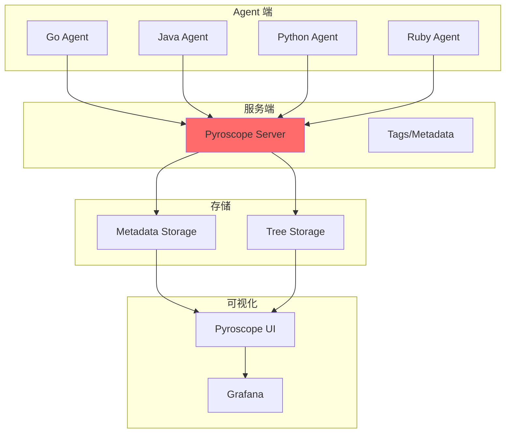
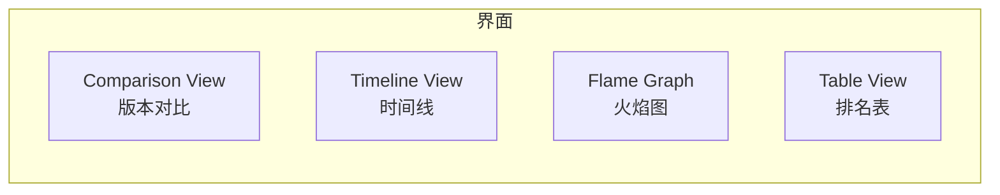
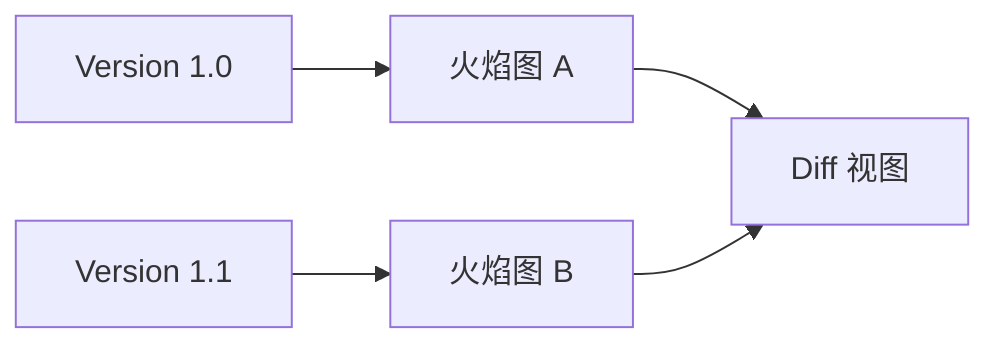

# Pyroscope 与 Polar Signals

Pyroscope 是开源的持续性能剖析平台，Polar Signals 是其商业化产品（基于 Parca）。两者都专注于提供低开销、持续运行的性能剖析能力。

## Pyroscope 架构



## Pyroscope 部署

### Docker Compose 快速部署

```yaml title="docker-compose.yml"
version: '3.8'

services:
  pyroscope:
    image: pyroscope/pyroscope:latest
    ports:
      - "4040:4040"
    environment:
      - PYROSCOPE_SERVER_ADDRESS=http://localhost:4040
      - PYROSCOPE_LOG_LEVEL=debug
    volumes:
      - ./data:/data
```

```bash
# 启动
docker-compose up -d

# 访问 UI
# http://localhost:4040
```

### Java Agent 接入

```bash
# 下载 Java Agent
wget https://github.com/pyroscope-io/pyroscope/releases/latest/download/pyroscope.jar

# 启动应用
java -javaagent:pyroscope.jar \
     -Dpyroscope.serverAddress=http://localhost:4040 \
     -Dpyroscope.applicationName=my-app \
     -jar my-app.jar
```

## Pyroscope UI

### 主要功能



### 时间线视图

选择任意时间段，分析该时段的性能数据：

```java
// 时间范围选择
start: 2024-01-01 10:00:00
end: 2024-01-01 10:15:00

// 支持拖拽选择
```

### 火焰图视图

与 async-profiler 生成的火焰图类似，但可以直接在 UI 中交互：

```java
// 交互功能
- 点击方法钻取
- 搜索特定方法
- 对比不同时间段
```

### 版本对比



## Grafana 集成

Pyroscope 原生支持 Grafana 数据源：

```yaml title="grafana.ini"
[datasources.pyroscope]
name = Pyroscope
type = pyroscope
url = http://localhost:4040
access = proxy
```

```sql
# Grafana 查询示例
{__name__="process_cpu", app="my-app"}
```

## Polar Signals

Polar Signals 是 Pyroscope 的商业化产品，基于 Parca：

### 主要特性

| 特性 | Pyroscope | Polar Signals |
| --- | --- | --- |
| 部署方式 | 自托管 | SaaS / 自托管 |
| 成本 | 免费 | 按使用量收费 |
| 存储 | 需自己管理 | 云端托管 |
| 支持 | 社区 | 企业级支持 |

### Parca 兼容

Polar Signals 基于 Parca（开源项目），两者 API 兼容：

```bash
# Parca Agent 示例
parca-agent \
  --store-address=grpc.polarsignals.com:443 \
  --insecure \
  --node=$(hostname)
```

## 持续 Profiling vs APM

| 维度 | 持续 Profiling | APM |
| --- | --- | --- |
| 数据类型 | 性能剖析 | 链路追踪 |
| 粒度 | 函数级 | 请求级 |
| 开销 | < 2% | 5-10% |
| 存储成本 | 高 | 中 |
| 主要用途 | 热点分析 | 故障定位 |

## 本章小结

Pyroscope 与 Polar Signals 的特点：
- **Pyroscope**：开源、灵活、可自托管
- **Polar Signals**：商业化、零运维、Grafana 集成
- **共同点**：低开销、持续运行、支持多语言

两者都是持续性能分析领域的优秀工具，选择取决于部署和成本需求。

## 延伸思考

Pyroscope 的存储如何扩展？

Pyroscope 支持多种后端存储：
- **Badger**：嵌入式，适合小规模
- **S3**：对象存储，适合大规模
- **GCS**：Google Cloud Storage
- **Azure Blob**：Azure Storage

对于大规模部署，建议使用 S3 存储元数据，Badger 存储性能数据。
