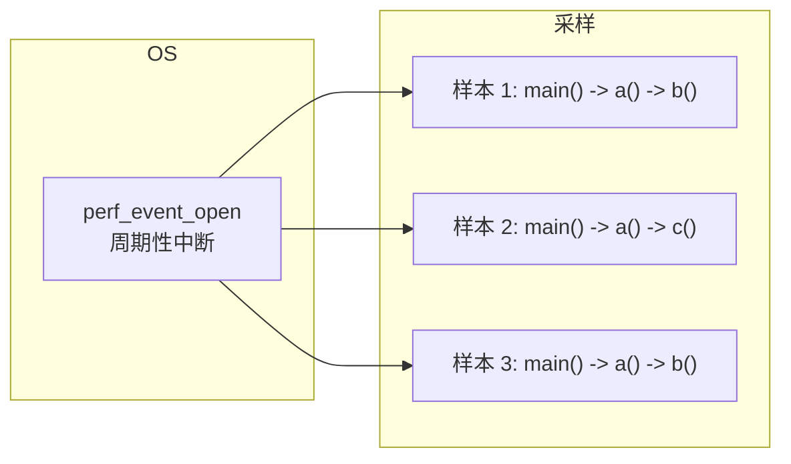

# 采样 vs 插桩

性能剖析有两种核心技术：采样和插桩。它们各有优劣，选择哪个取决于具体场景。

## 采样剖析（Sampling）

采样剖析基于 OS 的周期性中断（如 Linux 的 `perf_event_open`），在每个中断时刻采样线程的调用栈。



**工作原理**：
- 每隔固定时间（如 10ms）向目标进程发送信号
- JVM 响应信号，采样当前线程的调用栈
- 重复多次，统计每个调用栈出现的次数

```java
// 采样结果示例
// main() -> service() -> dao.query() - 45 次 (30%)
// main() -> service() -> dao.update() - 30 次 (20%)
// main() -> service() -> cache.get() - 25 次 (17%)
```

### 采样的优点

- **低开销**：通常 `< 5%` CPU 开销
- **可随时启用**：不需要修改代码
- **统计准确**：样本足够大时，统计结果接近真实
- **适合生产环境**：低干扰

### 采样的缺点

- **结果具有统计性**：需要足够长的采样时间
- **短方法可能被漏掉**：如果一个方法执行时间 < 采样间隔，可能检测不到
- **无法获取精确计数**：只能知道时间占比，无法知道调用次数

## 插桩剖析（Instrumentation）

插桩剖析通过修改字节码，在方法入口和出口插入计时代码。

```mermaid
flowchart LR
    subgraph 原始代码
        O["public void method() {\n    // 业务逻辑\n}"]
    end

    subgraph 插桩后
        I["public void method() {\n    long start = System.nanoTime();\n    // 业务逻辑\n    record(start, \"method\");\n}"]
    end

    O -->|"字节码修改"| I
```

**工作原理**：
- 在方法入口记录开始时间
- 在方法出口记录结束时间
- 计算执行时长并上报

### 插桩的优点

- **精确到方法**：能获取每个方法的执行时间和调用次数
- **无遗漏**：无论方法执行多快，都能记录
- **功能丰富**：可以记录入参、返回值、异常

### 插桩的缺点

- **有性能开销**：可能放大 2x-10x
- **需要修改代码或字节码**：增加了复杂度
- **可能改变优化决策**：插桩代码本身可能影响 JIT 优化

## 对比总结

| 特性 | 采样 | 插桩 |
| --- | --- | --- |
| **开销** | 低（`< 5%`） | 高（2x-10x） |
| **精度** | 统计级 | 方法级 |
| **适用场景** | 生产环境、长时间运行 | 测试环境、精确诊断 |
| **常见工具** | async-profiler、perf | JFR、Arthas trace |
| **调用次数** | 无法直接获取 | 可精确获取 |
| **短方法检测** | 可能漏掉 | 不会漏掉 |

## 实战选择

### 场景一：生产环境 CPU 热点分析

**推荐**：采样剖析（async-profiler）

```bash
# 30 秒 CPU 采样
./async-profiler.sh start -d 30 -f profile.html -e cpu <pid>
```

理由：生产环境不能承受高开销，采样足以定位 CPU 热点。

### 场景二：定位特定方法的耗时

**推荐**：插桩剖析（Arthas trace）

```bash
# 追踪方法调用链路
trace com.example.Service processOrder
```

理由：需要精确到方法级别的耗时，插桩可以提供。

### 场景三：分析内存分配

**推荐**：采样剖析（async-profiler alloc）

```bash
# 采样内存分配
./async-profiler.sh start -d 30 -f alloc.html -e alloc <pid>
```

理由：内存分配分析通常是采样，插桩开销太大。

### 场景四：测试环境性能验证

**推荐**：插桩剖析（JFR profiling）

```bash
# JFR profiling 模式
java -XX:+FlightRecorder \
     -XX:StartFlightRecording=name=profile,settings=profile \
     -jar app.jar
```

理由：测试环境可以承受一定开销，插桩提供更精确的数据。

## 采样与插桩的结合

最佳实践是先用采样找到热点区域，再用插桩精确测量。


## 本章小结

采样和插桩是互补的技术：
- **采样**：低开销、统计准确，适合快速定位，适合生产环境
- **插桩**：精确到方法、功能丰富，适合精确诊断，适合测试环境

**实战建议**：先用采样定位问题区域，再用插桩精确分析。

## 延伸思考

为什么 async-profiler 比原生 perf 更适合 Java？

原生 perf 只能看到内核函数和汇编指令，看不到 Java 方法名和行号。async-profiler 通过 JVMTI 和 JVM 内部机制，可以获取：
- Java 方法名
- 行号
- 类名
- 甚至内联函数

这就是为什么 Java 性能剖析需要专门的工具。
