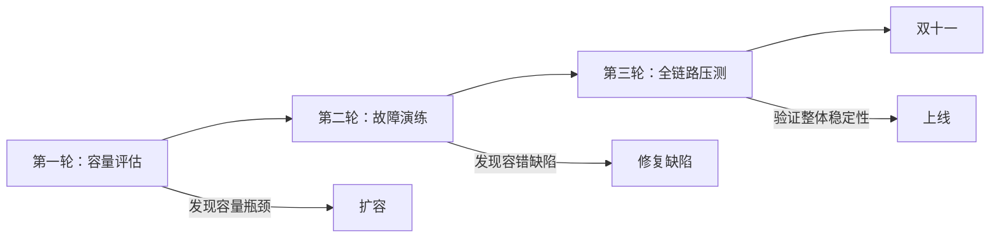

# 混沌工程案例：阿里 ChaosBlade

阿里巴巴是混沌工程在国内的先驱，ChaosBlade 在双十一等大规模活动中发挥了关键作用。

2016 年，阿里巴巴面临一个巨大的挑战：双十一的流量是平时的数十倍，任何一个小问题都可能放大成灾难。阿里工程师意识到，**不能等到双十一那天才知道系统能不能扛住**——必须在平时就不断验证。

## 阿里混沌工程的起源

```
阿里混沌工程的发展历程：

2016 年：开始建设混沌工程能力
  - 背景：双十一流量洪峰
  - 问题：如何验证系统韧性？

2017 年：自研故障注入平台
  - 开发内部工具
  - 故障演练常态化

2018 年：开源 ChaosBlade
  - 将内部工具开源
  - 推动行业混沌工程发展

2019 年至今：持续演进
  - 覆盖更多故障场景
  - 与业务深度结合
```

## 阿里混沌工程的实践

### 1. 日常演练：常态化

阿里将混沌工程融入日常开发节奏：

```yaml title="alibaba-daily-drill.yaml"]
# 日常演练配置
drill:
  # 每天凌晨 3 点自动执行
  schedule: "0 3 * * *"

  # 低风险实验
  experiments:
    - name: "lightweight-pod-kill"
      type: "pod-kill"
      percentage: 1

    - name: "network-delay"
      type: "network-delay"
      latency: "100ms"
      percentage: 5

  # 自动停止条件
  safety:
    error_rate_threshold: 0.01
    latency_threshold: 1000ms
```

### 2. 大促保障：全链路压测 + 故障演练

双十一前，阿里会进行三轮保障：



```yaml title="double11-guarantee.yaml"]
# 大促前故障演练配置
guarantee:
  # 模拟依赖服务故障
  scenarios:
    - name: "payment-service-failure"
      type: "pod-kill"
      target: "payment-service"
      percentage: 50  # 杀死 50% 实例
      duration: 10m

    - name: "redis-failure"
      type: "network-partition"
      target: "redis-cluster"
      duration: 5m

    - name: "database-slow-query"
      type: "database-latency"
      latency: 3000ms  # 模拟数据库慢查询
      duration: 5m
```

### 3. 问题复盘：每个故障都是学习机会

阿里建立了完善的故障复盘机制：

```yaml title="incident-review.yaml"]
incident_review:
  # 故障分类
  classification:
    - type: "chaos-engineering-found"
      description: "混沌工程发现的缺陷"
      percentage: 70

    - type: "production-incident"
      description: "生产环境故障"
      percentage: 20

    - type: "testing-found"
      description: "测试环境发现"
      percentage: 10

  # 复盘模板
  template:
    - section: "故障现象"
      fields: ["发生时间", "影响范围", "持续时间"]

    - section: "根因分析"
      fields: ["直接原因", "根本原因", "为何未提前发现"]

    - section: "改进措施"
      fields: ["短期修复", "长期改进", "预防措施"]

    - section: "经验沉淀"
      fields: ["学到了什么", "可以分享给团队的"]
```

## 关键技术实践

### 1. Java 故障注入

```bash
# ChaosBlade JVM 故障注入
blade create jvm oom --pid 12345
blade create jvm delay --pid 12345 --time 3000
blade create jvm exception --pid 12345 --exception java.lang.RuntimeException
```

### 2. 数据库故障注入

```bash
# ChaosBlade 数据库故障
# 模拟主从延迟
blade create mysql delay --database order_db --time 5000

# 模拟慢查询
blade create mysql execute --sql "SELECT * FROM large_table" --time 10000

# 模拟连接池耗尽
blade create mysql exception --error-code 1040 --count 10
```

### 3. 网络故障注入

```bash
# ChaosBlade 网络故障
# 网络丢包
blade create network loss --interface eth0 --percent 20

# 网络延迟
blade create network delay --interface eth0 --offset 500ms

# DNS 故障
blade create dns error --domain payment-service --ip 127.0.0.1
```

## 成果数据

阿里公开的一些数据：

| 指标 | 数据 |
| --- | --- |
| 日常演练频率 | 每天 |
| 故障演练覆盖率 | 核心服务 100% |
| 双十一 MTTR | 从 30 分钟降低到 5 分钟 |
| 因演练发现并修复的缺陷 | 500+ |
| 混沌工程团队规模 | 20+ 人 |

## 阿里混沌工程的启示

### 1. 混沌工程要与业务结合

阿里的经验是：**混沌工程不是安全团队的专属，而是每个团队的日常工作**。

```yaml title="ownership-model.yaml"]
# 每个团队对自己的服务负责
ownership:
  - team: "order-team"
    responsible_for:
      - "order-service"
      - "order-db"
    chaos_experiments:
      - "order-service-failover"
      - "order-db-slow-query"
      - "order-service-circuit-breaker"

  - team: "payment-team"
    responsible_for:
      - "payment-service"
      - "payment-gateway"
    chaos_experiments:
      - "payment-service-high-load"
      - "payment-gateway-timeout"
      - "payment-service-degradation"
```

### 2. 自动化是规模化前提

阿里每天执行数百次故障演练，这只有通过自动化才能实现。

### 3. 从失败中学习

```
阿里的故障复盘文化：

每个故障都是学习机会
不是追责，而是追因
修复的是系统，不是人
```

## 与 Netflix 的对比

| 维度 | Netflix | 阿里 |
| --- | --- | --- |
| **背景** | AWS 基础设施迁移 | 双十一流量洪峰 |
| **规模** | 全球用户 | 中国用户 |
| **工具** | Chaos Monkey / FIT | ChaosBlade |
| **频率** | 持续混沌 | 日常 + 大促专项 |
| **文化** | 「Built-in」 | 「日常化 + 大促保障」 |

## 质量判断标准

一篇「阿里 ChaosBlade 案例」的文章是否达标，要看它是否回答了：

1. ✅ 阿里为什么需要混沌工程（背景和问题）？
2. ✅ 阿里混沌工程的实践模式（日常演练 + 大促保障）？
3. ✅ 有哪些关键实践（故障类型、技术实现）？
4. ✅ 取得了哪些成果（数据支撑）？
5. ✅ 对行业有哪些启示？
6. ❌ 只有工具介绍，没有真实案例和实践——不达标

## 本章总结

**核心要点**：

1. **阿里混沌工程源于双十一的挑战**：必须在大流量前验证系统韧性
2. **日常演练 + 大促保障双模式**：平时常态化，大促前专项验证
3. **混沌工程是每个团队的责任**：不是安全团队的专属，而是开发的日常工作
4. **故障复盘是学习机会**：追因不追责，修复系统而非人
5. **自动化是规模化的前提**：每天数百次演练只有自动化才能实现
