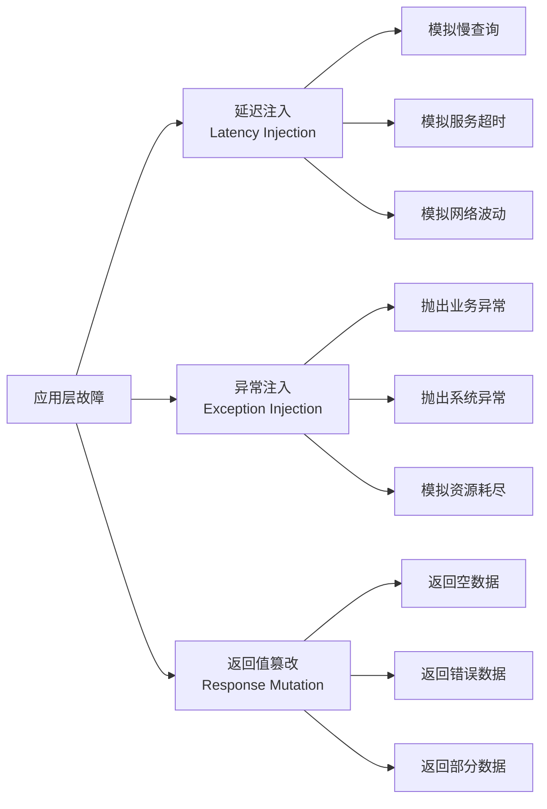

# 应用层故障注入

代码层面的故障比基础设施层故障更难发现，也更需要通过故障注入来验证。

应用层故障注入在应用代码或中间件层面模拟各种异常——异常抛出、响应延迟、返回值篡改——用于验证应用在面对故障时的处理能力。与基础设施层故障不同，应用层故障注入更加精细，可以针对特定接口、特定参数、特定调用路径进行故障模拟。

## 应用层故障的三种类型



## 延迟注入

### 通过代理层注入延迟

```yaml title="延迟注入.yaml"
# Envoy 延迟注入
apiVersion: networking.istio.io/v1alpha3
kind: VirtualService
metadata:
  name: order-service
spec:
  http:
  - route:
    - destination:
        host: order-service
    fault:
      delay:
        percentage:
          value: 10  # 10% 请求
        fixedDelay: 5s  # 延迟 5 秒
```

```yaml title="Spring Cloud Gateway延迟.yaml"
# Spring Cloud Gateway 延迟
spring:
  cloud:
    gateway:
      routes:
      - id: order-service
        uri: http://order-service
        filters:
        - name: RequestDelay
          args:
            delay: 5000      # 5 秒延迟
            percentage: 10   # 10% 请求受影响
```

### 通过 AOP 注入延迟

```java title="DelayInjectionAspect.java"
@Aspect
@Component
public class DelayInjectionAspect {

    private final ChaosConfig config;

    @Around("execution(* com.example.*.OrderService.*(..))")
    public Object injectDelay(ProceedingJoinPoint point) throws Throwable {
        if (!config.isDelayEnabled()) {
            return point.proceed();
        }

        int percentage = config.getDelayPercentage();
        int delayMs = config.getDelayMilliseconds();

        // 根据百分比决定是否注入延迟
        if (ThreadLocalRandom.current().nextInt(100) < percentage) {
            Thread.sleep(delayMs);
        }

        return point.proceed();
    }
}
```

### Chaos Monkey for Spring Boot

```java title="SpringChaos配置.java"
@SpringBootApplication
@EnableChaosMonkey
public class OrderServiceApplication {

    public static void main(String[] args) {
        SpringApplication.run(OrderServiceApplication.class, args);
    }
}
```

```yaml title="chaos-monkey配置.yaml"
chaos:
  monkey:
    enabled: true
    level: 5

    attacks:
      latency:
        enabled: true
        mean: 2000
        variance: 500

      exception:
        enabled: true
        probability: 0.1
        exceptionClass: RuntimeException

    watchers:
      - controller
      - service
```

## 异常注入

### 异常注入切面

```java title="ExceptionInjectionAspect.java"
@Aspect
@Component
public class ExceptionInjectionAspect {

    private final Map<String, ChaosConfig.ExceptionConfig> exceptionMap = new ConcurrentHashMap<>();

    @Autowired
    private ChaosConfig chaosConfig;

    @Around("execution(* com.example.*.OrderService.*(..))")
    public Object injectException(ProceedingJoinPoint point) throws Throwable {
        String methodName = point.getSignature().toShortString();
        ChaosConfig.ExceptionConfig config = exceptionMap.get(methodName);

        if (config != null && shouldInject(config)) {
            log.warn("Chaos: 注入异常到方法 {}", methodName);
            throw config.getException();
        }

        return point.proceed();
    }

    private boolean shouldInject(ChaosConfig.ExceptionConfig config) {
        if (!config.isEnabled()) {
            return false;
        }
        return ThreadLocalRandom.current().nextDouble() < config.getProbability();
    }

    // 动态配置异常
    public void configureException(String method, ChaosConfig.ExceptionConfig config) {
        exceptionMap.put(method, config);
    }
}
```

### Byteman 异常注入

```bash
# 安装 Byteman agent
CATALINA_OPTS="-javaagent:$BYTEMAN_HOME/lib/byteman.jar=script:$SCRIPT_DIR/inject.btm"

# Byteman 脚本
# inject.btm
RULE inject payment timeout
CLASS PaymentService
METHOD processPayment
AT INVOKE processPayment
IF true
DO throw new com.example.PaymentException("Chaos: payment timeout simulation")
ENDRULE
```

### Spring MockMvc 异常注入

```java title="MockMvc异常注入测试.java"
@SpringBootTest
public class ChaosInjectionTest {

    @Autowired
    private MockMvc mockMvc;

    @Test
    public void testPaymentServiceFailure() {
        // 模拟支付服务不可用
        when(paymentClient.process(any()))
            .thenThrow(new PaymentServiceException("Payment service unavailable"));

        // 验证系统行为
        mockMvc.perform(get("/api/orders"))
            .andExpect(status().isServiceUnavailable())
            .andExpect(jsonPath("$.code").value("PAYMENT_SERVICE_UNAVAILABLE"));
    }
}
```

## 返回值篡改

### 返回空值

```java title="NullValueInjection.java"
@Aspect
@Component
@ConditionalOnProperty(name = "chaos.enabled", havingValue = "true")
public class NullValueInjection {

    private final Map<String, Double> nullProbabilityMap = new ConcurrentHashMap<>();

    @Around("execution(* com.example.*.ProductService.getProduct(..))")
    public Object injectNullValue(ProceedingJoinPoint point) throws Throwable {
        String method = point.getSignature().toShortString();
        Double probability = nullProbabilityMap.get(method);

        if (probability != null && Math.random() < probability) {
            log.warn("Chaos: 注入 null 返回值到 {}", method);
            return null;
        }

        return point.proceed();
    }
}
```

### 返回错误数据

```java title="CorruptDataInjection.java"
@Service
public class CorruptDataService {

    @Autowired
    private ChaosConfig chaosConfig;

    public Product getProduct(Long productId) {
        Product product = productRepository.findById(productId);

        if (chaosConfig.isCorruptEnabled()) {
            // 篡改价格，使之下跌 90%
            if (Math.random() < chaosConfig.getCorruptProbability()) {
                Product corrupted = new Product();
                corrupted.setId(product.getId());
                corrupted.setName(product.getName());
                corrupted.setPrice(product.getPrice().multiply(new BigDecimal("0.1")));
                return corrupted;
            }
        }

        return product;
    }
}
```

## Chaos Mesh 应用层故障

```yaml title="http-fault.yaml"
# Chaos Mesh HTTPFault
apiVersion: chaos-mesh.org/v1alpha1
kind: HTTPChaos
metadata:
  name: http-fault
spec:
  mode: one
  selector:
    namespaces:
      - production
    labelSelectors:
      app: order-service

  # 延迟注入
  delay:
    - port: 8080
      path: "/api/orders"
      delay: "3s"
      probability: 20

  # 异常注入
  abort:
    - port: 8080
      path: "/api/payment"
      probability: 10
      code: 500
```

## 分布式追踪与故障注入结合

```java title="链路追踪注入点.java"
@Service
public class InstrumentedOrderService {

    private final Tracer tracer;

    public Order createOrder(OrderRequest request) {
        Span span = tracer.buildSpan("createOrder").start();

        try (Scope scope = tracer.activate(span)) {
            // 模拟延迟
            simulateChaos("createOrder");

            Order order = doCreateOrder(request);

            span.setTag("order.id", order.getId());
            return order;
        } catch (Exception e) {
            span.setTag("error", true);
            span.setTag("error.message", e.getMessage());
            throw e;
        } finally {
            span.finish();
        }
    }

    private void simulateChaos(String operation) {
        // 从配置中心获取故障注入规则
        ChaosRule rule = chaosConfig.getRule(operation);
        if (rule == null) return;

        if (rule.getLatencyMs() > 0) {
            try {
                Thread.sleep(rule.getLatencyMs());
            } catch (InterruptedException ignored) {}
        }

        if (rule.getExceptionProbability() > 0
            && Math.random() < rule.getExceptionProbability()) {
            throw new ChaosException("Chaos: injected failure");
        }
    }
}
```

## 故障注入的配置管理

```java title="ChaosConfig.java"]
@Configuration
@ConfigurationProperties(prefix = "chaos")
public class ChaosConfig {

    private boolean enabled = false;
    private Map<String, AttackConfig> attacks = new HashMap<>();

    public static class AttackConfig {
        private int percentage;
        private int latencyMs;
        private String exceptionClass;
        private double exceptionProbability;

        // getters and setters
    }

    public ChaosRule getRule(String method) {
        if (!enabled) return null;
        return new ChaosRule(attacks.get(method));
    }
}
```

```yaml title="chaos-rules.yaml"]
chaos:
  enabled: true

  attacks:
    createOrder:
      percentage: 10
      latencyMs: 3000
      exceptionProbability: 0.05

    processPayment:
      percentage: 20
      latencyMs: 5000
      exceptionProbability: 0.1

    getProduct:
      percentage: 5
      latencyMs: 1000
      exceptionProbability: 0.02
```

## 质量判断标准

一篇「应用层故障注入」的文章是否达标，要看它是否回答了：

1. ✅ 应用层故障有哪三种类型（延迟/异常/篡改）？
2. ✅ 每种故障如何实现（AOP/代理/配置）？
3. ✅ 有具体的代码示例和配置？
4. ✅ 故障注入如何与链路追踪结合？
5. ❌ 只有列表，没有代码实现——不达标

## 本章总结

**核心要点**：

1. **应用层故障有三种类型**：延迟注入、异常注入、返回值篡改
2. **AOP 是实现故障注入的好方式**：不侵入业务代码
3. **延迟注入可以模拟真实故障场景**：慢查询、网络波动、依赖超时
4. **异常注入验证错误处理**：系统是否有兜底方案
5. **返回值篡改验证边界处理**：空值、错误数据是否导致系统崩溃
