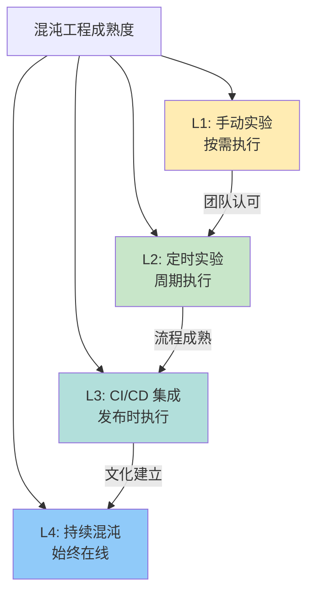

# 混沌实验自动化

手动实验只解决了「能不能做」的问题，自动化才是混沌工程成熟的标志。

手动执行有几个明显的局限：不可重复、依赖人工、容易遗忘、无法持续改进。当团队开始认真对待混沌工程时，自动化就成了必然选择。

## 自动化的成熟度模型



### L1: 手动实验

最低级别，按需手动执行：

```bash
# 手动执行一个实验
kubectl apply -f pod-kill-experiment.yaml
sleep 60
kubectl delete -f pod-kill-experiment.yaml
```

**问题**：

- 依赖人工操作，容易遗忘
- 无法持续验证
- 结果难以复现
- 无法规模化

### L2: 定时实验

通过 CronJob 或调度器定期执行：

```yaml title="scheduled-experiment.yaml"
apiVersion: batch/v1
kind: CronJob
metadata:
  name: chaos-experiment-daily
spec:
  schedule: "0 2 * * *"  # 每天凌晨 2 点
  concurrencyPolicy: Forbid
  jobTemplate:
    spec:
      template:
        spec:
          containers:
          - name: chaos
            image: chaos-experiment:latest
            args:
            - --experiment=pod-kill
            - --namespace=production
            - --service=order-service
            - --count=1
          restartPolicy: OnFailure
```

### L3: CI/CD 集成

集成到发布流水线，每次发布前执行：

```yaml title="gitlab-ci.yaml"
stages:
  - build
  - test
  - chaos
  - deploy

# 混沌工程阶段
chaos_experiment:
  stage: chaos
  image: chaosblade/chaosblade:latest

  script: |
    # 1. 执行前置条件检查
    ./scripts/check_steady_state.sh

    # 2. 记录基线指标
    ./scripts/record_baseline.sh

    # 3. 注入故障
    chaosblade create k8s pod kill \
      --namespace production \
      --label app=order-service \
      --count 1

    # 4. 等待观察
    sleep 60

    # 5. 验证稳态
    ./scripts/verify_steady_state.sh

    # 6. 清理故障
    chaosblade destroy $BLADE_UID

    # 7. 记录结果
    ./scripts/record_result.sh

  only:
    - main
    - release/*

  variables:
    CHAOS_ENABLED: "true"

  allow_failure: false  # 混沌实验失败则流水线失败
```

```yaml title="github-actions.yaml"
name: Chaos Engineering

on:
  push:
    branches: [main]
  schedule:
    - cron: '0 2 * * *'  # 每天凌晨

jobs:
  chaos:
    runs-on: ubuntu-latest
    steps:
      - uses: actions/checkout@v3

      - name: Run Chaos Experiments
        uses: chaoshub/action-chaos@v1
        with:
          experiment: ./experiments/pod-kill.yaml
          namespace: production
          verify: ./scripts/verify.sh

      - name: Upload Results
        if: always()
        uses: actions/upload-artifact@v3
        with:
          name: chaos-results
          path: results/
```

### L4: 持续混沌

在生产环境始终运行低风险故障实验：

```yaml title="continuous-chaos.yaml"
# Chaos Mesh Scheduler - 持续混沌
apiVersion: chaos-mesh.org/v1alpha1
kind: Schedule
metadata:
  name: continuous-chaos
spec:
  schedule: "0 */4 * * *"  # 每 4 小时
  startingDeadlineSeconds: 100
  chaosTemplate:
    name: pod-kill-light
  type: PodChaos
```

```yaml title="lightweight-experiments.yaml"
# 持续混沌的实验必须是低风险的
experiments:
  # 实验 1：随机杀死 1% 的 Pod（低风险）
  - name: "lightweight-pod-kill"
    type: "pod-kill"
    mode: "percentage"
    value: 1  # 1% 的 Pod
    duration: "60s"

  # 实验 2：注入 100ms 网络延迟（低风险）
  - name: "lightweight-network-delay"
    type: "network-delay"
    latency: "100ms"
    percentage: 5  # 5% 的请求

  # 实验 3：随机杀死非关键服务
  - name: "non-critical-service"
    type: "pod-kill"
    selector:
      labelSelector:
        tier: "frontend"
    percentage: 10
```

## 自动化的关键技术

### 1. 稳态自动验证

```java title="SteadyStateVerifier.java"
@Service
public class SteadyStateVerifier {

    private final PrometheusClient prometheus;

    public boolean isSteady() {
        // 成功率 >= 99.9%
        double successRate = prometheus.query(
            "sum(rate(http_requests_total{status!~'5..'}[5m])) " +
            "/ sum(rate(http_requests_total[5m]))"
        );
        if (successRate < 0.999) {
            log.warn("成功率 {} 低于阈值 0.999", successRate);
            return false;
        }

        // TP99 延迟 <= 500ms
        double p99Latency = prometheus.query(
            "histogram_quantile(0.99, " +
            "sum(rate(http_request_duration_seconds_bucket[5m])) by (le)) * 1000"
        );
        if (p99Latency > 500) {
            log.warn("TP99 延迟 {} ms 超过阈值 500ms", p99Latency);
            return false;
        }

        return true;
    }
}
```

### 2. 自动停止机制

```yaml title="auto-stop.yaml"]
# Prometheus 告警触发的自动停止
groups:
- name: chaos-safety
  rules:
  - alert: ChaosExperimentUnsafe
    expr: |
      sum(rate(http_requests_total{status=~"5.."}[1m]))
      / sum(rate(http_requests_total[1m])) > 0.05
    for: 30s
    labels:
      severity: critical
      action: "stop-chaos"
    annotations:
      summary: "混沌实验导致错误率超过 5%，自动停止"

  # Webhook 触发停止
  webhook:
    - name: "stop-chaos"
      url: "http://chaos-operator/stop"
      body: |
        {"experiment_id": "{{ $labels.experiment_id }}"}
```

### 3. 实验编排

```java title="ExperimentOrchestrator.java"]
@Service
public class ExperimentOrchestrator {

    public void executeExperiment(Experiment experiment) {
        log.info("开始执行实验: {}", experiment.getName());

        // 1. 前置检查
        if (!preconditionCheck(experiment)) {
            throw new ChaosException("前置条件检查失败");
        }

        // 2. 记录基线
        Baseline baseline = recordBaseline(experiment);

        // 3. 注入故障
        String faultId = injectFault(experiment);

        try {
            // 4. 监控验证
            monitorAndVerify(experiment);

        } finally {
            // 5. 清理故障
            cleanupFault(faultId);
        }

        // 6. 记录结果
        recordResult(experiment, baseline);
    }

    private void monitorAndVerify(Experiment experiment) {
        long startTime = System.currentTimeMillis();
        long timeout = experiment.getTimeout();

        while (System.currentTimeMillis() - startTime < timeout) {
            if (!steadyStateVerifier.isSteady()) {
                log.warn("稳态被破坏，自动停止实验");
                throw new ChaosException("稳态验证失败");
            }

            // 检查安全阈值
            if (safetyGuard.isUnsafe()) {
                log.warn("安全阈值被触发，自动停止实验");
                safetyGuard.triggerAutoStop();
                throw new ChaosException("安全阈值触发");
            }

            Thread.sleep(5000);  // 每 5 秒检查一次
        }
    }
}
```

## 自动化最佳实践

### 1. 渐进式自动化

```
第一步：手动执行，建立团队认知
    ↓
第二步：脚本化，提高可重复性
    ↓
第三步：定时执行，持续验证
    ↓
第四步：CI/CD 集成，每次发布验证
    ↓
第五步：持续混沌，始终在线
```

### 2. 失败处理

```java title="ChaosExperimentRunner.java"]
public class ChaosExperimentRunner {

    public ExperimentResult run(Experiment experiment) {
        try {
            // 正常执行
            return execute(experiment);
        } catch (ChaosException e) {
            // 记录异常
            log.error("实验异常: {}", e.getMessage());
            // 确保清理
            cleanup(experiment);
            // 记录失败结果
            return ExperimentResult.failed(e);
        } catch (Exception e) {
            // 未知异常，强制清理并告警
            log.error("未知异常，强制清理", e);
            forceCleanup(experiment);
            alert("Chaos experiment failed critically", e);
            return ExperimentResult.critical(e);
        }
    }
}
```

### 3. 结果持久化

```yaml title="result-storage.yaml"]
# 实验结果存储
experiment_results:
  - experiment_id: "exp-001"
    name: "payment-service-failover"
    timestamp: "2024-01-15T10:00:00Z"
    result: "PASS"
    duration_seconds: 300
    baseline:
      success_rate: 0.9999
      p99_latency: 50
    experiment:
      success_rate: 0.9997
      p99_latency: 120
    findings:
      - type: "observation"
        description: "切换时出现短暂延迟上升"
```

## 质量判断标准

一篇「混沌实验自动化」的文章是否达标，要看它是否回答了：

1. ✅ 自动化的成熟度模型（L1~L4）是什么？
2. ✅ CI/CD 集成的具体配置示例？
3. ✅ 持续混沌如何实现？
4. ✅ 自动停止机制如何实现？
5. ❌ 只有概念和列表，没有配置和代码——不达标

## 本章总结

**核心要点**：

1. **自动化是混沌工程成熟的标志**：从手动到持续混沌
2. **CI/CD 集成是 L3 的关键**：每次发布前验证系统韧性
3. **持续混沌是 L4 的目标**：始终在线，持续验证
4. **安全机制不可少**：自动停止、告警、失败处理
5. **渐进式推进**：不要试图一步到位
