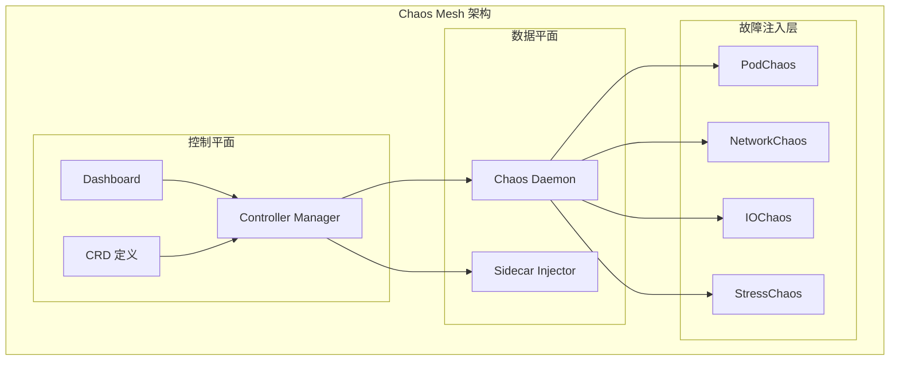

# Chaos Mesh 深度解析

Chaos Mesh 是 CNCF 旗下的云原生混沌工程平台，专为 Kubernetes 环境设计，提供开箱即用的故障注入能力。

Chaos Mesh 的核心优势在于与 Kubernetes 的深度集成——通过 CRD 定义实验，无需额外部署 agent，即可对 K8s 环境中的各种资源进行故障注入。

## 架构解析



### 核心组件

| 组件 | 说明 |
| --- | --- |
| **Controller Manager** | 核心控制器，管理所有 Chaos 实验的生命周期 |
| **Dashboard** | Web UI，可视化管理实验 |
| **Chaos Daemon** | 通过 Ptrace/Ptrace-C 注入故障 |
| **Sidecar Injector** | 通过 Sidecar 模式注入网络故障 |

## 安装

```bash
# 使用 Helm 安装
helm repo add chaos-mesh https://charts.chaos-mesh.org
helm repo update

helm install chaos-mesh chaos-mesh/chaos-mesh \
  -n chaos-mesh --create-namespace

# 验证安装
kubectl get pods -n chaos-mesh
```

## Pod 故障注入

### Pod Failure（Pod 不可用）

```yaml title="pod-failure.yaml"
apiVersion: chaos-mesh.org/v1alpha1
kind: PodChaos
metadata:
  name: pod-failure
spec:
  action: pod-failure
  mode: one                    # 随机选择 1 个 Pod
  duration: 60s               # 持续 60 秒
  selector:
    namespaces:
      - production
    labelSelectors:
      app: order-service
```

### Pod Kill（杀死 Pod）

```yaml title="pod-kill.yaml"
apiVersion: chaos-mesh.org/v1alpha1
kind: PodChaos
metadata:
  name: pod-kill
spec:
  action: pod-kill
  mode: percentage            # 按百分比
  value: "50"               # 杀死 50% 的 Pod
  duration: 30s
  selector:
    namespaces:
      - production
    labelSelectors:
      app: payment-service
```

## 网络故障注入

### 网络延迟

```yaml title="network-latency.yaml"
apiVersion: chaos-mesh.org/v1alpha1
kind: NetworkChaos
metadata:
  name: network-latency
spec:
  action: delay
  mode: one
  duration: 60s

  # 延迟配置
  delay:
    latency: "500ms"         # 延迟 500ms
    correlation: "25"        # 与实际延迟的相关性（0-100）
    jitter: "100ms"          # 抖动

  # 选择目标
  selector:
    namespaces:
      - production
    labelSelectors:
      app: payment-service
```

### 网络丢包

```yaml title="network-loss.yaml"
apiVersion: chaos-mesh.org/v1alpha1
kind: NetworkChaos
metadata:
  name: network-loss
spec:
  action: loss
  mode: one
  duration: 60s

  loss:
    loss: "20"              # 20% 丢包率
    correlation: "25"

  selector:
    namespaces:
      - production
    labelSelectors:
      app: order-service
```

### 网络分区

```yaml title="network-partition.yaml"
apiVersion: chaos-mesh.org/v1alpha1
kind: NetworkChaos
metadata:
  name: network-partition
spec:
  action: partition          # 网络分区
  mode: one
  duration: 60s

  # 方向：to（出向）、from（入向）、both（双向）
  direction: both

  selector:
    namespaces:
      - production
    labelSelectors:
      app: order-service

  # 分区目标
  target:
    mode: all               # 所有其他 Pod
    selector:
      namespaces:
        - production
      labelSelectors:
        app: payment-service
```

## IO 故障注入

```yaml title="io-chaos.yaml"
apiVersion: chaos-mesh.org/v1alpha1
kind: IOChaos
metadata:
  name: io-delay
spec:
  action: delay
  mode: one
  duration: 60s

  # 延迟配置
  delay:
    latency: "100ms"
    correlation: "25"

  # 指定卷
  volume:
    path: /data

  # 目标选择
  selector:
    namespaces:
      - production
    labelSelectors:
      app: file-service
```

## 压力故障注入

```yaml title="stress-chaos.yaml"
apiVersion: chaos-mesh.org/v1alpha1
kind: StressChaos
metadata:
  name: cpu-stress
spec:
  mode: one
  duration: 60s

  stressng:
    stressors:
      # CPU 压力
      cpu:
        workers: 4
        load: 80          # 80% CPU 使用率

      # 内存压力
      # memory:
      #   workers: 2
      #   size: "256MB"

  selector:
    namespaces:
      - production
    labelSelectors:
      app: order-service
```

## DNS 故障注入

```yaml title="dns-chaos.yaml"
apiVersion: chaos-mesh.org/v1alpha1
kind: DNSChaos
metadata:
  name: dns-fault
spec:
  action: error              # 返回错误
  mode: one
  duration: 60s

  # DNS 错误类型
  dns:
    pattern: "*.database.svc"  # 匹配模式
    action: Error
    ip: "127.0.0.1"          # 返回的 IP

  selector:
    namespaces:
      - production
    labelSelectors:
      app: order-service
```

## 时间故障注入

```yaml title="time-chaos.yaml"
# 修改 Pod 的系统时间
apiVersion: chaos-mesh.org/v1alpha1
kind: TimeChaos
metadata:
  name: time-shift
spec:
  action: skew              # 时间偏移
  mode: one
  duration: 60s

  timeOffset: "-1h"         # 时间回拨 1 小时

  selector:
    namespaces:
      - production
    labelSelectors:
      app: order-service
```

## 定时调度实验

```yaml title="scheduled-experiment.yaml"
apiVersion: chaos-mesh.org/v1alpha1
kind: Schedule
metadata:
  name: scheduled-chaos
spec:
  schedule: "0 */4 * * *"   # 每 4 小时执行一次
  startingDeadlineSeconds: 100

  # 引用的实验模板
  chaosTemplate:
    name: pod-failure-light
    namespace: chaos-mesh

  type: PodChaos
```

## 完整的实验配置

```yaml title="complete-experiment.yaml"
apiVersion: chaos-mesh.org/v1alpha1
kind: PodChaos
metadata:
  name: complete-pod-failure
  labels:
    experiment: payment-service-availability
spec:
  action: pod-failure
  mode: percentage
  value: "10"               # 只影响 10% 的 Pod

  # 持续时间
  duration: 60s

  # 实验暂停（人工审批）
  paused: false

  # 目标选择
  selector:
    namespaces:
      - production
    labelSelectors:
      app: payment-service
      tier: critical

  # 经验值（可选）
 经验值:
    - name: "error_rate"
      template: |
        histogram_quantile(0.99,
          sum(rate(http_request_duration_seconds_bucket{service="payment"}[1m])) by (le)
        ) * 1000
      type: Metric
      threshold: 1000        # 超过 1000ms 自动停止
```

## Dashboard 使用

```bash
# 端口转发访问 Dashboard
kubectl port-forward -n chaos-mesh \
  svc/chaos-dashboard 2333:2333

# 访问 http://localhost:2333
```

Dashboard 提供以下功能：

| 功能 | 说明 |
| --- | --- |
| **实验管理** | 创建、编辑、删除、暂停实验 |
| **状态监控** | 实时查看实验状态和进度 |
| **事件查看** | 查看实验触发的所有事件 |
| **归档管理** | 历史实验记录和报告 |

## 质量判断标准

一篇「Chaos Mesh 深度解析」的文章是否达标，要看它是否回答了：

1. ✅ Chaos Mesh 的整体架构是什么？
2. ✅ 如何安装和配置？
3. ✅ 各种故障类型（Pod/网络/IO/Stress）如何注入？
4. ✅ 有完整的 YAML 配置示例？
5. ❌ 只有安装命令，没有深入使用示例——不达标

## 本章总结

**核心要点**：

1. **Chaos Mesh 是 K8s 原生的混沌工程平台**：通过 CRD 定义实验，与 K8s 深度集成
2. **支持多种故障类型**：Pod、网络、IO、压力、时间等多种故障
3. **Dashboard 提供可视化界面**：方便管理和监控实验
4. **支持定时调度和自动停止**：可与监控告警集成
5. **开箱即用，无需额外部署**：适合 K8s 环境快速落地混沌工程
