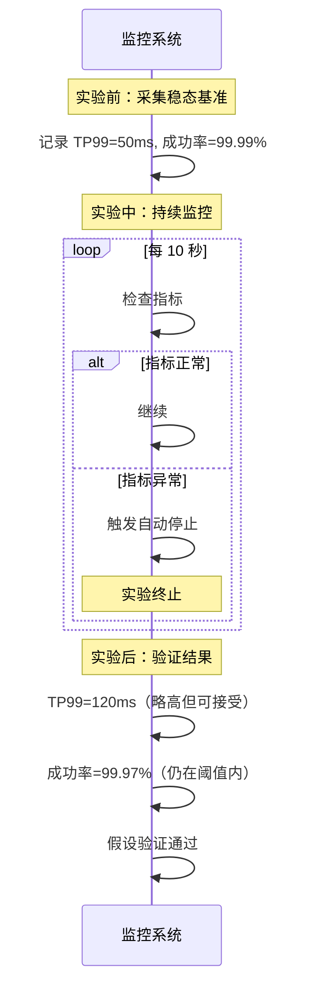

# 混沌实验设计流程

混沌工程不是「随便注入点故障看看」，而是需要系统性的设计和验证流程。

一个好的混沌实验，就像一次严谨的科学实验：有假设、有设计、有执行、有验证、有复盘。本节详解混沌实验的完整设计流程。

## 混沌实验方法论

混沌工程的核心是「假设驱动」的实验：

```
假设：系统在故障情况下，会保持某种行为

实验：注入故障，验证假设

结论：假设成立/不成立 → 改进系统/调整假设
```

## 完整的实验流程

```mermaid
flowchart TD
    A["1. 定义稳态"] --> B["2. 提出假设"]
    B --> C["3. 设计实验"]
    C --> D["4. 执行实验"]
    D --> E["5. 验证结果"]
    E --> |"通过| F["6. 扩大范围"]
    E --> |"失败| G["7. 修复系统"]
    G --> C
    F --> H["8. 记录复盘"]

    style A fill:#e1f5fe
    style B fill:#e1f5fe
    style C fill:#fff3e0
    style D fill:#fff3e0
    style E fill:#e8f5e9
    style G fill:#ffebee
```

## 第一步：定义稳态

稳态是系统正常行为的具体定义。定义不清楚，后续实验就无法判定结果。

### 稳态定义的四个维度

| 维度 | 指标 | 稳态阈值 |
| --- | --- | --- |
| **可用性** | 请求成功率 | `>` 99.9% |
| **性能** | TP99 延迟 | `<` 500ms |
| **一致性** | 数据同步延迟 | `<` 1s |
| **容量** | CPU 使用率 | `<` 80% |

### 稳态定义示例

```yaml title="steady-state-example.yaml"
steady_state:
  name: "order-service-baseline"

  # 可用性指标
  availability:
    - name: "success_rate"
      query: |
        sum(rate(http_requests_total{status!~"5.."}[5m]))
        / sum(rate(http_requests_total[5m]))
      threshold: 0.999
      comparison: "gte"

    - name: "error_rate"
      query: |
        sum(rate(http_requests_total{status=~"5.."}[5m]))
        / sum(rate(http_requests_total[5m]))
      threshold: 0.001
      comparison: "lte"

  # 性能指标
  performance:
    - name: "p99_latency"
      query: |
        histogram_quantile(0.99,
          sum(rate(http_request_duration_seconds_bucket[5m])) by (le)
        ) * 1000
      threshold: 500
      comparison: "lte"

  # 容量指标
  capacity:
    - name: "cpu_usage"
      query: avg(rate(container_cpu_usage_seconds_total[5m])) by (pod)
      threshold: 0.8
      comparison: "lte"
```

## 第二步：提出假设

假设是关于系统在故障情况下行为的预测。

### 好的假设

```
✓ 假设：支付服务实例被杀死后，流量会在 5 秒内切换到其他实例，
       请求成功率保持在 99.9% 以上

✓ 假设：数据库连接池耗尽时，熔断器会在 3 秒内打开，
       后续请求直接降级，不再等待

✓ 假设：Redis 缓存不可用时，系统会降级到数据库查询，
       TP99 延迟从 10ms 上升到 50ms，但不会超时
```

### 不好的假设

```
✗ 假设：系统能处理故障（太模糊）

✗ 假设：系统不会崩溃（无法验证）

✗ 假设：故障时系统会变慢（太模糊，没有具体指标）
```

## 第三步：设计实验

### 实验设计模板

```yaml title="experiment-design-template.yaml"
experiment:
  name: "payment-service-failover-test"
  version: "1.0"
  owner: "platform-team"
  date: "2024-01-15T10:00:00Z"

  # 假设
  hypothesis: |
    支付服务实例被杀死后，流量会在 5 秒内切换到其他实例，
    请求成功率保持在 99.9% 以上

  # 故障注入
  fault:
    type: "pod-kill"
    target:
      kind: "Pod"
      namespace: "production"
      labels:
        app: "payment-service"
    duration: "60s"

  # 验证指标
  probes:
    - name: "success_rate"
      query: "sum(rate(http_requests_total{status!~'5..'}[1m])) / sum(rate(http_requests_total[1m]))"
      threshold: 0.999

    - name: "p99_latency"
      query: "histogram_quantile(0.99, sum(rate(http_request_duration_seconds_bucket[1m])) by (le)) * 1000"
      threshold: 1000

  # 安全措施
  safety:
    auto_stop:
      enabled: true
      conditions:
        - metric: "error_rate"
          threshold: 0.05
          action: "STOP"

    manual_stop:
      enabled: true
      channels: ["slack", "pagerduty"]

  # 预期结果
  expected_outcome:
    - "Pod 被杀死后，新的 Pod 在 30 秒内启动"
    - "流量切换在 5 秒内完成"
    - "请求成功率保持在 99.9%"
```

### 从简单到复杂

```
第一阶段：单点故障
  - 杀死 1 个 Pod
  - 验证：流量切换是否正常

第二阶段：多点故障
  - 杀死 50% 的 Pod
  - 验证：剩余实例是否承压，限流是否生效

第三阶段：持续故障
  - 杀死 1 个 Pod 后立即恢复，再杀死
  - 验证：系统是否出现「死亡螺旋」
```

## 第四步：执行实验

### 执行前检查清单

```bash
# 1. 确认稳态基准
check_steady_state.sh

# 2. 确认监控系统正常
check_monitoring.sh

# 3. 确认告警通道畅通
check_alerting.sh

# 4. 通知相关团队
notify_team.sh "即将进行混沌实验"

# 5. 准备回滚方案
prepare_rollback.sh
```

### 执行命令

```bash
# 使用 chaosblade 执行实验
chaosblade create k8s pod kill \
  --namespace production \
  --name payment-service \
  --count 1

# 获取实验 UID
export EXPERIMENT_UID="..."

# 监控实验
watch_experiment.sh $EXPERIMENT_UID

# 60 秒后自动停止（或手动停止）
chaosblade destroy $EXPERIMENT_UID
```

## 第五步：验证结果



### 验证判定

| 结果 | 判定 | 后续动作 |
| --- | --- | --- |
| 所有指标在阈值内 | **PASS** | 扩大范围或记录 |
| 部分指标超出阈值 | **CONDITIONAL PASS** | 分析原因，记录 |
| 严重异常 | **FAIL** | 停止实验，修复系统 |

## 第六步：记录与复盘

### 实验报告模板

```yaml title="experiment-report.yaml"
report:
  experiment_name: "payment-service-failover-test"
  date: "2024-01-15T10:00:00Z"
  duration: "5m"
  owner: "platform-team"

  # 实验结果
  result: "PASS"

  # 假设验证
  hypothesis_verified: true
  hypothesis_notes: |
    流量切换在 3 秒内完成（预期 5 秒）
    请求成功率保持在 99.97%（预期 99.9%）

  # 发现的问题
  findings:
    - type: "improvement"
      description: "Pod 启动时间偏长（45 秒），建议优化健康检查配置"
      priority: "medium"

    - type: "observation"
      description: "流量切换时有短暂排队，建议增加预热机制"
      priority: "low"

  # 建议
  recommendations:
    - "优化 Pod 启动探针配置"
    - "增加 ReadinessGate 实现更平滑的流量切换"
    - "将实验集成到发布流程"

  # 下一步
  next_steps:
    - "修复 Pod 启动时间问题"
    - "设计数据库故障实验"
    - "设计多故障组合实验"
```

## 质量判断标准

一篇「混沌实验设计」的文章是否达标，要看它是否回答了：

1. ✅ 完整的实验流程是什么（稳态→假设→设计→执行→验证→复盘）？
2. ✅ 如何定义稳态（有具体指标和阈值）？
3. ✅ 如何提出好的假设（可验证的具体预测）？
4. ✅ 如何设计实验（模板和步骤）？
5. ✅ 如何验证结果并记录复盘？
6. ❌ 只有流程图，没有具体模板和示例——不达标

## 本章总结

**核心要点**：

1. **混沌实验是假设驱动的**：先定义稳态，再提出假设，然后验证
2. **好的假设是可验证的**：具体、量化、可判定通过或失败
3. **实验设计从简单到复杂**：单点故障 → 多点故障 → 持续故障
4. **验证结果是关键**：对比实验前后的指标，判定假设是否成立
5. **复盘记录持续改进**：每次实验都是学习机会，改进系统或改进实验
