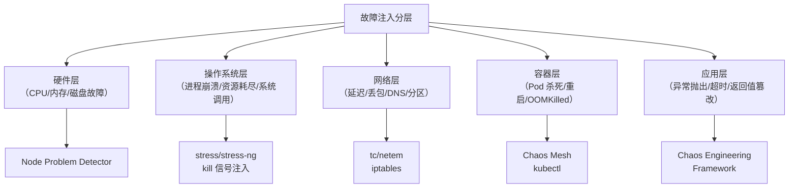

# 故障注入技术

故障注入（Fault Injection）是混沌工程的核心手段——通过主动制造故障，验证系统在真实故障下的行为。

混沌工程的本质是「假设-实验-验证」的循环，而故障注入就是这个循环中的「实验」环节。本节全面介绍不同层面的故障注入技术，以及如何设计有效的故障注入实验。

## 故障注入的分层模型



## 基础设施层故障注入

### 服务器宕机

最直接的故障类型——杀死服务器或容器：

```yaml title="pod-kill.yaml"
# Chaos Mesh - 杀死 Pod
apiVersion: chaos-mesh.org/v1alpha1
kind: PodChaos
metadata:
  name: pod-failure
spec:
  action: pod-failure      # 杀死 Pod
  mode: one                # 影响 1 个 Pod
  duration: 60s            # 持续 60 秒
  selector:
    namespaces:
      - production
    labelSelectors:
      app: order-service
```

```bash
# ChaosBlade - 杀死进程
# 杀死指定进程
blade create process kill --process-name payment-service --count 1

# 杀死随机 2 个实例
blade create k8s pod kill --namespace production --name payment-service --count 2
```

### CPU 负载注入

模拟 CPU 繁忙场景：

```bash
# ChaosBlade - CPU 负载
# 占用 80% CPU 10 秒
blade create cpu load --cpu-percent 80 --timeout 10

# 指定进程
blade create cpu load --cpu-percent 80 --process mysql

# 容器级别
blade create docker cpu load --cpu-percent 80 --container-id $(docker ps -q)
```

```yaml title="cpu-stress.yaml"
# Stress-ng 方式
apiVersion: v1
kind: Pod
metadata:
  name: stress-pod
spec:
  containers:
  - name: stress
    image: polinux/stress
    command: ["stress", "--cpu", "4", "--timeout", "60s"]
```

### 内存耗尽注入

```bash
# 模拟内存压力
blade create mem load --mem-percent 80 --timeout 30s

# JVM OOM 模拟（注入 FullGC 频繁）
blade create jvm oom --pid $(pgrep -f "order-service")
```

## 网络层故障注入

网络故障是最常见也最复杂的故障类型：

```mermaid
flowchart LR
    A["请求"] --> B["tc/netem"]
    B --> |"延迟| C["延迟后的请求"]
    B --> |"丢包| D["丢弃的请求"]
    B --> |"重复| E["重复的请求"]
    B --> |"损坏| F["损坏的请求"]
```

### tc/netem 注入网络故障

```bash
# 注入 500ms 网络延迟
tc qdisc add dev eth0 root netem delay 500ms

# 注入 10% 丢包率
tc qdisc add dev eth0 root netem loss 10%

# 注入网络延迟 + 抖动
tc qdisc add dev eth0 root netem delay 500ms 100ms distribution normal

# 注入重复包
tc qdisc add dev eth0 root netem duplicate 5%

# 清理规则
tc qdisc del dev eth0 root
```

### Chaos Mesh 网络故障

```yaml title="network-chaos.yaml"
# 网络延迟
apiVersion: chaos-mesh.org/v1alpha1
kind: NetworkChaos
metadata:
  name: network-latency
spec:
  action: delay
  mode: one
  duration: 60s
  delay:
    latency: "500ms"
    jitter: "100ms"
    correlation: "25"
  selector:
    namespaces:
      - production
    labelSelectors:
      app: payment-service
---
# 网络丢包
apiVersion: chaos-mesh.org/v1alpha1
kind: NetworkChaos
metadata:
  name: network-loss
spec:
  action: loss
  mode: one
  duration: 60s
  loss:
    loss: "20"
    correlation: "25"
  selector:
    namespaces:
      - production
    labelSelectors:
      app: payment-service
---
# 网络分区
apiVersion: chaos-mesh.org/v1alpha1
kind: NetworkChaos
metadata:
  name: network-partition
spec:
  action: partition
  mode: one
  duration: 60s
  direction: "to"
  selector:
    namespaces:
      - production
    labelSelectors:
      app: order-service
  target:
    mode: all
    selector:
      namespaces:
        - production
      labelSelectors:
        app: payment-service
```

### DNS 故障注入

```bash
# 模拟 DNS 不可用
# 方法一：修改 /etc/hosts
echo "127.0.0.1 payment-service" >> /etc/hosts

# 方法二：iptables 阻断 DNS
iptables -A OUTPUT -p udp --dport 53 -j DROP

# 方法三：返回错误 IP
echo "0.0.0.0 payment-service" > /etc/hosts
```

## 容器层故障注入

### Pod 故障类型

| 动作 | 说明 | Chaos Mesh 配置 |
| --- | --- | --- |
| **pod-failure** | Pod 不可用 | `action: pod-failure` |
| **pod-kill** | 杀死 Pod | `action: pod-kill` |
| **container-kill** | 杀死容器 | `action: container-kill` |

```yaml title="container-kill.yaml"
apiVersion: chaos-mesh.org/v1alpha1
kind: PodChaos
metadata:
  name: container-kill
spec:
  action: container-kill
  mode: one
  duration: 30s
  selector:
    namespaces:
      - production
    labelSelectors:
      app: order-service
```

### OOMKilled 模拟

```bash
# 触发容器 OOM（内存限制设置为极小值）
kubectl set resources pod/order-service -c myapp \
  --limits=memory=10Mi

# 手动触发 OOM
kubectl run oom-test --image=busybox --restart=Never \
  -- /bin/sh -c 'while true; do :; done'
```

## 应用层故障注入

应用层故障注入在代码层面模拟故障：

```java title="Byteman故障注入.java"
// Byteman 注入异常
// 安装 Byteman agent 后，使用脚本注入故障

// 注入随机异常
RULE inject exception
CLASS OrderService
METHOD createOrder
AT INVOKE createOrder
IF true
DO throw new RuntimeException("Chaos: injected exception")
ENDRULE

// 注入延迟
RULE inject delay
CLASS PaymentService
METHOD process
AT ENTRY
IF true
DO Thread.sleep(5000)
ENDRULE
```

```java title="Chaos Monkey for Spring"]
// Spring Chaos Monkey 配置
chaos:
  monkey:
    enabled: true
    level: 5  # 故障强度 1-10

    # 配置要攻击的组件
    attacks:
      - latency
      - exception
      - killApplication

    # 观察者：哪些服务被攻击
    watchers:
      - controller
      - service
      - repository
```

## IO 故障注入

```yaml title="io-chaos.yaml"
# Chaos Mesh IO 故障
apiVersion: chaos-mesh.org/v1alpha1
kind: IOChaos
metadata:
  name: io-delay
spec:
  action: delay
  mode: one
  duration: 60s
  delay:
    latency: "100ms"
    correlation: "25"
  selector:
    namespaces:
      - production
    labelSelectors:
      app: file-service
  volume:
    path: /data
```

## DNS 故障隔离

```yaml title="dns-failure.yaml"
# 模拟 DNS 解析失败
# 方式一：修改 Pod 的 hosts 文件
apiVersion: v1
kind: Pod
metadata:
  name: test-pod
spec:
  hostAliases:
  - ip: "127.0.0.1"
    hostnames:
    - "payment-service"  # DNS 解析失败
```

## 故障注入的设计原则

### 1. 从简单故障开始

```mermaid
flowchart TD
    A["故障复杂度"] --> B["单点故障"]
    B --> C["网络延迟"]
    C --> D["网络丢包"]
    D --> E["网络分区"]
    E --> F["多故障组合"]

    Note over B: 先验证单点故障
    Note over C: 再验证网络问题
    Note over F: 最后验证组合故障
```

### 2. 记录每次注入

```yaml title="experiment-log.yaml"
experiment:
  name: "payment-service-availability-test"
  date: "2024-01-15T10:00:00Z"
  injected_faults:
    - type: "pod-kill"
      target: "payment-service-7d9b8c"
      duration: "60s"
  expected_behavior:
    - "流量切换到其他 Pod"
    - "无用户请求失败"
  actual_behavior:
    - "流量切换成功"
    - "1% 用户请求超时（可接受）"
  verdict: "PASS"
```

## 质量判断标准

一篇「故障注入技术」的文章是否达标，要看它是否回答了：

1. ✅ 故障注入有哪些分层（基础设施/网络/容器/应用）？
2. ✅ 每层有哪些具体工具和命令？
3. ✅ 如何设计故障注入实验（从简单到复杂）？
4. ❌ 只有列表，没有具体示例——不达标

## 本章总结

**核心要点**：

1. **故障注入分多层**：基础设施、网络、容器、应用，每层有不同的工具和方法
2. **网络故障最复杂**：延迟、丢包、分区、DNS 都需要不同处理
3. **从简单故障开始**：先单点故障，再组合故障
4. **每次注入都要记录**：记录预期行为和实际行为，验证假设
5. **工具选择要匹配场景**：Chaos Mesh 适合 K8s，tc/netem 适合网络层
