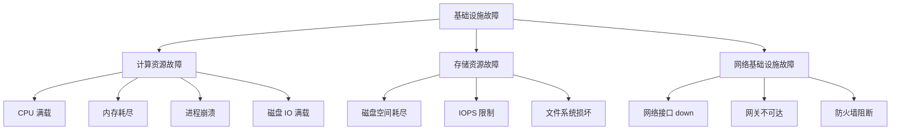
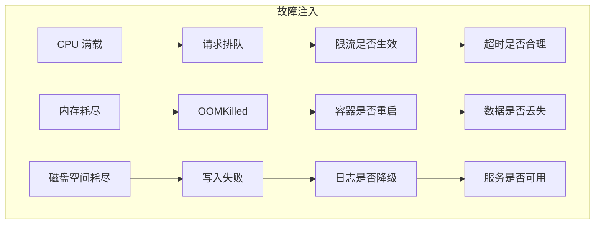

# 基础设施故障注入

服务器宕机、CPU 打满、内存耗尽——基础设施层的故障是最常见的生产事故来源。

与网络层故障不同，基础设施层故障直接影响计算资源的可用性。本节详解如何通过故障注入模拟这些场景，以及如何验证系统在资源枯竭时的行为。

## 基础设施故障分类



## CPU 故障注入

### CPU 满载

```bash
# stress 命令
# 4 个 worker，100% CPU，持续 60 秒
stress --cpu 4 --timeout 60s

# 指定核心（核心 0,1）
stress --cpu 2 --cpu-load 80 --timeout 60s

# chaosblade 方式
blade create cpu load --cpu-percent 80 --timeout 60s

# 指定进程
blade create cpu load --cpu-percent 80 --process mysql
```

### Chaos Mesh CPU 故障

```yaml title="chaos-cpu.yaml"
# 注入 CPU 压力
apiVersion: chaos-mesh.org/v1alpha1
kind: StressChaos
metadata:
  name: cpu-stress
spec:
  mode: one
  duration: 60s
  stressng:
    stressors:
      cpu:
        workers: 4
        load: 80
  selector:
    namespaces:
      - production
    labelSelectors:
      app: order-service
```

### CPU 故障的典型场景

| 场景 | 症状 | 验证目标 |
| --- | --- | --- |
| 突发流量 | CPU 飙升，请求排队 | 限流是否生效 |
| 复杂计算 | 单次请求占用大量 CPU | 超时是否合理 |
| GC 频繁 | 短时间 CPU 打满 | GC 配置是否优化 |
| 恶意爬虫 | 大量并发请求 | 防爬/限流是否有效 |

## 内存故障注入

### 内存耗尽

```bash
# stress-ng 内存压力
# 占用 1GB 内存，持续 60 秒
stress-ng --vm 1 --vm-bytes 1G --timeout 60s

# 多个 worker 共同占用
stress-ng --vm 4 --vm-bytes 256M --timeout 60s

# chaosblade 内存压力
blade create mem load --mem-percent 80 --timeout 30s
```

### OOMKilled 模拟

```bash
# 触发容器内存限制
kubectl set resources deployment/order-service \
  --limits=memory=100Mi

# 然后发送大量请求，触发 OOM

# 查看 OOM 事件
kubectl get events | grep OOM
```

### 内存泄漏模拟

```java title="MemoryLeakSimulation.java"
public class MemoryLeakSimulation {

    // 模拟内存泄漏
    private static final List<byte[]> leakList = new ArrayList<>();

    @Scheduled(fixedRate = 100)
    public void simulateLeak() {
        // 每次分配 1MB，永不释放
        leakList.add(new byte[1024 * 1024]);
    }

    // 正确的内存使用
    @Scheduled(fixedRate = 100)
    public void correctMemoryUsage() {
        // 使用完后释放
        List<byte[]> temp = new ArrayList<>();
        temp.add(new byte[1024 * 1024]);
        // temp 在方法结束自动回收
    }
}
```

## 磁盘故障注入

### 磁盘空间耗尽

```bash
# 填充磁盘到指定百分比
dd if=/dev/zero of=/tmp/fill bs=1M count=9000

# 快速填充
fallocate -l 10G /tmp/largefile

# 清理
rm /tmp/largefile
```

### IO 延迟注入

```bash
# tc 注入磁盘 IO 延迟
tc qdisc add dev sda root netem delay 100ms

# 注入 IO 错误
tc qdisc add dev sda root netem corrupt 5%

# Chaos Mesh IO 故障
blade create disk fill --path /data --size 10G
```

## 进程故障注入

### 进程崩溃

```bash
# ChaosBlade 杀死进程
blade create process kill --process-name order-service --count 1

# kill 信号注入
kill -9 $(pgrep -f order-service)

# 优雅退出
kill -SIGTERM $(pgrep -f order-service)
```

### 进程挂起

```bash
# 模拟进程挂起（暂停进程）
kill -STOP $(pgrep -f order-service)

# 恢复进程
kill -CONT $(pgrep -f order-service)

# 模拟死锁（多次注入 SIGSTOP/SIGCONT）
for i in {1..10}; do
  kill -STOP $(pgrep -f order-service)
  sleep 0.1
  kill -CONT $(pgrep -f order-service)
done
```

## 网络接口故障

### 网卡 down

```bash
# 模拟网卡故障
ip link set eth0 down

# ChaosBlade 方式
blade create network loss --interface eth0 --percent 100

# 恢复
ip link set eth0 up
```

### 防火墙规则

```bash
# 阻断所有入站流量
iptables -A INPUT -j DROP

# 阻断特定端口
iptables -A INPUT -p tcp --dport 3306 -j DROP

# 模拟网络分区
# 节点 A 无法访问节点 B
iptables -A INPUT -s 192.168.1.10 -j DROP
```

## 基础设施故障的监控指标

```yaml title="infra-monitor.yaml"
# CPU 故障监控
alerts:
  - name: HighCpuUsage
    expr: avg(rate(node_cpu_seconds_total[5m])) by (instance) > 0.9
    for: 2m
    message: "CPU 使用率超过 90%，可能发生资源竞争"

  - name: MemoryPressure
    expr: node_memory_MemAvailable_bytes / node_memory_MemTotal_bytes < 0.1
    for: 1m
    message: "可用内存不足 10%，可能触发 OOM"

  - name: DiskSpaceLow
    expr: (node_filesystem_avail_bytes{mountpoint="/"} / node_filesystem_size_bytes) < 0.1
    for: 5m
    message: "磁盘空间不足 10%"

  - name: IOHighLatency
    expr: rate(node_disk_io_time_seconds_total[1m]) > 0.8
    for: 2m
    message: "磁盘 IO 延迟过高"
```

## 故障场景与验证目标



## Chaos Monkey 配置

```yaml title="chaos-monkey-config.yaml"
chaos-monk:
  enabled: true

  #  Assaults 配置
  assaults:
    # 终止服务器
    - type: kill-process
      probablity: 0.02
      level: 5

    # CPU 压力
    - type: cpu-stress
      probablity: 0.01
      load-percentage: 80

    # 内存压力
    - type: mem-stress
      probablity: 0.01
      mem-percentage: 70

    # 网络问题
    - type: network-latency
      probablity: 0.01
      latency: 500ms
```

## 质量判断标准

一篇「基础设施故障注入」的文章是否达标，要看它是否回答了：

1. ✅ 基础设施故障有哪些类型（CPU/内存/磁盘/进程/网络）？
2. ✅ 每种故障如何注入（具体命令和配置）？
3. ✅ 故障注入后验证什么（监控指标和预期行为）？
4. ❌ 只有工具列表，没有具体命令和场景——不达标

## 本章总结

**核心要点**：

1. **基础设施故障分多种类型**：CPU、内存、磁盘、进程、网络接口
2. **每种故障有不同的注入工具**：stress/chaosblade/chaos-mesh/kubectl
3. **故障注入后必须验证**：监控系统指标，确认预期行为
4. **从低风险故障开始**：CPU 满载比网络分区风险更低
5. **OOMKilled 是容器环境的常见故障**：必须验证重启和数据恢复机制
