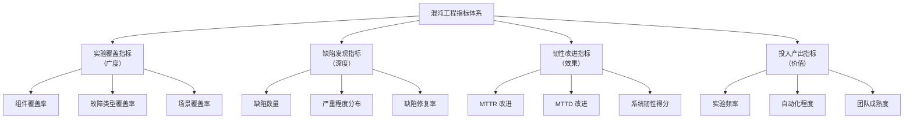

# 混沌工程度量指标

混沌工程的价值需要量化，否则无法评估投入产出比，也无法持续改进。

混沌工程的度量指标回答三个核心问题：我们的系统在变强吗？我们发现了多少问题？我们投入的回报是什么？

## 混沌工程的指标体系



## 实验覆盖指标

### 组件覆盖率

有多少核心组件有混沌实验覆盖：

```
组件覆盖率 = 有实验的组件数 / 总组件数 × 100%
```

| 覆盖率 | 成熟度 |
| --- | --- |
| `<` 30% | 初级 |
| 30%~60% | 成长 |
| 60%~80% | 成熟 |
| `>` 80% | 领先 |

```yaml title="component-coverage.yaml"]
# 核心组件清单
core_components:
  - name: order-service
    tier: critical
    has_experiment: true

  - name: payment-service
    tier: critical
    has_experiment: true

  - name: user-service
    tier: critical
    has_experiment: true

  - name: product-service
    tier: important
    has_experiment: false

  - name: recommendation-service
    tier: normal
    has_experiment: false

coverage: 3/5 = 60%
```

### 故障类型覆盖率

| 故障类型 | 是否覆盖 |
| --- | --- |
| Pod 杀死 | ✅ |
| 网络延迟 | ✅ |
| 网络丢包 | ✅ |
| CPU 满载 | ✅ |
| 内存耗尽 | ✅ |
| 数据库故障 | ❌ |
| Redis 故障 | ❌ |
| 依赖服务故障 | ✅ |

### 场景覆盖率

| 故障场景 | 覆盖 |
| --- | --- |
| 单点故障 | ✅ |
| 多点故障 | ✅ |
| 级联故障 | ❌ |
| 网络分区 | ✅ |
| 依赖故障 | ✅ |

## 缺陷发现指标

### 缺陷发现数

```python
def defect_discovery_metrics(experiments):
    total_experiments = len(experiments)
    pass_experiments = len([e for e in experiments if e.result == 'PASS'])
    fail_experiments = len([e for e in experiments if e.result == 'FAIL'])

    # 发现率
    discovery_rate = fail_experiments / total_experiments

    return {
        "total_experiments": total_experiments,
        "defects_found": fail_experiments,
        "discovery_rate": discovery_rate,
        "false_positive_rate": calculate_false_positive_rate(experiments)
    }
```

### 缺陷严重程度分布

| 严重程度 | 定义 | 数量 |
| --- | --- | --- |
| **P0 - 致命** | 导致服务完全不可用，数据丢失 | 1 |
| **P1 - 严重** | 核心功能受损，需要紧急处理 | 3 |
| **P2 - 一般** | 功能部分受损，有临时方案 | 5 |
| **P3 - 轻微** | 非核心问题，可接受 | 8 |

### 缺陷修复率

```
缺陷修复率 = 已修复缺陷数 / 发现缺陷总数 × 100%
```

| 缺陷类型 | 发现数 | 已修复 | 修复率 |
| --- | --- | --- | --- |
| 配置问题 | 5 | 5 | 100% |
| 代码缺陷 | 3 | 2 | 67% |
| 架构问题 | 2 | 1 | 50% |

## 韧性改进指标

### MTTR 改进（Mean Time To Recovery）

```python
def mttr_improvement(historical_data):
    """
    MTTR 改进 = (改进前 MTTR - 改进后 MTTR) / 改进前 MTTR × 100%
    """
    mttr_before = historical_data["pre_chaos_mttr"]
    mttr_after = historical_data["post_chaos_mttr"]

    improvement = (mttr_before - mttr_after) / mttr_before * 100

    return {
        "mttr_before": mttr_before,
        "mttr_after": mttr_after,
        "improvement_percent": improvement,
        "unit": "minutes"
    }
```

### MTTD 改进（Mean Time To Detect）

```python
def mttd_improvement(historical_data):
    """
    MTTD 改进 = (改进前 MTTD - 改进后 MTTD) / 改进前 MTTD × 100%
    """
    mttd_before = historical_data["pre_chaos_mttd"]
    mttd_after = historical_data["post_chaos_mttd"]

    improvement = (mttd_before - mttd_after) / mttd_before * 100

    return {
        "mttd_before": mttd_before,
        "mttd_after": mttd_after,
        "improvement_percent": improvement
    }
```

### 系统韧性得分

```python
def resilience_score(components, experiments):
    """
    综合韧性得分 = 实验覆盖率 × 0.3 + 缺陷发现率 × 0.2 + MTTR 改进 × 0.3 + 修复率 × 0.2
    """
    coverage = len(experiments) / components
    defect_rate = len([e for e in experiments if e.result == 'FAIL']) / len(experiments)
    mttr_improvement = calculate_mttr_improvement(experiments)
    fix_rate = calculate_fix_rate(experiments)

    score = (
        coverage * 0.3 +
        (1 - defect_rate) * 0.2 +  # 越少发现缺陷，得分越高（系统变强）
        mttr_improvement * 0.3 +
        fix_rate * 0.2
    )

    return {
        "score": score * 100,  # 0-100 分
        "grade": "A" if score > 0.8 else "B" if score > 0.6 else "C" if score > 0.4 else "D",
        "details": {
            "coverage_score": coverage * 30,
            "defect_score": (1 - defect_rate) * 20,
            "mttr_score": mttr_improvement * 30,
            "fix_score": fix_rate * 20
        }
    }
```

## 投入产出指标

### 实验频率

```
实验频率 = 执行的实验数 / 时间周期
```

| 频率 | 成熟度 |
| --- | --- |
| 每月少于 1 次 | 初级 |
| 每周 1 次 | 成长 |
| 每天 1 次 | 成熟 |
| 持续混沌 | 领先 |

### 自动化程度

| 级别 | 说明 |
| --- | --- |
| **L1** | 100% 手动执行 |
| **L2** | 定时自动执行 |
| **L3** | CI/CD 集成 |
| **L4** | 持续混沌 |

### 团队成熟度评估

```yaml title="team-maturity.yaml"]
team_maturity:
  awareness:
    - name: "混沌工程认知"
      score: 4/5  # 团队对混沌工程的认知程度

  skills:
    - name: "实验设计能力"
      score: 3/5
    - name: "故障注入能力"
      score: 4/5
    - name: "结果分析能力"
      score: 3/5

  process:
    - name: "实验流程标准化"
      score: 3/5
    - name: "结果记录完整性"
      score: 4/5
    - name: "复盘改进机制"
      score: 3/5

  culture:
    - name: "故障学习文化"
      score: 4/5
    - name: "跨团队协作"
      score: 3/5
```

## 指标看板

```yaml title="chaos-dashboard.json"]
{
  "dashboard": {
    "title": "混沌工程指标看板",
    "panels": [
      {
        "title": "实验覆盖率趋势",
        "type": "line",
        "query": "chaos_experiment_coverage",
        "legend": ["组件覆盖", "故障覆盖"]
      },
      {
        "title": "缺陷发现统计",
        "type": "pie",
        "query": "chaos_defects_by_severity"
      },
      {
        "title": "MTTR 改进趋势",
        "type": "line",
        "query": "chaos_mttr_improvement"
      },
      {
        "title": "系统韧性得分",
        "type": "gauge",
        "query": "chaos_resilience_score"
      }
    ]
  }
}
```

## 质量判断标准

一篇「混沌工程度量指标」的文章是否达标，要看它是否回答了：

1. ✅ 混沌工程有哪些维度的指标？
2. ✅ 每个指标如何计算（公式和代码）？
3. ✅ 如何用指标评估成熟度？
4. ✅ 如何构建指标看板？
5. ❌ 只有列表，没有计算方法——不达标

## 本章总结

**核心要点**：

1. **实验覆盖指标评估广度**：组件覆盖、故障覆盖、场景覆盖
2. **缺陷发现指标评估深度**：发现率、严重程度、修复率
3. **韧性改进指标评估效果**：MTTR 改进、MTTD 改进、韧性得分
4. **投入产出指标评估价值**：实验频率、自动化程度、团队成熟度
5. **指标需要可视化**：用看板展示趋势，持续跟踪改进
