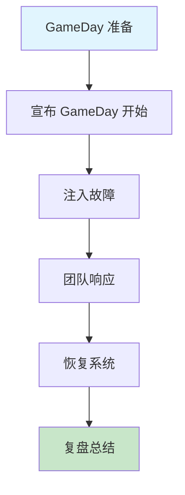

# 混沌工程案例：Netflix Chaos Monkey

Netflix 是混沌工程的先驱，Chaos Monkey 开创了生产级混沌工程的先河。

2010 年，Netflix 正在从 DVD 邮寄业务转型流媒体服务，同时开始将基础设施迁移到 AWS EC2。在这个背景下，Netflix 的工程师们问了自己一个问题：**如果 AWS 不可用了，我们的服务还能工作吗？** 这个问题的答案，推动了混沌工程的诞生。

## 为什么 Netflix 需要混沌工程

Netflix 面临的挑战：

```
2010 年，Netflix 面临的挑战：

1. 基础设施从自有数据中心迁移到 AWS
2. 服务架构从单体应用转型为微服务
3. 服务依赖关系变得极其复杂
4. AWS 云服务本身也会有故障

问题：如何保证在 AWS 故障时，服务仍然可用？
```

传统的测试方法无法回答这个问题——测试环境无法模拟真实的 AWS 故障。

## Chaos Monkey 的设计理念

Chaos Monkey 的核心思想非常简单：

```
"如果 Chaos Monkey 能让系统宕机，
 说明系统还没有准备好，
 就有问题需要修复。"
```

这颠覆了传统的思维方式。传统思维是「假设系统不会坏」，Chaos Monkey 的思维是「假设系统会坏，验证它是否能恢复」。

## Chaos Monkey 的演进

### Chaos Monkey（2010）

```yaml title="chaos-monkey-v1.yaml"
# 原始版本的 Chaos Monkey 配置
chaos:
  enabled: true
  level: 5  # 1-10，影响范围

  # 攻击类型
  assault:
    - type: "kill-process"
      probability: 30
    - type: "ec2-terminate"
      probability: 20

  # 排除列表
  exceptions:
    - "critical-database"
    - "payment-service"
```

**功能**：随机关闭 EC2 实例。

### Chaos Kong（2014）

在 Chaos Monkey 验证了单实例故障处理后，Netflix 发现了新的问题：

> **真实发现**：单实例故障处理正常，但当整个可用区（AZ）不可用时，系统崩溃了。

Chaos Kong 的设计是关闭整个可用区：

```yaml title="chaos-kong.yaml"
chaos:
  type: "chaos-kong"
  target: "availability-zone"
  # 模拟整个 AZ 不可用
  # 验证流量是否正确切换到其他 AZ
```

**结果**：第一次运行 Chaos Kong 时，Netflix 花了 4 小时才恢复服务。这个发现推动了整个多可用区架构的重构。

### FIT（Failure Injection Testing）

Chaos Kong 验证了大范围故障，但不够精细。FIT 提供了更精确的故障注入：

```yaml title="fit-config.yaml"]
# FIT 故障注入配置
fit:
  enabled: true
  experiments:
    - name: "dependency-failure"
      type: "http-abort"
      target: "catalog-service"
      percentage: 5  # 5% 的请求受影响
```

## Netflix 的混沌工程文化

Netflix 不仅是工具的创造者，更是混沌工程文化的推动者。

### 「GameDay」文化

Netflix 每月进行一次「GameDay」——全团队的混沌工程演练日：



### 从 Chaos Monkey 到 chaos 工程成熟度

```
L1: Chaos Monkey → 验证实例故障处理
L2: Chaos Kong → 验证 AZ 级故障处理
L3: FIT → 验证服务间故障处理
L4: 持续混沌 → 始终在线验证
```

## 关键发现

Netflix 通过混沌工程发现了大量架构问题：

| 发现时间 | 发现内容 | 影响 | 修复方式 |
| --- | --- | --- | --- |
| 2011 | 单实例故障未正确处理 | 客户投诉 | 重构故障转移逻辑 |
| 2014 | AZ 故障导致服务崩溃 | 4 小时恢复 | 重构多 AZ 架构 |
| 2016 | 级联故障：支付服务拖垮订单服务 | 部分请求失败 | 引入熔断器 |
| 2018 | 缓存失效导致数据库压力激增 | 响应变慢 | 优化缓存策略 |

## 对行业的启示

### 1. 故障是常态，不是意外

Netflix 的 SRE 有一句名言：

```
"Everything fails all the time."
（任何东西随时都可能失败。）

Built-in 而不是 Bolt-on。
容错能力应该在设计阶段就考虑，而不是事后补救。
```

### 2. 自动化是关键

Netflix 发现，手动的混沌工程实验无法持续。只有自动化，才能让混沌工程成为日常工作。

### 3. 文化比工具更重要

混沌工程的最大障碍不是技术，而是文化。很多团队害怕在生产环境做实验。Netflix 的经验是：**建立信任，从失败中学习，而不是惩罚失败**。

## 真实数据

Netflix 公开的一些数据：

| 指标 | 数据 |
| --- | --- |
| 每月 Chaos Monkey 执行的实例终止数 | `~` 20~40 |
| 平均故障恢复时间（MTTR） | 从 4 小时降低到 45 分钟 |
| 因 Chaos Monkey 发现的架构缺陷 | 100+ |
| GameDay 频率 | 每月一次 |

## 质量判断标准

一篇「Netflix Chaos Monkey 案例」的文章是否达标，要看它是否回答了：

1. ✅ Netflix 为什么需要混沌工程（背景和问题）？
2. ✅ Chaos Monkey 的设计理念是什么？
3. ✅ 从 Chaos Monkey 到 Chaos Kong 到 FIT 的演进过程？
4. ✅ 通过混沌工程发现了哪些关键问题？
5. ✅ 对整个行业有哪些启示？
6. ❌ 只有工具介绍，没有真实案例和教训——不达标

## 本章总结

**核心要点**：

1. **混沌工程起源于 Netflix**：为了回答「AWS 故障时服务是否可用」这个问题
2. **理念：假设系统会坏，验证它能否恢复**：而不是假设系统不会坏
3. **从 Chaos Monkey 到 Chaos Kong 到 FIT**：从单实例到 AZ 到服务间，故障范围逐步扩大
4. **混沌工程发现了大量架构问题**：包括 AZ 级故障导致 4 小时服务崩溃
5. **文化比工具更重要**：建立从失败中学习的文化，而不是惩罚失败
