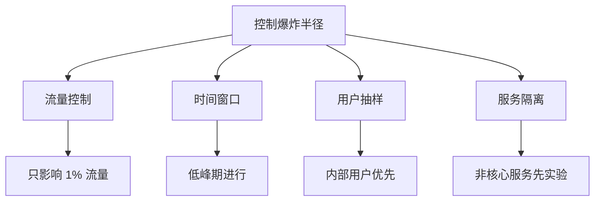

# 混沌工程原则

Netflix 在 2012 年提出了混沌工程的五大原则，这些原则至今仍是指导混沌工程实践的核心框架。

这五大原则不是空洞的理论，而是 Netflix 在大规模分布式系统中多年实践的总结。理解这些原则，是开展混沌工程的前提。

## 原则一：建立稳态假设

### 什么是稳态

稳态（Steady State）是系统在正常情况下的行为特征。混沌工程实验的目标，是验证在故障情况下，系统的稳态是否被破坏。

```
稳态定义 = 具体的、可测量的行为特征

好的稳态：
✓ 请求成功率 > 99.9%
✓ P99 延迟 < 500ms
✓ 每分钟处理订单数 = 1000~2000

不好的稳态：
✗ 系统运行正常（太模糊）
✗ 没有错误（太模糊）
```

### 为什么需要稳态假设

没有稳态假设，就无法判断实验结果：

```
场景：如果没有定义稳态

执行：注入网络延迟
结果：请求延迟上升

问题：这是「预期行为」还是「系统缺陷」？

→ 无法判断！因为不知道「正常」是什么
```

有稳态假设后：

```
稳态定义：P99 延迟 < 500ms

执行：注入 300ms 网络延迟
结果：P99 延迟 = 580ms

判断：稳态被破坏 → 系统对网络延迟敏感，需要优化
```

### 如何定义稳态

```yaml title="steady-state-definition.yaml"]
steady_state:
  name: "order-service-baseline"

  metrics:
    # 可用性指标
    availability:
      - name: "success_rate"
        query: |
          sum(rate(http_requests_total{status!~"5.."}[5m]))
          / sum(rate(http_requests_total[5m]))
        threshold: 0.999

      - name: "error_rate"
        query: |
          sum(rate(http_requests_total{status=~"5.."}[5m]))
          / sum(rate(http_requests_total[5m]))
        threshold: 0.001

    # 性能指标
    performance:
      - name: "p99_latency_ms"
        query: |
          histogram_quantile(0.99,
            sum(rate(http_request_duration_seconds_bucket[5m])) by (le)
          ) * 1000
        threshold: 500

    # 容量指标
    capacity:
      - name: "queue_depth"
        query: sum(mq_consumer_queue_depth)
        threshold: 1000
```

## 原则二：变更应该真实

### 真实故障 vs 模拟故障

混沌工程要模拟真实的故障，而不是人为制造的故障：

```mermaid
flowchart TD
    A["故障分类"] --> B["真实故障"]
    A --> C["模拟故障"]

    B --> B1["服务器宕机（硬件/内核）"]
    B --> B2["网络丢包（交换机故障）"]
    B --> B3["数据库连接耗尽（真实压力）"]

    C --> C1["注入随机异常"]
    C --> C2["模拟网络延迟"]
    C3["... 很多团队只做了这些"]

    Note over B: 只有真实故障才能发现真实问题
```

### 真实故障的例子

| 真实故障 | 模拟方式 | 发现的问题 |
| --- | --- | --- |
| EC2 实例被 AWS 终止 | 杀死 Pod | 重启流程 |
| AZ 不可用 | 杀死整个 AZ 的 Pod | 多 AZ 架构问题 |
| 网络分区 | iptables 阻断 | CAP 定理取舍 |
| 数据库连接池耗尽 | 限制连接数 | 连接泄漏问题 |
| DNS 解析失败 | 修改 /etc/hosts | 降级方案 |

### 真实 vs 模拟的对比

| 维度 | 真实故障 | 模拟故障 |
| --- | --- | --- |
| **代表性** | 高，完全真实 | 中，取决于模拟质量 |
| **可控性** | 低，风险较高 | 高，可精确控制 |
| **可重复** | 难，难以复现 | 易，可重复执行 |
| **发现的问题** | 多，往往发现意想不到的问题 | 少，只能发现已知的缺陷 |

**Netflix 的经验**：Chaos Monkey 注入的真实故障（杀死 EC2 实例），发现的架构问题比任何模拟故障都多。

## 原则三：在生产环境实验

### 为什么测试环境不够

测试环境有三个无法解决的问题：

```
测试环境的局限性：

1. 负载不真实
   测试环境：100 QPS，固定流量
   生产环境：10000 QPS，流量波动
   → 同样的故障，在不同负载下表现完全不同

2. 依赖不完整
   测试环境：模拟的依赖服务
   生产环境：真实的外部服务
   → 外部服务的行为无法预测

3. 故障不真实
   测试环境：手动注入的故障
   生产环境：真实的网络抖动、硬件故障
   → 真实故障往往更复杂、更意外
```

### 生产环境实验的风险

生产环境实验确实有风险，但风险可以被控制：

```
风险控制框架：

风险 = 影响范围 × 发生概率

控制策略：
1. 缩小影响范围 → 流量抽样
2. 降低发生概率 → 控制实验频率
3. 缩短影响时间 → 快速停止机制
4. 准备回滚方案 → 一键恢复
```

### 生产环境实验的收益

```
Netflix 2011 年的发现：

在测试环境运行 Chaos Monkey 6 个月：
  → 发现 0 个问题

在生产环境运行第 1 次：
  → 3 小时内发现 3 个关键架构缺陷
  → 包括 AZ 级故障导致 4 小时服务崩溃的问题
```

## 原则四：自动化实验

### 手动实验的局限

手动实验有三个问题：

```
手动实验的问题：

1. 不可持续
   - 依赖人工操作
   - 容易遗忘
   - 无法规模化

2. 不可重复
   - 每次实验条件不同
   - 结果难以对比
   - 无法验证改进

3. 无法持续改进
   - 一次实验无法验证长期趋势
   - 无法量化系统韧性变化
```

### 自动化实验的价值

```
自动化实验的优势：

1. 持续验证
   - 每次发布自动运行
   - 持续监控系统韧性

2. 可重复
   - 每次实验条件相同
   - 结果可对比

3. 可集成
   - 集成到 CI/CD 流水线
   - 自动化验证发布质量
```

### 自动化的成熟度模型

| 级别 | 描述 | 价值 |
| --- | --- | --- |
| L1 | 手动执行 | 建立认知 |
| L2 | 定时执行 | 持续验证 |
| L3 | CI/CD 集成 | 发布时验证 |
| L4 | 持续混沌 | 始终在线 |

## 原则五：最小化爆炸半径

### 什么是爆炸半径

```
爆炸半径 = 故障实验影响的用户/请求/功能的范围

目标：最小化爆炸半径

好的实验：
  ✓ 影响 1% 的用户
  ✓ 影响时间 < 60 秒
  ✓ 有紧急停止机制

差的实验：
  ✗ 影响 50% 的用户
  ✗ 影响时间未知
  ✗ 无法停止
```

### 控制爆炸半径的策略



### 从小开始，渐进扩大

```
混沌工程实验的扩展路径：

第一阶段：测试环境
  - 影响范围：0% 真实用户
  - 目的：验证实验流程

第二阶段：生产环境（低风险）
  - 影响范围：1% 用户
  - 低峰期进行
  - 目的：验证系统行为

第三阶段：生产环境（中等风险）
  - 影响范围：5% 用户
  - 正常业务时间
  - 目的：验证真实影响

第四阶段：生产环境（高风险）
  - 影响范围：10%+ 用户
  - 目的：验证极端情况
```

### 紧急停止机制

任何实验都必须有紧急停止机制：

```yaml title="safety-guard.yaml"]
safety:
  auto_stop:
    enabled: true

    conditions:
      - name: "error_rate"
        metric: "error_rate"
        threshold: 0.05
        window: "30s"
        action: "STOP"

      - name: "latency"
        metric: "p99_latency"
        threshold: "2000ms"
        window: "60s"
        action: "STOP"

  manual_stop:
    enabled: true
    # 任何人都可以一键停止
```

## 五大原则的实践检查清单

```yaml title="chaos-principles-checklist.yaml"]
# 每次混沌工程实验前，检查是否符合五大原则

principles:
  - name: "建立稳态假设"
    checklist:
      - "✓ 定义了具体的、可测量的稳态指标"
      - "✓ 稳态指标有明确的阈值"
      - "✓ 有工具采集稳态指标"

  - name: "变更应该真实"
    checklist:
      - "✓ 故障模拟真实的故障场景"
      - "✓ 不是人为制造的简单异常"
      - "✓ 考虑了真实故障的复杂性"

  - name: "在生产环境实验"
    checklist:
      - "✓ 已在测试环境验证过"
      - "✓ 有降低风险的措施"
      - "✓ 准备回滚方案"

  - name: "自动化实验"
    checklist:
      - "✓ 实验流程可自动化"
      - "✓ 结果可自动收集"
      - "✓ 可集成到 CI/CD"

  - name: "最小化爆炸半径"
    checklist:
      - "✓ 影响范围可控（< 5% 流量）"
      - "✓ 有紧急停止机制"
      - "✓ 有明确的影响时间"
```

## 质量判断标准

一篇「混沌工程原则」的文章是否达标，要看它是否回答了：

1. ✅ 五大原则分别是什么？
2. ✅ 每个原则背后的原因是什么？
3. ✅ 每个原则如何落地实践？
4. ✅ 有具体的检查清单？
5. ❌ 只有原则列表，没有深入解释——不达标

## 本章总结

**核心要点**：

1. **稳态假设是混沌工程的基础**：不知道什么是「正常」，就无法判断故障的影响
2. **故障要真实**：只有真实故障才能发现真实的架构问题
3. **生产环境是最终舞台**：测试环境的局限性决定了必须到生产环境实验
4. **自动化是关键**：手动实验不可持续，无法持续改进
5. **爆炸半径必须可控**：任何实验都要有紧急停止机制
