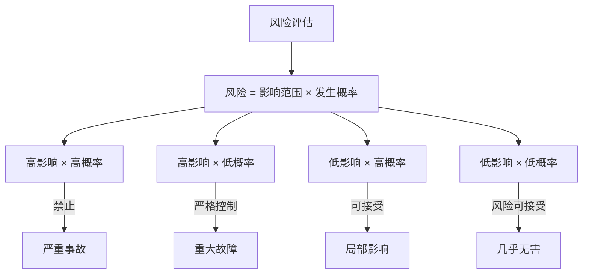
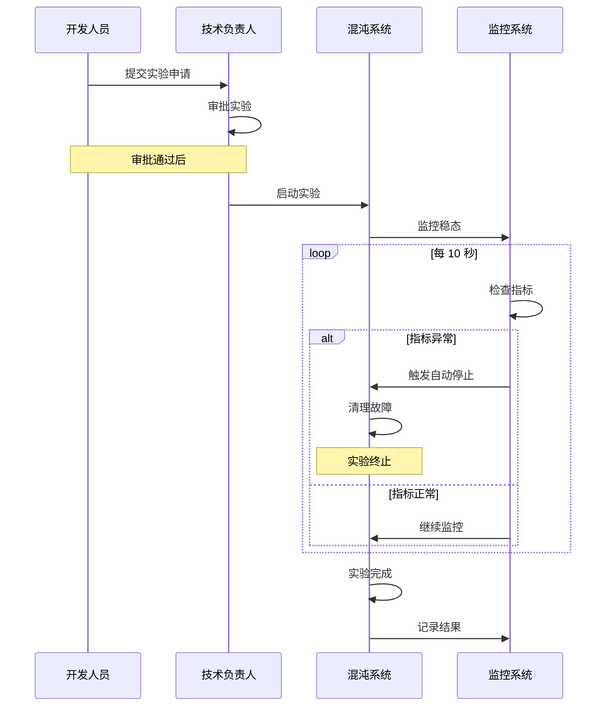

# 生产环境混沌工程实践

生产环境是混沌工程的最终舞台，但也是风险最高的地方。

很多人认为「生产环境太危险，不能做实验」。但实际上，只有生产环境才能真实反映系统的行为。关键不是「要不要在生产环境做实验」，而是「如何在生产环境安全地做实验」。

## 为什么必须在生产环境实验

测试环境有三个无法解决的问题：

```
测试环境的局限性：

1. 负载不真实
   测试环境：100 QPS
   生产环境：10000 QPS
   → 同样的故障，在不同负载下表现完全不同

2. 依赖不完整
   测试环境：20 个依赖服务
   生产环境：200 个依赖服务
   → 复杂的依赖关系无法模拟

3. 故障不真实
   测试环境：手动注入的故障
   生产环境：真实的网络抖动、硬件故障
   → 人工故障与真实故障有本质差异
```

> **Netflix 的发现**：在测试环境运行了 6 个月的 Chaos Monkey，从未发现问题。但第一次在生产环境运行时，3 小时内就发现了 3 个关键缺陷。

## 生产环境实验的风险矩阵



| 风险 | 场景 | 应对策略 |
| --- | --- | --- |
| **高影响 × 高概率** | 杀死 50% 的核心服务实例 | 禁止，必须改进后再实验 |
| **高影响 × 低概率** | 数据库主库故障 | 严格控制流量和时长 |
| **低影响 × 高概率** | 10% 流量的网络延迟 | 可接受，但仍需监控 |
| **低影响 × 低概率** | 杀死 1% 的非核心 Pod | 风险可接受 |

## 多重安全机制

生产环境实验必须有多重安全机制：

### 1. 流量控制

```yaml title="traffic-control.yaml"]
experiment:
  # 只影响 1% 的流量
  traffic_percentage: 1

  # 策略：按用户 ID 分流
  traffic_selector:
    type: "user-id-modulo"
    modulo: 100
    remainder: 0  # 只影响末尾为 0 的用户

  # 白名单用户不受影响
  whitelist:
    - type: "user-type"
      values: ["vip", "internal"]
```

### 2. 时间窗口控制

```yaml title="time-window.yaml"]
experiment:
  # 只允许在低峰期进行
  allowed_hours:
    - "02:00-05:00"  # 凌晨 2-5 点
    - "14:00-16:00"  # 下午 2-4 点

  # 排除高峰时段
  excluded_hours:
    - "11:00-13:00"  # 午休高峰
    - "20:00-22:00"  # 晚高峰

  # 自动结束时间
  auto_end_time: "06:00"
```

### 3. 自动停止机制

```yaml title="auto-stop.yaml"]
safety:
  auto_stop:
    enabled: true

    # 指标触发停止
    conditions:
      - name: "error-rate"
        metric: "error_rate"
        threshold: 0.02  # 错误率超过 2% 停止
        window: "30s"

      - name: "latency"
        metric: "p99_latency"
        threshold: "2000ms"  # P99 延迟超过 2s 停止
        window: "60s"

      - name: "availability"
        metric: "success_rate"
        threshold: 0.98  # 成功率低于 98% 停止
        window: "60s"

    # 停止后的操作
    post_stop:
      - "cleanup_fault"
      - "notify_team"
      - "create_incident"
```

### 4. 人工审批

```yaml title="approval.yaml"]
experiment:
  approval:
    required: true
    minimum_approvers: 2

    approvers:
      - role: "on-call-lead"
        status: "approved"

      - role: "team-lead"
        status: "pending"  # 待审批

    # 紧急情况豁免
    emergency_override:
      enabled: true
      approvers:
        - "cto"
        - "vp-engineering"
```

### 5. 回滚方案

```yaml title="rollback.yaml"]
safety:
  rollback:
    # 一键回滚
    one_click_rollback:
      enabled: true

    # 回滚步骤
    steps:
      - "cleanup_fault"
      - "restart_affected_pods"
      - "reset_network_rules"
      - "verify_health"

    # 回滚超时
    rollback_timeout: "5m"

    # 自动回滚
    auto_rollback:
      enabled: true
      trigger: "if not steady within 10m"
```

## 实施流程



## 实验前的准备清单

```bash title="pre-experiment-checklist.sh"
#!/bin/bash

# 1. 确认稳态
./check_steady_state.sh
if [ $? -ne 0 ]; then
    echo "❌ 系统不在稳态，禁止执行实验"
    exit 1
fi

# 2. 确认监控系统正常
./check_monitoring.sh
if [ $? -ne 0 ]; then
    echo "❌ 监控系统异常，禁止执行实验"
    exit 1
fi

# 3. 确认告警通道畅通
./check_alerting.sh
if [ $? -ne 0 ]; then
    echo "❌ 告警通道异常，禁止执行实验"
    exit 1
fi

# 4. 通知相关团队
./notify_team.sh "即将进行混沌实验"

# 5. 准备回滚方案
./prepare_rollback.sh

# 6. 记录实验基线
./record_baseline.sh

echo "✅ 所有检查通过，可以开始实验"
```

## 实验后的处理流程

```mermaid
flowchart TD
    A["实验结束"] --> B{"结果如何？"}
    B -->|"正常结束| C["记录结果"]
    B -->|"自动停止| D["分析原因"]
    B -->|"手动停止| E["紧急处理"]

    C --> F["更新实验报告"]
    D --> F
    E --> F

    F --> G{"发现问题？"}
    G -->|"是| H["创建缺陷单"]
    G -->|"否| I["归档实验"]

    H --> J["修复缺陷"]
    J --> K["验证修复"]
    K --> I
```

## 生产环境的「安全实验」清单

```
✅ 可以在生产环境做的实验：
- 影响 < 1% 的流量
- 杀死非核心服务的 Pod
- 注入 < 100ms 的网络延迟
- 在低峰期（凌晨 2-5 点）进行
- 有完整的安全机制和回滚方案

❌ 禁止在生产环境做的实验：
- 影响 > 10% 的流量
- 杀死核心服务 50% 以上的实例
- 模拟数据库主库故障
- 在高峰期进行
- 没有回滚方案的情况下实验
```

## 质量判断标准

一篇「生产环境混沌工程实践」的文章是否达标，要看它是否回答了：

1. ✅ 为什么必须在生产环境实验（测试环境的局限性）？
2. ✅ 生产环境实验的风险如何评估？
3. ✅ 有哪些安全机制（流量控制、自动停止、回滚）？
4. ✅ 完整的实施流程是什么？
5. ✅ 实验前/后的处理流程是什么？
6. ❌ 只有概念，没有具体配置和流程——不达标

## 本章总结

**核心要点**：

1. **生产环境是混沌工程的最终舞台**：只有生产环境才能真实反映系统行为
2. **风险 = 影响范围 × 发生概率**：高风险实验必须严格控制
3. **多重安全机制缺一不可**：流量控制、时间窗口、自动停止、人工审批、回滚方案
4. **从小流量、低峰期开始**：逐步扩大范围和影响
5. **实验前检查、实验后复盘**：每次实验都是学习机会
