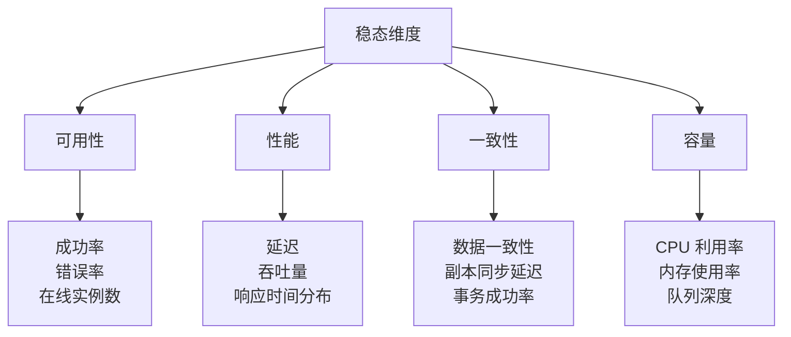
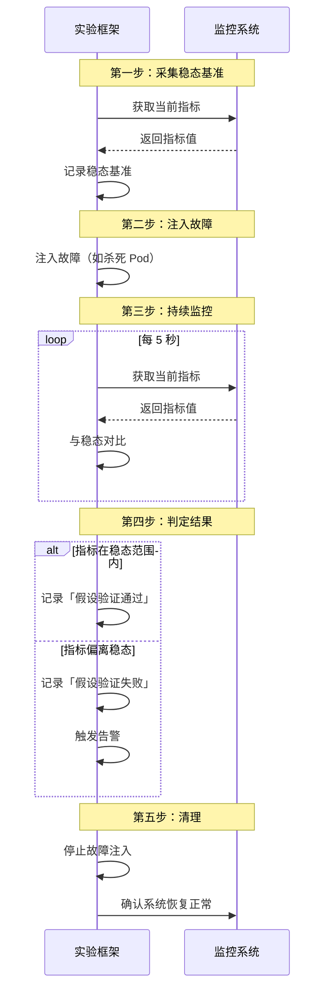

# 稳态假设（Steady State Hypothesis）

混沌工程的核心方法论：在动手注入故障之前，先定义什么是「正常」。

如果连「正常」是什么都不知道，就无法判断故障发生后系统是否还「正常」。稳态假设（Steady State Hypothesis）就是混沌工程实验的第一步：定义系统的正常行为，作为实验前后的对比基准。

## 什么是稳态

```
稳态 = 系统在正常情况下的行为特征

稳态假设 = 假设系统在正常情况下，这些行为特征保持稳定

实验目标 = 在故障注入后，验证这些行为特征是否发生变化
```

例如，一个订单系统的稳态可能是：

- 请求成功率保持在 99.9% 以上
- P99 延迟不超过 500ms
- 每分钟处理订单数保持在 1000~2000 之间

如果注入故障后，这些指标偏离了稳态，就说明故障对系统产生了影响。

## 稳态的四个维度

稳态可以从多个维度定义：



### 维度一：可用性

| 指标 | 稳态范围 | 说明 |
| --- | --- | --- |
| 请求成功率 | `>` 99.9% | 5xx 错误占比 `<` 0.1% |
| 在线实例数 | `>=` 预期数量 | 无异常下线 |
| 服务启动时间 | `<` 30s | 冷启动时间 |

### 维度二：性能

| 指标 | 稳态范围 | 说明 |
| --- | --- | --- |
| TP99 延迟 | `<` 500ms | 99% 请求在 500ms 内完成 |
| 平均延迟 | `<` 100ms | 所有请求的平均延迟 |
| QPS | 1000~2000 | 每秒处理的请求数 |

### 维度三：一致性

| 指标 | 稳态范围 | 说明 |
| --- | --- | --- |
| 数据同步延迟 | `<` 1s | 主从同步延迟 |
| 缓存命中率 | `>` 90% | 缓存有效率 |
| 事务成功率 | `>` 99.99% | 分布式事务成功率 |

## 稳态定义示例

### 示例一：电商订单系统

```yaml title="steady-state-definition.yaml"
steady_state:
  name: "order-service-steady-state"

  metrics:
    # 可用性指标
    - name: "request_success_rate"
      query: |
        sum(rate(http_requests_total{status!~"5.."}[5m]))
        / sum(rate(http_requests_total[5m]))
      threshold: 0.999
      comparison: "gte"

    - name: "error_rate"
      query: |
        sum(rate(http_requests_total{status=~"5.."}[5m]))
        / sum(rate(http_requests_total[5m]))
      threshold: 0.001
      comparison: "lte"

    # 性能指标
    - name: "p99_latency_ms"
      query: |
        histogram_quantile(0.99,
          sum(rate(http_request_duration_seconds_bucket[5m])) by (le)
        ) * 1000
      threshold: 500
      comparison: "lte"

    # 容量指标
    - name: "queue_depth"
      query: |
        sum(mq_consumer_queue_depth{topic="order-created"})
      threshold: 1000
      comparison: "lte"
```

### 示例二：数据库系统

```yaml title="database-steady-state.yaml"
steady_state:
  name: "database-steady-state"

  metrics:
    - name: "queries_per_second"
      query: |
        sum(rate(mysql_queries_total[5m]))
      range: [1000, 5000]  # 在这个范围内算稳态

    - name: "replication_lag_seconds"
      query: |
        mysql_slave_replication_lag_seconds
      threshold: 1
      comparison: "lte"

    - name: "connection_pool_usage"
      query: |
        mysql_connection_pool_active / mysql_connection_pool_max
      threshold: 0.8
      comparison: "lte"
```

## 稳态验证流程



## 常见的稳态假设错误

### 错误一：稳态范围过窄

如果稳态范围定义得太窄，即使是正常的业务波动也可能被判定为「稳态被破坏」。

```yaml
# 错误示例：P99 延迟设为 100ms
# 实际上业务高峰期 P99 延迟经常达到 300ms
p99_latency_ms:
  threshold: 100  # 太窄，误判率高

# 正确示例：P99 延迟设为 500ms
p99_latency_ms:
  threshold: 500  # 合理，覆盖正常波动
```

### 错误二：只看平均值

平均值容易掩盖问题。例如：99% 的请求 1ms 完成，1% 的请求 10s 完成，平均延迟是 100ms——看起来正常，但实际上有 1% 的用户在经历 10 秒的等待。

```python
# 错误：用平均值判断稳态
avg_latency = sum(latencies) / len(latencies)
is_stable = avg_latency < 100  # 可能掩盖长尾问题

# 正确：用百分位数判断稳态
p99_latency = sorted(latencies)[int(len(latencies) * 0.99)]
is_stable = p99_latency < 500  # 能发现长尾问题
```

### 错误三：指标太多或太少

指标太多会导致实验难以判定；太少则覆盖不够。

```python
# 经验法则：核心指标 3~5 个
core_metrics = [
    "success_rate",   # 可用性
    "p99_latency",    # 性能
    "error_rate",     # 错误
]

# 过多指标
all_metrics = [...]  # 30+ 个指标，任何一个波动都算失败
```

## 质量判断标准

一篇「稳态假设」的文章是否达标，要看它是否回答了：

1. ✅ 什么是稳态，为什么需要稳态假设？
2. ✅ 稳态从哪些维度定义？
3. ✅ 如何量化定义稳态（有具体指标和阈值）？
4. ✅ 稳态验证的完整流程是什么？
5. ❌ 只给概念，没有量化定义——不达标

## 本章总结

**核心要点**：

1. **稳态是混沌工程的起点**：不知道什么是「正常」，就无法判断故障的影响
2. **稳态要从多个维度定义**：可用性、性能、一致性、容量
3. **稳态必须量化**：具体的指标、具体的阈值，而不是模糊的描述
4. **稳态范围要合理**：太窄会误判，太宽会漏判
5. **优先关注长尾指标**：P99/P999 比平均值更能反映真实用户体验
