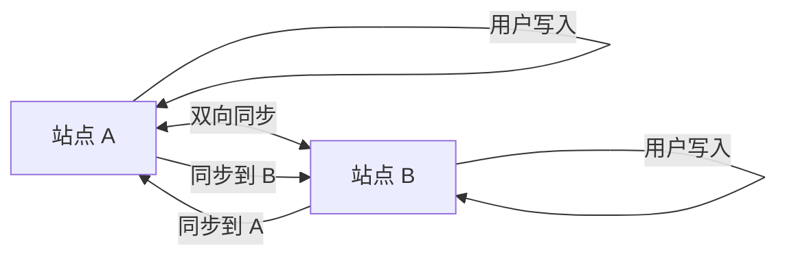

# 双活架构（Active-Active）

双活架构是两个站点同时提供服务，故障时可以快速切换。

## 双活 vs 主备

| 维度 | 主备 | 双活 |
| --- | --- | --- |
| **服务状态** | 主站服务，备站待机 | 两站都服务 |
| **资源利用** | 50% | 100% |
| **切换时间** | 分钟级 | 秒级 |
| **复杂度** | 低 | 高 |
| **成本** | 较低 | 较高 |

## 双活数据同步

## 冲突解决

| 方法 | 说明 |
| --- | --- |
| **最后写入胜出** | 以时间戳判断 |
| **主键冲突** | 以 ID 段区分 |
| **应用层解决** | 业务逻辑处理 |

## 本章总结

**核心要点**：

1. **双活提高资源利用率**：两站同时服务
2. **切换速度快**：秒级切换
3. **数据同步是核心**：双向同步 + 冲突解决
