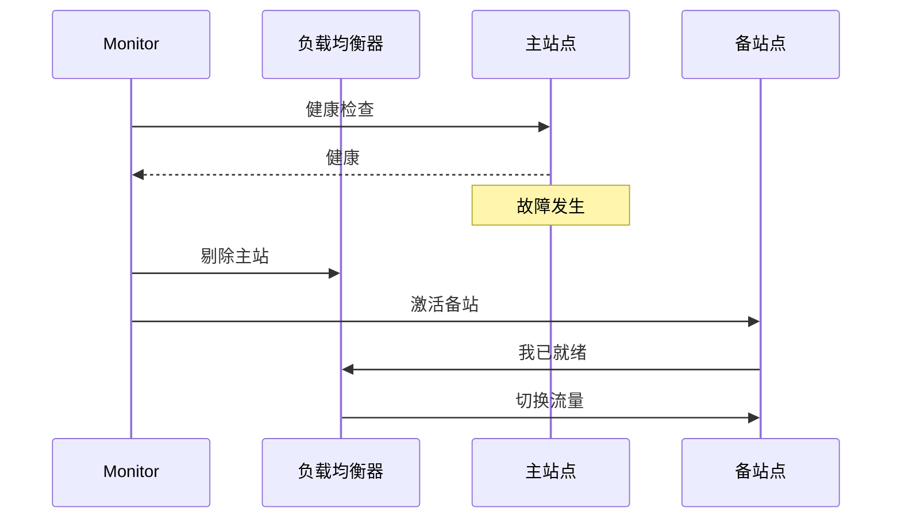

# 主备架构（Active-Standby）

主备架构是经典的容灾方案——主站提供服务，备站待机。

## 主备架构原理

```mermaid
flowchart LR
    A["用户"] --> B["负载均衡器"]
    B --> C["主站点\n（Active）"]

    C -->|"数据同步"| D["备站点\n（Standby）"]

    C -x E["故障发生"]
    E --> F["切换到备站"]
    F --> D
```

## 主备切换流程



## 适用场景

| 场景 | 说明 |
| --- | --- |
| **数据库容灾** | MySQL 主从、PostgreSQL 主备 |
| **应用容灾** | 应用多实例 + 共享存储 |
| **跨机房容灾** | 同城灾备 |

## 本章总结

**核心要点**：

1. **主备架构简单可靠**：备站待机，故障切换
2. **切换需要时间**：有 RTO
3. **数据同步是关键**：主备数据必须一致
