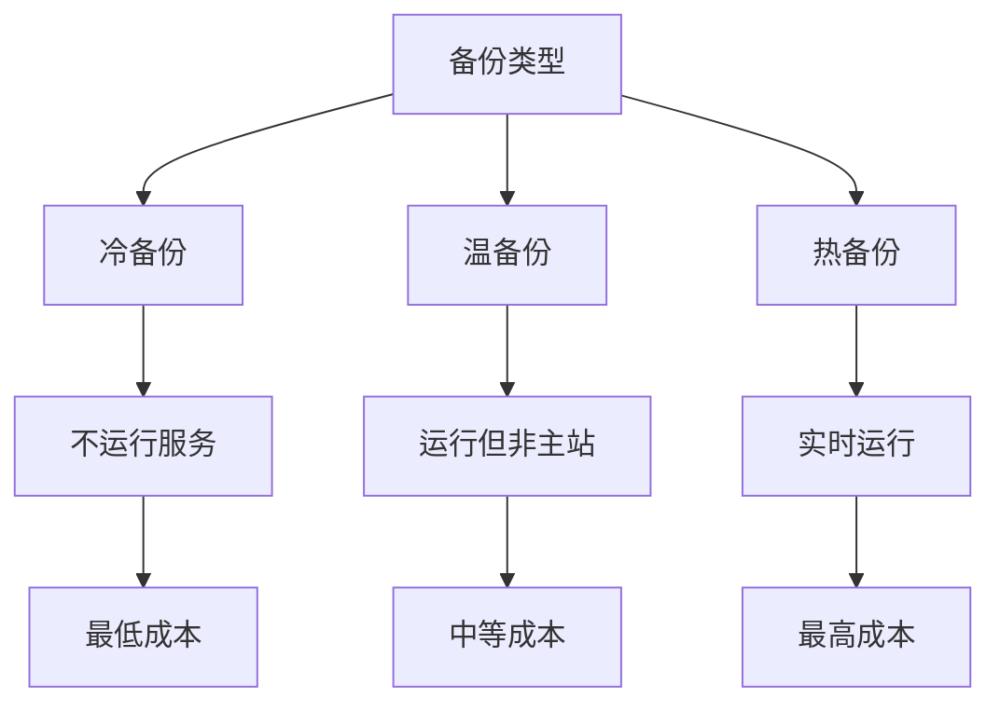

# 冷备份/温备份/热备份

根据业务连续性需求，选择不同等级的备份架构。

## 三种备份类型

## 对比表

| 类型 | 服务状态 | 切换时间 | 数据同步 | 成本 |
| --- | --- | --- | --- | --- |
| **冷备份** | 关闭 | 小时级 | 无 | 低 |
| **温备份** | 运行但非主 | 分钟级 | 定期同步 | 中 |
| **热备份** | 实时运行 | 秒级 | 实时同步 | 高 |

## 适用场景

| 类型 | 适用场景 |
| --- | --- |
| **冷备份** | 非关键系统、低成本方案 |
| **温备份** | 一般业务、需要定期演练 |
| **热备份** | 关键业务、需要快速恢复 |

## 本章总结

**核心要点**：

1. **冷备份成本最低**：但切换时间长
2. **热备份成本最高**：但切换几乎无中断
3. **选择取决于业务需求**：关键业务选热备份
