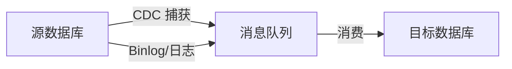

# 数据同步技术（CDC/主从复制）

数据同步是灾难恢复的核心——保证主备数据一致。

## 同步技术类型

| 技术 | 说明 | 延迟 | 适用场景 |
| --- | --- | --- | --- |
| **主从复制** | 数据库内置复制 | 低 | 同城 |
| **CDC** | 变更数据捕获 | 低~中 | 异构数据源 |
| **异步复制** | 定时同步 | 高 | 低成本方案 |
| **同步复制** | 实时同步 | 极低 | 强一致场景 |

## CDC 原理



## 主从复制配置

```sql title="MySQL 主从配置"
-- 主库配置
[mysqld]
log-bin=mysql-bin
server-id=1
sync-binlog=1

-- 从库配置
[mysqld]
server-id=2
relay-log=relay-bin
read-only=1
```

## 本章总结

**核心要点**：

1. **数据同步是灾备的核心**：主备数据必须一致
2. **CDC 是异构数据同步的好选择**：基于日志捕获变更
3. **根据 RPO 选择同步技术**：延迟要求决定技术选型
