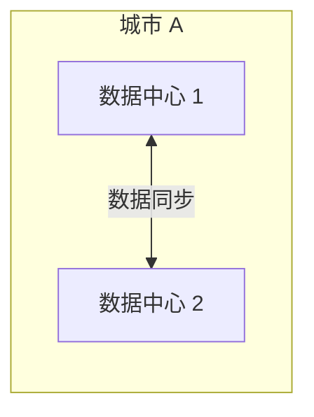
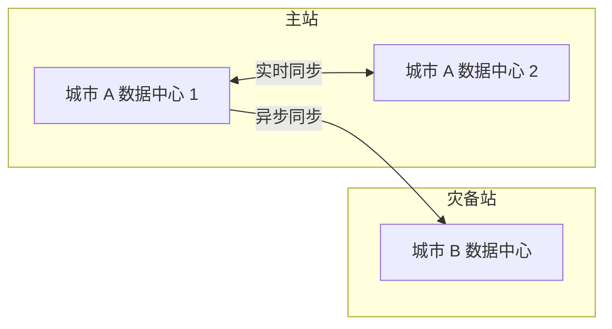

# 同城双活 vs 两地三中心

不同的容灾架构方案有不同的特点和适用场景。

## 同城双活

| 特点 | 说明 |
| --- | --- |
| **距离** | 同一城市，延迟低 |
| **成本** | 中等 |
| **适用** | 同城容灾 |

## 两地三中心

| 特点 | 说明 |
| --- | --- |
| **距离** | 跨城市，可应对城市级灾难 |
| **成本** | 高 |
| **适用** | 城市级灾难防护 |

## 选择建议

| 场景 | 推荐方案 |
| --- | --- |
| 同城容灾 | 同城双活 |
| 城市级灾难防护 | 两地三中心 |
| 国家级灾难防护 | 两地三中心 + 异地备份 |

## 本章总结

**核心要点**：

1. **同城双活适合同城的容灾需求**：延迟低，成本适中
2. **两地三中心可应对城市级灾难**：但成本高
3. **根据灾难场景选择方案**：不是越复杂越好
