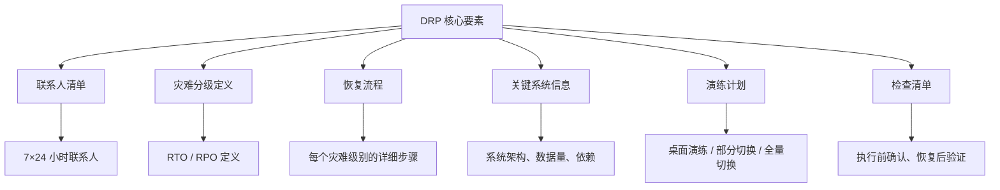

# 灾难恢复计划（DRP）编写

灾难恢复计划（Disaster Recovery Plan，DRP）是灾难发生时的操作手册。好的 DRP 能让团队在混乱中快速恢复系统，差的 DRP 在关键时刻形同虚设。

很多团队的 DRP 存在三个典型问题：写得过于简略，关键时刻不知道该做什么；写得过于复杂，执行时根本来不及看；长期不更新，灾难发生时才发现计划已经过时。

## DRP 的核心要素

一份完整的 DRP 必须包含以下要素：



## DRP 模板

```markdown title="disaster-recovery-plan.md"
# 灾难恢复计划

## 1. 文档信息

| 项目 | 内容 |
| --- | --- |
| 版本 | 1.0 |
| 更新日期 | 2024-01-15 |
| 下次审查日期 | 2024-07-15 |
| 负责人 | 架构组 |
| 审批人 | CTO |

## 2. 联系人清单

| 角色 | 姓名 | 电话 | 邮箱 | 备用联系人 |
| --- | --- | --- | --- | --- |
| DR 负责人 | 张三 | 138-xxxx-xxxx | zhangsan@company.com | 李四 |
| 首席 DBA | 李四 | 139-xxxx-xxxx | lisi@company.com | 王五 |
| 运维负责人 | 王五 | 137-xxxx-xxxx | wangwu@company.com | 赵六 |
| 云平台负责人 | 赵六 | 136-xxxx-xxxx | zhaoliu@company.com | 张三 |

### 供应商联系人

| 服务 | 供应商 | 支持电话 | SLA |
| --- | --- | --- | --- |
| AWS | 亚马逊 | 400-927-2207 | 24/7 |
| 数据库服务 | 阿里云 RDS | 95187 | 24/7 |
| CDN | 阿里云 CDN | 95187 | 24/7 |

## 3. 灾难分级定义

| 级别 | 定义 | RTO | RPO | 影响范围 |
| --- | --- | --- | --- | --- |
| **L0 - 提示** | 监控告警，无需人工介入 | - | - | 无 |
| **L1 - 警告** | 单机/单实例故障，系统自动恢复 | 10 分钟 | 0 | < 1% 用户 |
| **L2 - 故障** | 服务降级，需要人工介入 | 30 分钟 | 1 小时 | < 10% 用户 |
| **L3 - 严重** | 单机房故障，多服务受影响 | 2 小时 | 1 小时 | 10%~50% 用户 |
| **L4 - 灾难** | 城市级灾难，多机房不可用 | 24 小时 | 4 小时 | `>` 50% 用户 |

## 4. 恢复流程

### 4.1 L1 故障恢复流程（30 分钟内完成）

```
[10 分钟] 监控系统告警
    ↓
[15 分钟] 值班人员定位问题
    ↓
[20 分钟] 自动重启或手动重启故障实例
    ↓
[30 分钟] 验证服务恢复，更新故障记录
```

### 4.2 L2 故障恢复流程（30 分钟内完成）

```
[5 分钟] 值班人员确认故障范围
    ↓
[10 分钟] 通知相关团队负责人
    ↓
[15 分钟] 执行预设的恢复脚本
    ↓
[25 分钟] 验证服务恢复
    ↓
[30 分钟] 发送故障恢复通知
```

### 4.3 L3 故障恢复流程（2 小时内完成）

```
[15 分钟] 确认主站点不可用
    ↓
[30 分钟] 通知 DR 团队和高层
    ↓
[45 分钟] 执行 DNS 切换
    ↓
[60 分钟] 验证流量切换到 DR 站点
    ↓
[90 分钟] 验证所有服务正常运行
    ↓
[2 小时] 发送故障通告和状态更新
```

### 4.4 L4 灾难恢复流程（24 小时内完成）

```
[30 分钟] 确认灾难范围，激活 DR 团队
    ↓
[1 小时] 通知所有相关方（客户、合作伙伴、高层）
    ↓
[2 小时] 完成基础设施切换
    ↓
[4 小时] 完成数据恢复
    ↓
[8 小时] 验证核心业务功能
    ↓
[24 小时] 完成全量恢复，发布恢复报告
```

## 5. 关键系统信息

| 系统 | 类型 | 数据量 | 备份方式 | RTO | 负责人 |
| --- | --- | --- | --- | --- | --- |
| 订单系统 | 核心 | 10TB | 实时同步到 DR | 30 分钟 | 张三 |
| 用户系统 | 核心 | 5TB | 实时同步到 DR | 30 分钟 | 李四 |
| 支付系统 | 核心 | 2TB | 实时同步到 DR | 30 分钟 | 王五 |
| 商品系统 | 重要 | 20TB | 增量备份 | 2 小时 | 赵六 |
| 推荐系统 | 一般 | 50TB | 离线备份 | 24 小时 | 周七 |

### 系统依赖关系

```
用户系统（基础）
    ↓
商品系统 ← 依赖 → 订单系统
    ↓              ↓
推荐系统         支付系统
```

## 6. 演练计划

| 演练类型 | 频率 | 下次演练时间 | 参与人员 | 目标 |
| --- | --- | --- | --- | --- |
| 桌面演练 | 月度 | 2024-02-01 | DR 团队 | 验证流程熟悉度 |
| 部分切换 | 季度 | 2024-04-01 | DR + 运维 | 验证切换脚本 |
| 全量切换 | 半年度 | 2024-07-01 | 全员 | 验证完整恢复流程 |

### 演练记录模板

```
演练日期：2024-01-15
演练类型：桌面演练
参与人员：张三、李四、王五
发现问题：
1. 联系人清单有过期人员
2. 切换脚本缺少验证步骤

修复计划：
1. 更新联系人清单（截止日期：2024-01-20）
2. 更新切换脚本（截止日期：2024-01-25）
```

## 7. 执行检查清单

### 7.1 恢复前检查

```
□ 确认灾难级别
□ 通知相关团队
□ 确认备份数据可用
□ 确认 DR 站点可用
□ 确认人员可用
□ 准备通信渠道
```

### 7.2 恢复中检查

```
□ 按流程执行恢复步骤
□ 每 15 分钟更新状态
□ 记录所有操作
□ 监控恢复进度
```

### 7.3 恢复后检查

```
□ 验证核心功能可用
□ 验证数据完整性
□ 验证监控告警正常
□ 发送恢复通知
□ 安排故障复盘
□ 更新 DRP 文档
```

## 8. DRP 审查记录

| 日期 | 审查人 | 主要变更 | 版本 |
| --- | --- | --- | --- |
| 2024-01-15 | 张三 | 初始版本 | 1.0 |
| 2023-07-10 | 李四 | 更新联系人信息 | 0.9 |
```

## DRP 编写要点

### 1. 要详细到「傻瓜都能执行」

DRP 不是给专家看的，而是给任何人看的。理想情况是：一个刚入职的实习生，拿着 DRP 也能把灾难恢复流程走完。

**错误示例**：

```
4.1 恢复流程
1. 切换到 DR 站点
2. 验证服务正常
```

**正确示例**：

```
4.1 DR 站点切换流程
1. 登录阿里云控制台
2. 进入 DNS 解析设置页面
3. 修改 @ 前缀的 A 记录：
   - 主记录：180.x.x.x（当前主站点 IP）
   - 修改为：120.x.x.x（DR 站点 IP）
4. 保存修改
5. 等待 5 分钟
6. 验证 DNS 生效：nslookup yourdomain.com
7. 验证服务正常：curl https://yourdomain.com/health
```

### 2. 要有时间限制

每个步骤都要有明确的时间预期：

```
□ [15 分钟内] 完成 DNS 切换
□ [30 分钟内] 完成数据库切换
□ [1 小时内] 完成所有服务验证
```

### 3. 要有联系方式

每个步骤的负责人要写清楚联系方式：

```
□ [负责人] 张三 | 138-xxxx-xxxx
□ [备份负责人] 李四 | 139-xxxx-xxxx
```

### 4. 要有检查点

每个关键步骤后要有验证点：

```
1. 执行 DNS 切换
   ↓
   [验证点] nslookup yourdomain.com 确认 IP 已变更
   ↓
2. 验证服务正常
   ↓
   [验证点] curl https://yourdomain.com/health 返回 200
   ↓
3. 发送通知
```

## DRP 维护建议

1. **每季度审查一次**：检查联系人、脚本、备份是否更新
2. **每次故障后更新**：把真实故障中学到的教训加入 DRP
3. **每次演练后更新**：把演练中发现的问题加入 DRP
4. **重大变更后更新**：系统架构变更后必须更新 DRP

## 质量判断标准

一篇「灾难恢复计划」的文章是否达标，要看它是否回答了：

1. ✅ DRP 包含哪些核心要素（联系人、灾难分级、恢复流程、系统信息、演练计划）？
2. ✅ 每个灾难级别的恢复流程是否详细到「傻瓜都能执行」？
3. ✅ 是否有执行检查清单（恢复前/中/后）？
4. ✅ DRP 如何维护和更新？
5. ❌ 只有模板，没有编写要点和注意事项——不达标

## 本章总结

**核心要点**：

1. **DRP 是灾难发生时的操作手册**：必须详细到任何人都能执行
2. **每个步骤要有时间预期和验证点**：执行者知道何时算完成
3. **联系人必须保持最新**：关键时刻找不到人是最常见的问题
4. **定期演练和更新**：DRP 不练不用等于没写
5. **从真实故障中学习**：每次故障后更新 DRP，把教训固化下来
