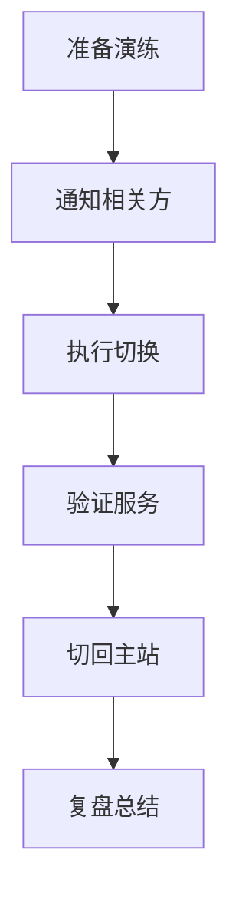

# 故障演练与切换

灾难恢复不能只靠设计，必须定期演练验证。

## 演练类型

| 类型 | 频率 | 范围 | 目的 |
| --- | --- | --- | --- |
| **桌面演练** | 月度 | 讨论 | 验证流程 |
| **部分切换** | 季度 | 单系统 | 验证切换 |
| **全量切换** | 年度 | 全系统 | 验证完整性 |

## 演练流程



## 切换检查清单

```yaml title="failover-checklist.yaml"
failover_checklist:
  - name: "故障检测"
    items:
      - "确认主站不可用"
      - "确认故障类型"
      - "评估影响范围"

  - name: "切换准备"
    items:
      - "通知相关团队"
      - "确认备站状态"
      - "确认数据同步"

  - name: "执行切换"
    items:
      - "DNS 切换"
      - "数据库切换"
      - "应用启动"

  - name: "验证"
    items:
      - "健康检查"
      - "功能验证"
      - "用户验证"
```

## 本章总结

**核心要点**：

1. **定期演练是必须的**：设计再好，不演练也是空的
2. **从桌面演练开始**：逐步增加复杂度
3. **每次演练都要复盘**：发现问题，改进流程
