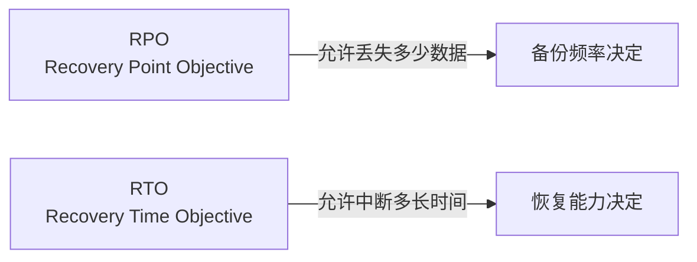
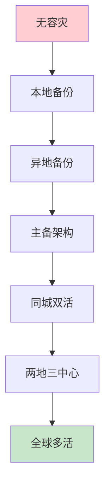

# 备份与灾难恢复

不怕一万，只怕万一。

灾难（Disaster）是小概率但高影响的事件：地震、火灾、数据中心级别的故障。虽然发生概率低，但一旦发生，如果没有任何准备，业务将遭受毁灭性打击。本模块详解 RPO/RTO 规划、备份策略、多活架构和灾难恢复计划，帮助你为最坏情况做好准备。

## 模块结构

### 基础概念

| 文章 | 核心问题 |
| --- | --- |
| [灾难恢复概述](/resilience/disaster-recovery/overview) | 灾难恢复的完整体系 |
| [RPO](/resilience/disaster-recovery/rpo) | 允许丢失多少数据 |
| [RTO](/resilience/disaster-recovery/rto) | 允许中断多长时间 |
| [RPO/RTO 权衡](/resilience/disaster-recovery/rpo-rto-tradeoff) | 如何在成本和风险间平衡 |

### 备份策略

| 文章 | 核心问题 |
| --- | --- |
| [备份策略概述](/resilience/disaster-recovery/backup-strategies) | 备份的完整策略 |
| [全量/增量/差异](/resilience/disaster-recovery/full-incremental) | 备份类型对比 |
| [冷/温/热备份](/resilience/disaster-recovery/backup-types) | 备份介质选择 |
| [备份工具](/resilience/disaster-recovery/backup-tools) | Velero/Restic/Xtrabackup |

### 容灾架构

| 文章 | 核心问题 |
| --- | --- |
| [多活架构](/resilience/disaster-recovery/multi-active) | 多地多活设计 |
| [主备架构](/resilience/disaster-recovery/active-standby) | Active-Standby 模式 |
| [双活架构](/resilience/disaster-recovery/active-active) | Active-Active 模式 |
| [单元化架构](/resilience/disaster-recovery/unit-architecture) | 单元化设计思路 |
| [单元化设计](/resilience/disaster-recovery/unit-design) | 单元化的实现 |
| [灾难等级](/resilience/disaster-recovery/disaster-levels) | 不同级别的应对策略 |

### 实践

| 文章 | 核心问题 |
| --- | --- |
| [切换演练](/resilience/disaster-recovery/failover-drill) | 如何定期演练 |
| [数据同步](/resilience/disaster-recovery/data-sync) | 主从同步技术 |
| [成本分析](/resilience/disaster-recovery/cost-analysis) | 容灾的成本权衡 |
| [灾难恢复计划](/resilience/disaster-recovery/drp) | 如何编写 DRP |
| [合规要求](/resilience/disaster-recovery/compliance) | 合规与审计 |

## 核心概念

## RPO/RTO 规划

| 业务类型 | RPO | RTO | 架构要求 |
| --- | --- | --- | --- |
| 核心业务（支付） | 分钟级 | 分钟级 | 实时同步 + 多活 |
| 重要业务（订单） | 小时级 | 小时级 | 准实时 + 主备 |
| 一般业务 | 天级 | 天级 | 每日备份 |
| 归档数据 | 周级 | 周级 | 冷备份 |

## 容灾架构演进

准备好开始了吗？从[灾难恢复概述](/resilience/disaster-recovery/overview)开始。
