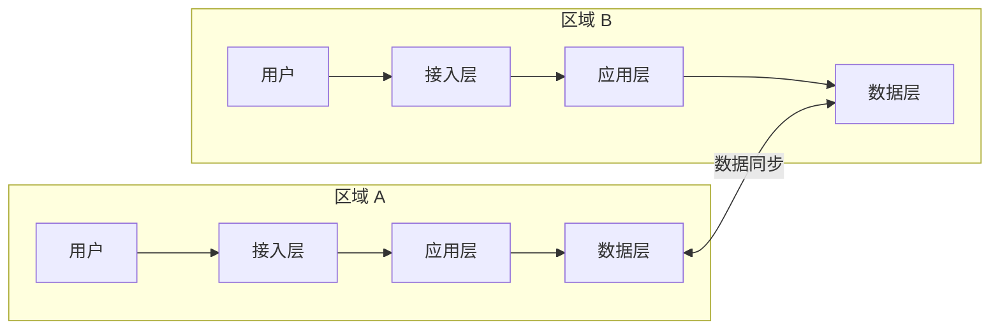

# 异地多活架构

异地多活是最高等级的可用性架构——多个地理位置独立的数据中心同时提供服务。

## 多活架构的特点

| 特点 | 说明 |
| --- | --- |
| **多地同时服务** | 所有区域都处理用户请求 |
| **数据实时同步** | 数据在各区域间同步 |
| **故障自动切换** | 区域故障自动切换到其他区域 |
| **用户体验一致** | 用户无感知区域差异 |

## 多活架构的挑战

| 挑战 | 说明 |
| --- | --- |
| **数据一致性** | CAP 定理的权衡 |
| **跨区域延迟** | 用户访问远端区域会有延迟 |
| **冲突解决** | 并发写入冲突需要解决 |
| **成本高** | 需要多个完整的数据中心 |

## 本章总结

**核心要点**：

1. **多活是最高等级架构**：多地同时服务，故障自动切换
2. **数据一致性是最大挑战**：需要权衡 CAP
3. **成本非常高**：只适合关键业务
