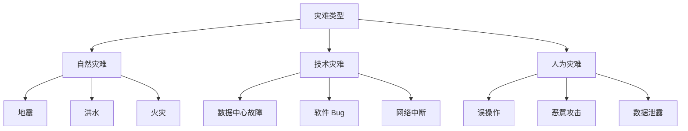
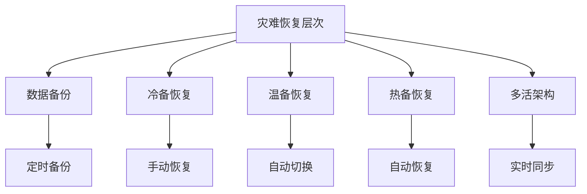

# 灾难恢复概述

灾难恢复是系统的最后一道防线——当最坏的情况发生时，如何快速恢复服务。

无论我们的系统多么可靠，灾难总有可能发生：地震、火灾、数据中心故障、勒索软件攻击……这些「黑天鹅」事件可能在瞬间摧毁一切。

灾难恢复不是「是否会发生」的问题，而是「发生时我们准备好了吗」的问题。

## 灾难的类型

## 灾难恢复 vs 高可用

| 维度 | 高可用（HA） | 灾难恢复（DR） |
| --- | --- | --- |
| **目标** | 防止单点故障 | 应对灾难性故障 |
| **范围** | 单机房/单区域 | 多机房/多区域 |
| **RTO** | 秒级~分钟级 | 分钟级~小时级 |
| **RPO** | 近零 | 可能有数据丢失 |
| **成本** | 中等 | 高 |

## 灾难恢复的关键指标

| 指标 | 说明 | 典型值 |
| --- | --- | --- |
| **RTO** | 恢复时间目标 | 分钟~小时 |
| **RPO** | 恢复点目标 | 分钟~小时 |
| **备份频率** | 数据多久备份一次 | 小时~天 |
| **恢复演练** | 多久进行一次演练 | 月~季度 |

## 灾难恢复的层次

## 本章总结

**核心要点**：

1. **灾难恢复是最后一道防线**：当一切手段都失效时的保障
2. **RTO 和 RPO 是核心指标**：决定需要什么样的恢复能力
3. **灾难恢复需要平衡成本和风险**：不同业务需要不同的恢复策略
