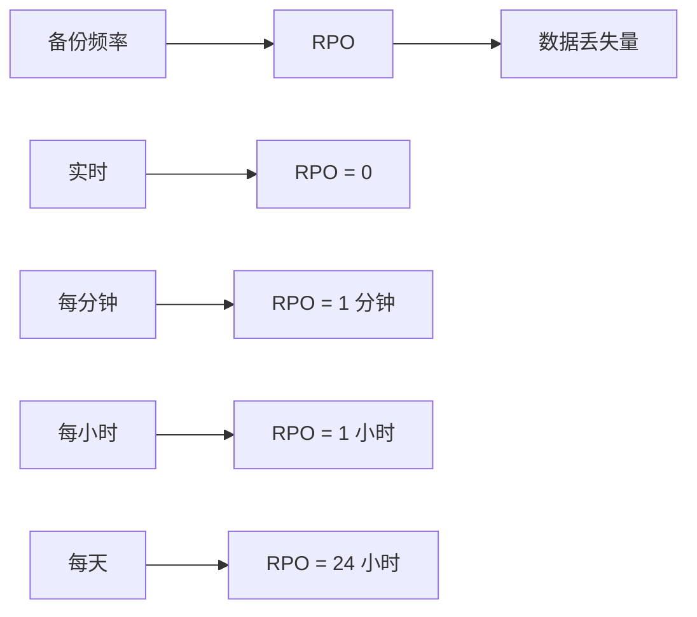

# RPO（恢复点目标）详解

RPO 回答的问题是：**发生灾难时，我们能接受丢失多少数据？**

## RPO 的定义

```
RPO = 恢复点目标 = 可以接受的最大数据丢失量（以时间衡量）

例如：
RPO = 1 小时 → 最多丢失 1 小时的数据
RPO = 0 → 不能丢失任何数据
```

## RPO 的计算

```python
# RPO 计算示例
def calculate_rpo(backup_interval_hours: float) -> float:
    """
    RPO 取决于备份间隔
    """
    return backup_interval_hours

# 不同备份频率对应的 RPO
print(f"每天备份: RPO = {calculate_rpo(24)} 小时")
print(f"每小时备份: RPO = {calculate_rpo(1)} 小时")
print(f"每分钟备份: RPO = {calculate_rpo(1/60)} 小时")
```

## 业务场景与 RPO

| 业务类型 | RPO 要求 | 备份策略 |
| --- | --- | --- |
| **金融交易** | RPO = 0 | 实时同步 |
| **订单系统** | RPO < 1 分钟 | 准实时同步 |
| **用户数据** | RPO < 1 小时 | 每小时备份 |
| **日志数据** | RPO < 1 天 | 每日备份 |
| **归档数据** | RPO < 1 周 | 每周备份 |

## RPO 与备份频率的关系



## 本章总结

**核心要点**：

1. **RPO 定义了数据丢失的可接受量**：以时间衡量
2. **RPO 决定备份策略**：RPO 越短，备份越频繁
3. **不同业务有不同的 RPO 要求**：金融交易要求 RPO=0
