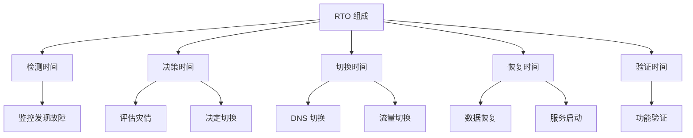

# RTO（恢复时间目标）详解

RTO 回答的问题是：**发生灾难后，系统需要多久才能恢复服务？**

## RTO 的定义

```
RTO = 恢复时间目标 = 从灾难发生到服务恢复的最大允许时间

例如：
RTO = 4 小时 → 灾难发生后 4 小时内必须恢复服务
```

## RTO 的组成



## 典型业务的 RTO

| 业务类型 | RTO 要求 | 架构方案 |
| --- | --- | --- |
| **金融交易** | RTO < 15 分钟 | 多活架构 |
| **电商核心** | RTO < 1 小时 | 热备 + 自动切换 |
| **内部系统** | RTO < 4 小时 | 温备 + 手动切换 |
| **非关键系统** | RTO < 24 小时 | 冷备恢复 |

## RTO 优化

| 优化方向 | 方法 |
| --- | --- |
| **减少检测时间** | 多区域监控、告警优化 |
| **减少决策时间** | 自动化切换、决策树 |
| **减少恢复时间** | 自动化部署、快速启动 |
| **减少验证时间** | 健康检查自动化 |

## 本章总结

**核心要点**：

1. **RTO 定义了恢复时间上限**：从灾难到恢复的时间
2. **RTO 由多个环节组成**：检测、决策、切换、恢复、验证
3. **自动化是降低 RTO 的关键**：减少人工干预
