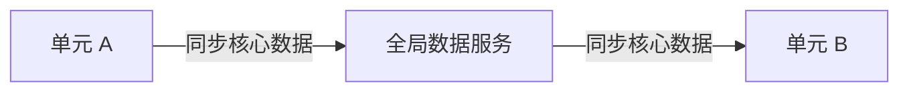

# 单元化架构设计

单元化架构的设计要点和实践。

## 设计要点

| 要点 | 说明 |
| --- | --- |
| **数据隔离** | 数据按单元划分，无跨单元访问 |
| **流量路由** | 用户请求路由到对应单元 |
| **单元扩展** | 单元可独立扩缩容 |
| **故障隔离** | 单元故障不影响其他单元 |

## 数据划分策略

```yaml title="data-partitioning.yaml"
data_partitioning:
  # 按用户 ID 划分
  user_sharding:
    strategy: "hash"
    shard_count: 100
    shard_key: "user_id"

  # 按地区划分
  region_sharding:
    strategy: "range"
    regions:
      - name: "cn-north"
        users: "1-1000万"
      - name: "cn-south"
        users: "1001-2000万"
```

## 单元间同步



## 本章总结

**核心要点**：

1. **数据划分是单元化的核心**：无跨单元数据访问
2. **流量路由要正确**：用户路由到对应单元
3. **单元可独立扩展**：按需扩容
